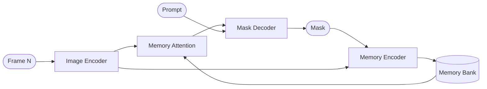

> [!abstract] Series context
> This is Part 1 of the *Optimizing SAMURAI* series. For why SAMURAI / EfficientTAM were chosen over the rest of the 2024-2025 tracking field, see [[long-term-visual-tracking-2026|Long-Term Visual Tracking for Drones (2026)]]. That post maps the full academic landscape; this series is the deployment story.

You have trained (or downloaded) a neural network that works brilliantly in a Jupyter notebook. It's accurate, it generalizes, it handles edge cases the previous generation couldn't. There's just one problem: it runs at 2 FPS, and you need 30.

This is the universal deployment gap in modern AI. The model itself is fine. Everything *around* it is the problem: Python overhead, memory synchronization stalls, unoptimized operator scheduling, and a runtime designed for research flexibility rather than production throughput. Closing that gap doesn't require retraining, doesn't require changing architectures, and doesn't require specialized hardware. It requires understanding where time actually goes and systematically removing the waste.

I hit this wall building a real-time visual tracking system for autonomous drone cinematography. The model ([SAMURAI](https://github.com/yangchris11/samurai), built on Meta's [SAM 2](https://github.com/facebookresearch/sam2)) needed to run at 30+ FPS on consumer hardware. Stock performance: **~20 FPS** on an RTX 4090 in PyTorch. After the work in this series: **97 FPS**. Same GPU, same model weights, same tracking task. 5x from engineering alone.

This series documents every step of that process. If you've ever stared at a PyTorch model wondering why it's slow and what to do about it, this is for you. The specific model is a visual object tracker, but the techniques (profiling, graph export, runtime optimization, precision tuning) apply to any neural network you want to deploy.

**Part 1** covers the foundation: understanding the model architecture, profiling to find the *actual* bottleneck (spoiler: it's not what you think), and exporting to ONNX. **[[optimizing-samurai-part-2|Part 2]]** takes it to GPU: CUDA execution providers, TensorRT engine compilation, and FP16 precision. **[[optimizing-samurai-part-3|Part 3]]** covers Apple Silicon: CoreML, Metal, and the M-series deployment story.

## The deployment gap

Research code and production code optimize for different things. Research code optimizes for *iteration speed*: try a new loss function, swap a backbone, add an attention layer. Every operation goes through Python, every intermediate result is a first-class tensor you can inspect, every module is a Python object you can monkey-patch. This flexibility has a cost.

Three layers of overhead compound in a typical PyTorch inference loop:

**Python dispatch overhead.** Every operation in PyTorch goes through Python's interpreter before reaching C++/CUDA kernels. For a model with hundreds of operators per forward pass, the cumulative cost of Python function calls, type checking, and autograd bookkeeping is substantial. This is invisible in profiling because it's spread across every operation rather than concentrated in one hot spot.

**Memory synchronization.** GPUs execute asynchronously: the CPU queues work, the GPU processes it in parallel. But certain operations force *synchronization*: the CPU blocks until the GPU finishes all queued work. `torch.nonzero()` (variable-length output), `.item()` (scalar transfer), and shape-dependent Python conditionals all trigger this. A single sync point can stall the entire GPU pipeline.

**Unoptimized operator scheduling.** PyTorch executes operators one at a time as Python encounters them. A specialized runtime can *fuse* sequences of operators (e.g., conv + batch_norm + relu becomes one kernel launch), *reorder* independent operations for better parallelism, and *eliminate* redundant memory copies. The same mathematical computation, scheduled better, runs faster.

The solution to all three is the same idea: **get Python out of the inference path**. Export the computation graph to a format a specialized runtime can optimize and execute without Python. This is where ONNX comes in.

## The ONNX mental model

If you've worked with compiled languages, the analogy is direct:

| Programming | ML Deployment |
|---|---|
| Python source code | PyTorch `nn.Module` |
| Compiler IR (LLVM IR) | ONNX graph |
| Machine code (x86, ARM) | TensorRT engine, CoreML model |
| CPU / GPU | Hardware execution |

**ONNX** (Open Neural Network Exchange) is a graph-based intermediate representation for neural networks. It captures the *computation* (which operators run in which order, with which weights) without any of the Python machinery. Think of it as the "assembly language" of neural networks: framework-agnostic, inspectable, optimizable.

**The export step** (`torch.onnx.export()`) traces your model's forward pass with a dummy input and serializes the resulting computation graph into a `.onnx` file. Every tensor operation becomes a node in the graph; every learned parameter becomes a constant. No Python code survives.

**ONNX Runtime** (ORT) is Microsoft's execution engine for ONNX graphs. It reads the graph, applies graph-level optimizations (operator fusion, constant folding, memory planning), and dispatches to hardware-specific backends called **execution providers**:

- **CPU EP**: optimized x86/ARM kernels, vectorized, multi-threaded
- **CUDA EP**: NVIDIA GPU kernels with operator fusion
- **TensorRT EP**: NVIDIA's compiler that generates hardware-specific engine files (the maximum-performance path on NVIDIA GPUs)
- **CoreML EP**: Apple's Neural Engine + GPU + CPU on M-series chips
- **DirectML EP**: AMD/Intel/Qualcomm GPUs on Windows

The key insight: you export *once* and deploy across all of these. The model doesn't know or care which hardware runs it. And each backend applies optimizations the PyTorch eager runtime cannot: fused kernels, hardware-specific memory layouts, reduced-precision arithmetic where safe.

**The verification pattern** used throughout this series is simple:

```python
# Feed identical input to both PyTorch and ORT
torch_out = model(dummy_input)
ort_out = session.run(None, {"input": dummy_input.numpy()})

# Compare element-wise
max_abs = np.max(np.abs(torch_out.numpy() - ort_out))
assert max_abs < 1e-3, f"Drift too large: {max_abs}"
```

If `max_abs` is small (< 1e-3), the export is faithful. If it's large, something went wrong during tracing: shape-dependent branches got baked as constants, dynamic control flow was flattened incorrectly, or an unsupported operation was silently approximated. This series encounters all three failure modes.

**Why not just use PyTorch's built-in optimizations?** `torch.compile()` (PyTorch 2.x) does offer graph capture and kernel fusion within PyTorch. It's a valid option for NVIDIA GPUs where Triton kernels are mature. But it doesn't give you cross-hardware portability (no CoreML, no edge deployment), its graph capture is fragile on complex models with dynamic control flow, and for our use case (a 4-module recurrent pipeline that needs maximum throughput across NVIDIA *and* Apple hardware), ONNX Runtime with hardware-specific EPs proved more reliable and faster. The ONNX path also produces standalone model files you can ship without a Python environment, which matters for embedded deployment.

## The model family

With the deployment framework established, let's look at the specific model we need to push through it. These three models form a lineage:

**SAM 2** (Meta, 2024) is a prompted video segmentation model. You give it a bounding box or point on frame 0, and it tracks that object through the entire video. The architecture is a 4-module recurrent pipeline:



Each frame runs all four modules in sequence. The **image encoder** (a Hiera-Tiny vision transformer, ~39M params) extracts features. **Memory attention** cross-attends to all previously encoded frames; this is where the model "remembers" what the object looks like. The **mask decoder** produces the segmentation mask, and the **memory encoder** stores the current frame's representation for future use.

**SAMURAI** (Yang et al., 2024) wraps SAM 2 with a Kalman filter that predicts subject motion and selects which past memory frames to attend to. The core model is identical; SAMURAI is a *scheduler* for SAM 2's memory bank. It improves tracking robustness without changing the inference cost.

**EfficientTAM** (2024) is a distilled SAM 2. Two key differences:
- A ViT-Tiny image encoder (~18M params vs Hiera's ~39M)
- 2×2 average-pooled memory keys/values in cross-attention (the `_2` checkpoint variants), directly targeting the dominant cost center

Same 4-module pipeline, same interface, same memory protocol. A drop-in replacement.

Why this matters for optimization: every frame runs all four modules in sequence. Speeding up one has bounded impact; you need to handle all four. And because memory attention cross-attends to a growing set of past frames, its cost scales with sequence length.

## Day one: 1.35 FPS

First run of SAMURAI on Apple Silicon (M1 Pro, MPS backend): **1.35 FPS**. 734 ms per frame with SAM 2.1 Hiera-Tiny at 1024×1024.

Getting there required four immediate fixes to the research code:

1. **Undocumented scipy dependency**: imported but not in requirements
2. **decord**: the video loader has no arm64 wheels. Dead project. Swapped for OpenCV
3. **float64 cast**: one line promotes to float64, which crashes MPS (`Float64 is not supported on MPS`)
4. **CUDA extension fallback**: custom CUDA kernels fail silently, falling back to a Python loop

This is research code in the wild: a fork of a fork, validated only on the authors' A100 cluster. The model itself works beautifully. Everything around it is fragile.

```python
# The kind of fix you write 4 times on day one
# Original: crashes MPS with "Float64 is not supported"
# obj_score_logit = obj_score_logit.to(torch.float64)
obj_score_logit = obj_score_logit.float()  # float32 is fine
```

One more lesson from day one: always visualize your outputs. Numeric metrics (IoU scores) can look plausible while the model tracks the wrong object entirely. I caught a meaningless evaluation early by watching the actual output video.

## The profiling twist

With SAMURAI running, I profiled to find the bottleneck using [PyTorch Profiler](https://pytorch.org/tutorials/recipes/recipes/profiler_recipe.html) with activity tracing on both CPU and MPS:

```python
from torch.profiler import profile, ProfilerActivity

with profile(
    activities=[ProfilerActivity.CPU],
    record_shapes=True,
) as prof:
    # Run 5 frames through the full pipeline
    for frame in frames[25:30]:
        model.track(frame)

# Sort by self CPU time to find the real bottlenecks
print(prof.key_averages().table(sort_by="self_cpu_time_total", row_limit=15))
```

The expectation: the model's attention layers dominate. The reality:

| Op | Self CPU % | Per-call | Calls/frame |
|---|---|---|---|
| `aten::nonzero` | 49.9% | 21.8 ms | 12 |
| `aten::upsample_nearest2d` | 39.8% | 204.8 ms | 1 |
| `aten::linear` | 1.3% | 0.05 ms | 149 |
| `aten::scaled_dot_product_attention` | 0.8% | 0.15 ms | 27 |

Genuine compute (attention + convolution) accounts for **less than 2% of frame time**.

The real costs:

**`upsample_nearest2d`** (205 ms/frame): SAMURAI upsamples the low-resolution mask logits to the original video resolution (1024×1024) on every frame. A single operator copying megabytes of data with no mathematical work.

**`nonzero`** (262 ms/frame across 12 calls): SAMURAI's Kalman filter extracts bounding boxes from predicted masks using `torch.nonzero()`. This is the sync killer. Here's why: `nonzero` returns a *variable-length* result (the number of True pixels isn't known until the kernel finishes). The CPU needs to know the output size to allocate the result tensor, so it **blocks until the entire GPU queue drains**. Every other kernel that was running async now becomes effectively synchronous.

```python
# SAMURAI's bbox extraction, each nonzero() forces a GPU→CPU sync
mask_pixels = torch.nonzero(predicted_mask)
# ↑ GPU must finish ALL queued work before this returns
# because the output tensor size depends on the result
if len(mask_pixels) > 0:
    bbox = [mask_pixels[:, 1].min(), mask_pixels[:, 0].min(),
            mask_pixels[:, 1].max(), mask_pixels[:, 0].max()]
```

The fix isn't to optimize `nonzero` itself. It's to move the entire pipeline into a framework where inference stays on-device without Python-level synchronization points. This reframes the optimization entirely: the goal isn't "make the model smaller" or "quantize to INT8." It's **remove the glue**.

## ONNX export: the image encoder saga

With profiling done, the path is clear: export all four sub-modules to ONNX, wire them together in application code, and the sync-forcing Python glue disappears. Start with the image encoder (the largest, most complex one). Should take an afternoon.

It took a week.

### The catastrophic first export

Export itself succeeds cleanly: 1.2 seconds, 109 MB `.onnx` file, no warnings that matter. I run the standard verification: feed the same input to both PyTorch and ORT, compare outputs tensor-by-tensor:

```python
# The verification pattern I use for every export
torch_out = model(dummy_input)
ort_out = ort_session.run(None, {"input": dummy_input.numpy()})

for name, (t, o) in zip(output_names, zip(torch_out, ort_out)):
    diff = np.max(np.abs(t.numpy() - o))
    print(f"{name}: max_abs = {diff:.2e}")
```

Results:

```
vision_pos_enc_0: max_abs = 6.19e-08  ✓ (numerical noise)
vision_pos_enc_1: max_abs = 5.96e-08  ✓
backbone_fpn_0:   max_abs = 1.28e+09  ✗ (expected magnitude: ~0.05)
backbone_fpn_1:   max_abs = 4.53e-01  ✗
backbone_fpn_2:   max_abs = 5.71e-01  ✗
```

Positional encodings match perfectly. The feature outputs are **catastrophically wrong**, nine orders of magnitude off. The exported graph computes garbage.

### The monkey-patch spiral

The culprit: shape-dependent conditionals in SAM 2's `window_partition` / `window_unpartition` functions. The legacy TorchScript tracer evaluates Python `if` statements at trace time and bakes the result as a constant. Any input whose shape differs from the tracing dummy takes the wrong branch, silently producing garbage.

```python
# From sam2/modeling/backbones/utils.py, the problematic pattern
def window_unpartition(windows, window_size, pad_hw, hw):
    Hp, Wp = pad_hw
    H, W = hw
    # BUG: These conditions are evaluated ONCE during tracing
    # and baked as constants in the exported graph!
    if Hp > H or Wp > W:
        x = x[:, :H, :W, :].contiguous()
    return x

# What a tracer-safe version looks like:
def window_unpartition_traceable(windows, window_size, pad_hw, hw):
    Hp, Wp = pad_hw
    H, W = hw
    # Always slice, when Hp == H and Wp == W this is a no-op
    # but the tracer records it unconditionally
    x = x[:, :H, :W, :].contiguous()
    return x
```

The general rule: any Python `if` that depends on tensor shapes will be constant-folded by `torch.jit.trace`. Replace with unconditional code that handles both cases (often a slice that becomes a no-op at the expected shape).

I spent two hours writing monkey-patches:

| Attempt | What I changed | max_abs |
|---|---|---|
| Baseline (no patch) |, | 1.28e+09 |
| Window partition rewrite | Unconditional (both branches always false at 1024) | 2.5e-02 |
| + int casts in attention | Explicit `int()` on shape arithmetic | **4.7e+18** (worse!) |
| + positional embedding rewrite | Rewrote `_get_pos_embed` | 2.5e-02 (no change) |
| **Seeded input** (same patches) | Fixed `torch.manual_seed` before randn | **3.6e+02** |

The punchline: my "11 orders of magnitude improvement" was **random input variance**. With unseeded `torch.randn`, different random inputs produce different max_abs values. The window patch didn't fix the corruption; it just happened to produce lower numbers for one particular random input.

> [!warning] Always seed your verification inputs
> If your dummy input isn't deterministic, you can't compare across export runs. The fix is trivial:
> ```python
> torch.manual_seed(42)
> dummy = torch.randn(1, 3, 1024, 1024)
> ```
> Without this, you can spend hours chasing "improvements" that are actually noise.

### The samexporter rescue

After the patch spiral, I searched for community solutions and found [`vietanhdev/samexporter`](https://github.com/vietanhdev/samexporter) (407 stars): a purpose-built ONNX export wrapper for SAM 2.

The problem with tracing SAM 2's image encoder directly is that you're asking the tracer to handle the raw Hiera backbone output: a complex multi-scale feature structure that passes through `window_partition`, multi-scale attention blocks, and then gets reassembled. Each of these stages has shape-dependent logic that the tracer mishandles.

samexporter sidesteps this by changing *what gets traced*. Instead of exporting the backbone alone, it wraps the encoder and the Feature Pyramid Network (FPN) neck together as one module:

```python
# What I was doing (tracing too low):
onnx.export(model.image_encoder.trunk, ...)  # raw Hiera backbone
# ^ Tracer must handle window_partition, multi-scale outputs, shape conditionals

# What samexporter does (tracing at the right boundary):
class SAM2ImageEncoder(nn.Module):
    def forward(self, image):
        # Backbone runs inside the trace, but its outputs
        # immediately flow into the FPN convolutions
        backbone_out = self.image_encoder(image)
        # FPN merges multi-scale features into 3 clean tensors
        feat_s0 = self.conv_s0(backbone_out[0])  # simple conv2d
        feat_s1 = self.conv_s1(backbone_out[1])  # simple conv2d
        return feat_s0, feat_s1, backbone_out[2]

onnx.export(SAM2ImageEncoder(...), ...)  # trace through backbone + FPN together
# ^ Same internal operations, but the final outputs are simple conv results
```

The backbone still runs during tracing (with all its window_partition internals), but because the multi-scale outputs immediately get consumed by deterministic convolutions, the tracer produces a graph where the FPN outputs are correct. The corruption in my direct approach was happening at the *boundary* where I split backbone outputs from FPN processing.

Result: zero patches needed. max_abs = 2.6e-02 out of the box. Still not perfect (Hiera's architecture introduces some inherent tracer imprecision), but well within tolerance for downstream tracking.

**The takeaway for your own exports**: when a submodule produces corrupt outputs, try tracing at a higher boundary that includes both the producer and its first consumer. The tracer handles end-to-end data flow better than split boundaries with complex intermediate structures.

> [!note] The debugging wasn't wasted
> The monkey-patch spiral taught the diagnostic technique: seed your inputs, compare per-tensor, isolate which output diverges first, trace the divergence back to a specific operator. These skills apply to every model export, including the ones where no community wrapper exists.

### The dynamo dead end

One side path: PyTorch's newer `torch.export.export()` (dynamo-based) promises cleaner exports with real graph capture. I tried it on the workstation (RTX 4090): it ran for over an hour without terminating. Single-threaded CPU at 0% GPU utilization the entire time. The dynamo tracer works under `FakeTensorMode` (meta-tensors, no real compute, only Python-level function dispatch). CUDA doesn't help, and for complex vision architectures with many custom operators, it simply doesn't converge in reasonable time. I gave up. The legacy tracer plus careful wrapping remains the practical path.

## Exporting memory attention: the boss fight that wasn't

SAM 2's memory attention module uses rotary positional embeddings (RoPE) implemented with `torch.view_as_complex`. The legacy tracer cannot handle complex number operations at all.

```python
# The problematic pattern in SAM 2's RoPE
freqs_cis = torch.view_as_complex(freqs)  # tracer: "ScalarType ComplexFloat unexpected"
x_rotated = x * freqs_cis               # complex multiply
```

After the image encoder experience, I went straight to prior art. Found [`dxlcnm/segment-anything-2-real-time-onnx`](https://github.com/dxlcnm/segment-anything-2-real-time-onnx) and a [discussion in sam2#186](https://github.com/facebookresearch/sam2/issues/186) describing the standard recipe: keep the precomputed `freqs_cis` as complex (it's computed once at init, before tracing starts), but rewrite `apply_rotary_enc` to use real-valued arithmetic at runtime.

The complex multiply $(a + bi)(c + di) = (ac - bd) + (ad + bc)i$ unrolls to four real multiplies:

```python
def apply_rotary_enc(xq, xk, freqs_cis):
    """Real-valued RoPE, no view_as_complex needed during tracing."""
    # freqs_cis is precomputed complex; extract real/imag parts
    cos = freqs_cis.real  # [seq_len, head_dim/2]
    sin = freqs_cis.imag

    # Split head_dim into pairs
    xq_r, xq_i = xq[..., ::2], xq[..., 1::2]
    xk_r, xk_i = xk[..., ::2], xk[..., 1::2]

    # Apply rotation: (ac-bd, ad+bc)
    xq_out_r = xq_r * cos - xq_i * sin
    xq_out_i = xq_r * sin + xq_i * cos
    xk_out_r = xk_r * cos - xk_i * sin
    xk_out_i = xk_r * sin + xk_i * cos

    # Interleave back
    xq_out = torch.stack([xq_out_r, xq_out_i], dim=-1).flatten(-2)
    xk_out = torch.stack([xk_out_r, xk_out_i], dim=-1).flatten(-2)
    return xq_out, xk_out
```

The key process improvement: I wrote a standalone probe script first, verifying parity across all three call patterns that memory_attention exercises (self-attention, cross-attention with `repeat_freqs_k`, and the empty-key edge case). Caught a shape bug in the `repeat_freqs_k` path in 30 seconds. Final parity:

- RoPE-only probe: max_abs **4.77e-07** (all three patterns)
- Full memory_attention module, ORT vs PyTorch: max_abs **4.02e-06**

The memory encoder exported clean on the first attempt: 1.4M params, no complex ops, no tracing hazards. max_abs 2.14e-05, 5.6 MB, 45 ms on CPU.

## Choosing the backbone

With all four sub-modules exportable, the question shifts: which model to export?

### EfficientTAM over SAM 2

Remember the profiling results: memory_attention is 58% of frame time because it cross-attends every frame against the full memory bank. EfficientTAM's `_2` variants use 2×2 average pooling on memory keys and values before cross-attention, reducing the token count by 4× in a module with quadratic cost. This is a direct architectural hit on the actual bottleneck.

I validated across 4 clips from the [LaSOT](https://cis.temple.edu/lasot/) benchmark (150 frames each, MPS FP32):

| Model | Frame time | FPS | mIoU vs SAM 2 |
|---|---|---|---|
| SAM 2 Hiera-Tiny @ 1024 | 654 ms | 1.53 | reference |
| EfficientTAM-Ti @ 1024 | 263 ms | 3.80 | 0.954 |
| EfficientTAM-Ti @ 512 | 66 ms | 15.15 | 0.958 |

Every clip scored ≥ 0.90 mIoU individually. The worst single-frame IoU was 0.713 (a heavy occlusion frame), acceptable for tracking.

### A note on resolution

Halving input resolution from 1024 to 512 gives a dramatic speedup (15× for memory_attention alone, because both sequence dimensions shrink and cross-attention cost is quadratic). But this deserves honest framing: **it's not a model optimization**. It's a deployment trade-off. You could skip every optimization in this series, keep the original SAM 2 at 512×512, and get similar raw speedups. No engineering required.

The interesting optimizations, the ones that let you keep resolution *and* go faster, come from runtime execution (CUDA EP, TensorRT, precision tuning). Those are Parts 2 and 3. Resolution is a knob you turn based on your application requirements, and for many tracking scenarios 512×512 is sufficient. I use it going forward because my use case (drone footage, tracking a person-sized subject) doesn't need 1024-pixel spatial precision.

### The final ONNX bundle

EfficientTAM-Ti @ 512, exported as 4 ONNX sub-modules:

| Module | Params | ONNX size | max_abs | ORT CPU |
|---|---|---|---|---|
| image_encoder | 6.16M | 25.1 MB | 6.78e-06 | 65 ms |
| memory_attention | 5.92M | 32.5 MB | 2.15e-06 | 102 ms |
| mask_decoder | 4.19M | 16.8 MB | 2.19e-05 | 6 ms |
| memory_encoder | 1.38M | 5.6 MB | 3.34e-06 | 14 ms |
| **Total** | **17.65M** | **80.0 MB** |, | **187 ms** |

Every module verified to max_abs < 1e-3 against PyTorch reference. Compare: SAM 2's Hiera encoder produced max_abs in the 5e-2 to 1.5e-1 range (from the window partition issues). EfficientTAM's flat ViT achieves **6.78e-06**, four orders of magnitude tighter, because there are no multi-scale tracing hazards to begin with.

## Where we landed

This blog covers two distinct optimizations:

1. **Model choice**: switching from SAM 2 Hiera-Tiny (39M params) to EfficientTAM-Ti (17.6M params), and choosing 512×512 resolution for our use case
2. **Runtime format**: exporting to ONNX, which eliminates Python dispatch overhead and unlocks hardware-specific execution providers

Here's what each contributed (all numbers on the same Apple Silicon M1 Pro):

| Configuration | Per-frame | What changed |
|---|---|---|
| PyTorch MPS, SAM 2 Hiera-Tiny @ 1024 | 661 ms / 1.5 FPS | Baseline |
| PyTorch MPS, EfficientTAM-Ti @ 512 | 66 ms / 15 FPS | Model + resolution |
| ORT CPU, EfficientTAM-Ti @ 512 | 187 ms / 5.3 FPS | ONNX export (CPU only) |

Wait, the ONNX CPU numbers are *worse* than PyTorch MPS? Yes, but that's an apples-to-oranges comparison. PyTorch MPS uses Apple's GPU (Metal Performance Shaders). ORT's CPU execution provider runs on CPU only. The fair Apple Silicon comparison (ORT with CoreML, which uses the same Apple GPU) is Part 3 of this series. The CPU number here serves as a portable baseline that runs identically on any machine.

The real comparison is on the same hardware class. On the RTX 4090, here's what vanilla PyTorch gets vs what ONNX Runtime achieves with the exact same model weights:

| Configuration | Per-frame (module sum) | What changed |
|---|---|---|
| PyTorch CUDA, FP32 (RTX 4090) | 12.4 ms | Same model, GPU, vanilla PyTorch |
| ORT CUDA EP, FP32 (RTX 4090) | 6.59 ms | ONNX + operator fusion (1.9x over PyTorch) |
| ORT TensorRT EP, FP16 (RTX 4090) | 2.39 ms | TRT engines + half precision (5.2x over PyTorch) |

These GPU numbers are what Part 2 will cover in detail (engine building, precision strategies, the FP16 overflow saga). They're here as a preview to show *why* the ONNX export work in this post matters: it's the prerequisite that makes everything in Parts 2-4 possible.

> [!info] These are module inference times only
> The numbers above measure running the 4 ONNX sub-models in isolation. A complete tracking pipeline adds memory management, prompt conditioning, frame I/O, and pre/post-processing. End-to-end throughput in later parts will be lower. The value here is seeing how far the model inference *itself* can go.

One important validation: running a 150-frame tracking chain shows that ONNX export drift is **bounded, not compounding**. The memory bank's recurrent averaging acts as a stabilizer. Small per-frame numerical differences don't accumulate into tracking failure.

**Next up**: [[optimizing-samurai-part-2|Part 2]] dives into NVIDIA optimization: CUDA execution providers, TensorRT engine building, FP16 precision strategies, and a Softmax numerical overflow that almost derailed the whole approach. Plus: wrapping these modules back into a full tracking pipeline and seeing what the real end-to-end numbers look like.

---

## References

- [SAM 2](https://github.com/facebookresearch/sam2), Meta AI (Ravi et al., 2024). [Paper](https://arxiv.org/abs/2408.00714)
- [SAMURAI](https://github.com/yangchris11/samurai), Yang et al., 2024. [Paper](https://arxiv.org/abs/2411.11922)
- [EfficientTAM](https://github.com/yformer/EfficientTAM), 2024
- [samexporter](https://github.com/vietanhdev/samexporter), vietanhdev. SAM/SAM2 ONNX export utility
- [segment-anything-2-real-time-onnx](https://github.com/dxlcnm/segment-anything-2-real-time-onnx), dxlcnm. RoPE rewrite reference
- [sam2 issue #186](https://github.com/facebookresearch/sam2/issues/186), ComplexFloat export discussion
- [ONNX Runtime](https://onnxruntime.ai/), Microsoft
- [LaSOT](https://cis.temple.edu/lasot/), Large-scale Single Object Tracking benchmark
