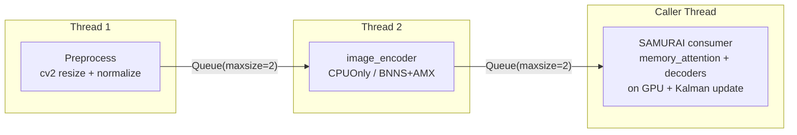

[[optimizing-samurai-part-2|Part 2]] ended at 97 FPS on an RTX 4090 using TensorRT with mixed precision and cuda-python. That's 3x real-time on a desktop GPU. But the drone cinematography use case also needs to work on a MacBook in the field, where there's no NVIDIA GPU, no CUDA, and no TensorRT.

This post covers what happens when you take the same four ONNX modules and run them on an M1 Pro MacBook. The constraints are completely different: a unified memory architecture, three distinct compute units competing for work, and an ML runtime (CoreML) whose op coverage silently determines whether your model runs fast or slow.

## Apple Silicon's ML stack

Before diving in, a quick orientation for readers coming from the CUDA world.

Apple Silicon chips (M1, M2, M3, M4 and their Pro/Max/Ultra variants) have three types of compute hardware that can run ML workloads:

- **CPU**: standard ARM cores, but with Apple's AMX (Apple Matrix eXtend) coprocessor and [BNNS](https://developer.apple.com/documentation/accelerate/bnns) (Basic Neural Network Subroutines) via the Accelerate framework. These are not just "fallback" cores; Apple has heavily optimized this path.
- **GPU**: Apple's integrated GPU, accessed via Metal. Good at large parallelizable operations (convolutions, large matrix multiplies).
- **Neural Engine (ANE)**: a dedicated ML accelerator, designed for 16-bit inference on specific graph patterns. Fast when your model fits its constraints; useless when it doesn't.

All three share a single unified memory pool. There's no PCIe transfer cost between CPU and GPU memory because there's no separate GPU memory. The cost comes instead from *dispatch overhead*: handing work to a compute unit and collecting the result.

[CoreML](https://developer.apple.com/documentation/coreml) is Apple's ML framework that decides which compute unit handles which operation. ONNX Runtime's [CoreML Execution Provider](https://onnxruntime.ai/docs/execution-providers/CoreML-ExecutionProvider.html) bridges ONNX models to CoreML: at session init, it compiles supported ONNX subgraphs into CoreML programs. Unsupported ops stay on ORT's CPU kernels. The boundary between "CoreML-supported" and "not supported" becomes the critical optimization surface.

## The 41% regression

My first attempt was straightforward. The ONNX bundle from Part 1, the CoreML EP, default settings:

```python
import onnxruntime as ort

session = ort.InferenceSession(
    "image_encoder.onnx",
    providers=["CoreMLExecutionProvider"]
)
```

The result:

| EP | mIoU | p50 ms | FPS |
|---|---|---|---|
| CPU | 0.9203 | 258.2 | **3.87** |
| CoreML (default) | 0.9202 | 438.9 | 2.28 |

CoreML was **41% slower than pure CPU**. Same model, same Mac, worse performance by enabling the hardware accelerator.

The ORT session-init logs tell the story. During graph partitioning, ORT prints which nodes CoreML claimed:

```
[CoreML] Supported 136/1495 nodes (9.1%) in memory_attention
[CoreML] Supported 5/29 nodes (17.2%) in prompt_encoder
```

Only 9% of `memory_attention` nodes run on CoreML. The rest fall back to ORT's CPU kernels. But the real cost isn't the fallback ops themselves. It's the **partition boundaries**: each time execution crosses from a CoreML subgraph to a CPU subgraph (or back), tensors must be copied between CoreML's internal format and ORT's format. With 24 partitions in `memory_attention`, that's 23 boundary crossings per frame. The copy overhead dominated any kernel speedup.

My initial conclusion: ship CPU EP as the Mac default, revisit CoreML later. That conclusion was wrong.

## The breakthrough: one runtime flag

The default CoreML configuration uses the legacy `NeuralNetwork` container format, which dates back to CoreML 1 and has narrow op coverage for transformer-style attention. FP16 batched MatMul, Gemm, and several reshape variants are rejected, forcing the graph into dozens of fragments.

[MLProgram](https://coremltools.readme.io/docs/model-intermediate-language), introduced in CoreML 5 (iOS 15 / macOS 12), is the modern container format with substantially wider op coverage. Switching to it is a single provider option:

```python
session = ort.InferenceSession(
    "memory_attention.onnx",
    providers=[("CoreMLExecutionProvider", {
        "ModelFormat": "MLProgram",
        "MLComputeUnits": "CPUAndGPU",
    })]
)
```

The effect on `memory_attention`:

| CoreML format | Partitions | Nodes claimed | p50 ms |
|---|---|---|---|
| NeuralNetwork (default) | 24 | 136/1495 (9%) | 320 |
| **MLProgram** | **13** | **509/549 (93%)** | **77** |

Coverage jumps from 9% to 93%. Partitions drop from 24 to 13. Latency falls 4x. The reason: the legacy NeuralNetwork format rejects FP16 batched MatMul/Gemm operations, triggering 987 `Cast` (fp16 to fp32 and back) events at partition boundaries. MLProgram supports those operations natively, so the entire attention block runs end-to-end on CoreML without intermediate precision conversions.

The `MLComputeUnits=CPUAndGPU` setting skips the Neural Engine, which has even stricter dtype/shape constraints than the GPU path. For transformer attention, the GPU path is better. More on compute unit selection later.

End-to-end result:

| Config | mIoU | p50 ms | FPS |
|---|---|---|---|
| CPU EP | 0.9203 | 258 | 3.87 |
| CoreML NeuralNetwork (old default) | 0.9202 | 439 | 2.28 |
| **CoreML MLProgram + CPUAndGPU** | **0.9084** | **136** | **7.36** |

1.9x faster than CPU, 3.2x faster than the old CoreML default. Small mIoU drop (−0.012) from FP16 GPU numerics, well above the 0.85 acceptance bar. The one cost: ~13 seconds of one-time session initialization while CoreML compiles the MLProgram subgraph. Fine for a long-running tracking service; noticeable for quick scripts.

> [!note]
> An initial measurement showed 183 ms / 5.46 FPS for this configuration. That turned out to be thermal throttling. After letting the Mac stabilize and re-running with a longer benchmark window, the true number was 136 ms / 7.36 FPS.

## Where the time goes

With MLProgram defaults, per-stage profiling reveals:

| Stage | p50 ms | % of frame |
|---|---|---|
| Preprocess (resize + normalize) | 6.5 | 4.8% |
| image_encoder | 36.6 | 27.1% |
| prompt_encoder | 0.7 | 0.5% |
| **memory_attention** | **75.2** | **55.7%** |
| mask_decoder | 5.9 | 4.4% |
| memory_encoder | 3.8 | 2.8% |
| Python overhead | 3.3 | 2.5% |
| **Total** | **134.9** | |

`memory_attention` is still 56% of the frame. That's where to focus. The Python overhead is only ~10 ms: no big hidden tax, unlike the CUDA pipeline in Part 2 where preprocessing was 40% of total time.

One module surprise: `memory_encoder` under CoreML MLProgram was **5.75x faster** than CPU EP (2.1 ms vs 12.3 ms). The unsung hero, and a sign that CoreML's GPU path handles feed-forward convolution blocks extremely well.

## ONNX surgery: the pattern matters more than the op

Part 2 had the TensorRT FP16 Softmax bug. CoreML has its own version of the same lesson: **how PyTorch traces your model to ONNX determines whether CoreML can fuse or must fragment.**

### Gather to Split/Squeeze

The rotary position embedding (RoPE) code in `memory_attention` indexes a pair tensor like this:

```python
# Original PyTorch code
xq_pair = xq.reshape(*xq.shape[:-1], -1, 2)
xq_real = xq_pair[..., 0]  # real part
xq_imag = xq_pair[..., 1]  # imaginary part
```

How do you find what this becomes in ONNX? Open the exported `.onnx` in [Netron](https://netron.app/) and trace the graph from the RoPE reshape. You'll see that `torch.onnx.export` lowers `xq_pair[..., 0]` to a `Gather` node:

```
# What Netron shows for this indexing pattern:
Gather(data=xq_pair, indices=0, axis=-1)
  → output shape: [batch, seq, heads, dim/2]
```

Then cross-reference against ORT's session-init log:

```
[CoreML] Node 'Gather_142' is not supported: 
  Gather with scalar index on last axis not supported for MLProgram
```

CoreML MLProgram refuses that combination (scalar int64 index on the last axis with variable batch dimensions), creating a partition seam right in the middle of the attention block.

The fix is a one-line change in the model code before re-export:

```python
# Fixed: Split instead of Gather
xq_pair = xq.reshape(*xq.shape[:-1], -1, 2)
xq_real, xq_imag = torch.unbind(xq_pair, dim=-1)
```

`torch.unbind` lowers to ONNX `Split` + `Squeeze` (visible in Netron as two nodes instead of one `Gather`). Both are fully supported by CoreML MLProgram.

The numbers tell an interesting story. The trace showed `Gather` ops costing only ~9 ms/frame directly. But removing them let CoreML fuse longer contiguous partitions, saving **30 ms** of boundary overhead. The indirect partition cost was 3x the direct op cost.

| Metric | Before (Gather) | After (Split/Squeeze) |
|---|---|---|
| mIoU | 0.9084 | 0.9085 |
| p50 ms | 135.8 | **99.3** |
| FPS | 7.36 | **10.08** |
| memory_attention ms | 75.2 | **45.4** |

### ScatterND to Split/Concat

The same RoPE code has a slice-assignment pattern:

```python
# Original: slice-assignment
k[:, :, :num_k_rope] = apply_rotary_enc(k[:, :, :num_k_rope], ...)
```

In Netron, this shows up as a `ScatterND` node with a symbolic-length int64 index tensor (the `:num_k_rope` slice generates a dynamic index range). ORT's CoreML EP logs confirm:

```
[CoreML] Node 'ScatterND_89' is not supported:
  ScatterND with symbolic index dimensions not supported
```

CoreML refuses the symbolic index dimension.

The fix: replace the in-place slice-assignment with an explicit split, transform, and concatenate:

```python
# Fixed: split → transform → concat
k_rope, k_pass = k.split([num_k_rope, k.shape[2] - num_k_rope], dim=2)
k_rope = apply_rotary_enc(k_rope, ...)
k = torch.cat([k_rope, k_pass], dim=2)
```

The ONNX node count dropped from 1322 to **950** (−372 nodes). Only 8 `ScatterND` nodes were removed directly, but their removal let the ONNX optimizer fuse 364 other nodes that had been trapped at partition boundaries. The optimizer couldn't see through the partition seams before.

Combined with the Gather fix, `memory_attention` went from the biggest bottleneck (75 ms) to a manageable 35 ms.

## The compute-unit surprise

After the ONNX surgery, I ran a per-module compute-unit sweep on `image_encoder` (the new bottleneck at 33.8 ms):

| Config | p50 ms | Partitions |
|---|---|---|
| ORT CPU EP (reference) | 75.18 | N/A |
| MLProgram + ALL (CPU+GPU+ANE) | 30.55 | 17 |
| MLProgram + CPUAndNeuralEngine | 29.63 | 17 |
| MLProgram + CPUAndGPU (shipped default) | 44.07 | 17 |
| **MLProgram + CPUOnly** | **23.74** | **17** |

Three things I didn't expect:

**1. CPUAndGPU was the worst CoreML config for image_encoder.** The evidence: `CPUOnly` (23.7 ms) beats `CPUAndGPU` (44.1 ms) by nearly 2x, yet both run the same CoreML-compiled graph with identical partition counts. The only difference is which hardware executes the kernels. The ViT encoder has 12 attention blocks, each with LayerNorm, GELU, and small per-head matmuls. That's ~60 individual Metal dispatches per forward pass, each paying a fixed GPU command-buffer submission cost. For operations this small, the dispatch overhead exceeds the GPU's compute advantage over the CPU's AMX path. You can see this in Instruments (Metal System Trace): the GPU utilization is only ~15% with most time spent in command submission.

**2. CoreML CPUOnly crushed ORT's CPU EP: 24 ms vs 75 ms (3.2x faster).** Same CPU, same operations, dramatically different performance. CoreML's CPUOnly path uses Apple's [BNNS](https://developer.apple.com/documentation/accelerate/bnns) (Basic Neural Network Subroutines) and AMX coprocessor through the Accelerate framework. These are hand-tuned for Apple Silicon's specific microarchitecture (cache line sizes, vector widths, memory controller behavior). ORT's CPU kernels are portable C++ targeting generic x86/ARM, so they can't exploit these hardware-specific paths.

**3. All four configs have identical partitioning** (17 partitions, 92% on CoreML). The performance difference is purely about which hardware backend executes the CoreML subgraphs, not about op coverage.

The production fix: a per-module compute-unit override. `image_encoder` gets `CPUOnly`, everything else keeps `CPUAndGPU`:

```python
from onnxruntime import InferenceSession

def create_session(model_path, module_name):
    # Per-module compute unit selection
    compute_units = {
        "image_encoder": "CPUOnly",      # BNNS/AMX path
        "memory_attention": "CPUAndGPU",  # GPU handles attention well
        "mask_decoder": "CPUAndGPU",
        "memory_encoder": "CPUAndGPU",
        "prompt_encoder": "CPUAndGPU",
    }

    return InferenceSession(
        model_path,
        providers=[("CoreMLExecutionProvider", {
            "ModelFormat": "MLProgram",
            "MLComputeUnits": compute_units.get(module_name, "CPUAndGPU"),
        })]
    )
```

Stacked result: 10.08 → **15.94 FPS**. The `image_encoder` alone went from 44 ms to 24 ms.

## Pipelining: why threading works here

On an NVIDIA GPU, pipelining ORT sessions across Python threads is pointless. All sessions share a single CUDA stream by default; the GPU serializes their kernel launches regardless of how many threads you use. You'd need multi-stream execution with explicit synchronization, which is its own complexity.

On Apple Silicon, threading actually works. The three compute units (CPU/BNNS, GPU, ANE) are physically separate hardware. When `image_encoder` runs on BNNS/AMX (CPUOnly) and `memory_attention` runs on the GPU (CPUAndGPU), they execute on different silicon. Two Python threads calling two ORT sessions map to genuinely concurrent computation.

ORT releases the GIL during `session.run()`, so standard `threading.Thread` is sufficient. No need for Python 3.13's free-threaded interpreter.

The architecture: three stages connected by two bounded queues:



Each queue holds at most 2 frames. This bounds memory usage and provides enough buffering to absorb per-frame jitter without unbounded growth.

I tested five variants to understand the design space:

| Variant | FPS p50 | mIoU | Notes |
|---|---|---|---|
| Sequential | 15.39 | 0.9041 | No concurrency. One frame at a time. |
| Threaded (1-buffer) | 25.28 | 0.9041 | 2 stages, `Queue(maxsize=1)`. Producer blocks if consumer is slow. |
| Asyncio | 26.39 | 0.9041 | Same 2-stage split but with `asyncio.Queue`. Similar to threads since the real work is in ORT (C++, GIL released). |
| Threaded (2-buffer) | 26.51 | 0.9041 | 2 stages, `Queue(maxsize=2)`. Extra buffer absorbs variance but doesn't add a pipeline stage. |
| **3-stage** | **31.24** | **0.9041** | 3 stages, 2 queues. Preprocess, encoder, consumer each run independently. |

The key insight: the asyncio variant performs nearly identically to threads because ORT releases the GIL during `session.run()`. The actual computation happens in C++/Metal, so Python's concurrency model (threads vs asyncio) barely matters. What does matter is the number of pipeline stages.

The 3-stage variant wins because splitting preprocess into its own stage frees the image_encoder thread from blocking on cv2/numpy work. Queue wait time dropped to 0.01 ms, meaning the consumer (stage 3) is the bottleneck and the encoder is always one frame ahead. That's exactly the right regime: the pipeline is balanced enough that no stage is idle.

Production validation (250-frame clip, `person-1`):

| Metric | Sequential | Pipelined |
|---|---|---|
| FPS p50 | 14.05 | **29.64** |
| Wall FPS | 13.28 | **28.06** |
| p95 ms | 93.64 | **38.34** |
| mIoU | 0.9087 | **0.9087** |

Bit-exact mIoU parity. The p95 improvement is notable: pipelining doesn't just raise throughput, it **smooths per-frame jitter** because a slow frame in one stage is hidden by the buffer in the next. p95 dropped from 94 ms to 38 ms.

> [!info]
> The spike's 31.24 FPS slipped to 29.64 in production due to per-call `ThreadPoolExecutor` construction and dataclass bookkeeping. Under 1 ms per frame of overhead, well worth it for the clean `Iterator[TrackingResult]` API.

Pipelining is enabled by default for `mac_silicon` and disabled for CUDA/TRT (where it adds queue overhead with no concurrency win).

## Where we landed

The full trajectory on Apple Silicon:

| Configuration | FPS p50 | mIoU | vs CPU |
|---|---|---|---|
| CoreML NeuralNetwork (starting point) | 2.28 | 0.9202 | 0.59x |
| ORT CPU EP | 3.87 | 0.9203 | 1.00x |
| MLProgram + CPUAndGPU | 7.36 | 0.9084 | 1.90x |
| + Gather → Split/Squeeze re-export | 10.08 | 0.9085 | 2.60x |
| + Per-module CPUOnly + ScatterND fix | 15.94 | 0.9087 | 4.12x |
| **+ 3-stage pipelined streaming** | **29.64** | **0.9087** | **7.66x** |

13x over the CoreML starting point. 7.66x over CPU. Same mIoU throughout.

### Cross-platform comparison

| Platform | FPS | Precision | Runtime |
|---|---|---|---|
| Apple Silicon (this post) | **28** wall | FP16 | ORT CoreML EP, pipelined |
| RTX 4090 (Part 2) | **97** | Mixed FP16/FP32 | Raw TRT + cuda-python |

Both exceed the 30 FPS real-time bar (with Apple Silicon sitting right at the boundary). The RTX 4090 is 3.5x faster in raw throughput, but Apple Silicon's 28 FPS is achieved on laptop hardware with no discrete GPU, no external power supply, and no CUDA dependency.

### What the CoreML journey teaches

The optimization surface on Apple Silicon is fundamentally different from CUDA:

1. **Op coverage, not kernel speed.** The dominant cost factor was partition fragmentation, not individual kernel performance. Fixing two ONNX patterns (`Gather` and `ScatterND`) yielded more speedup than any runtime configuration change.
2. **The right format flag matters more than the right hardware.** Switching from `NeuralNetwork` to `MLProgram` was a bigger win (3.2x) than any of the ONNX graph changes.
3. **CPU can beat GPU.** On Apple Silicon, the CPU path (via BNNS/AMX) can outperform GPU dispatch for graphs with many small operations. Per-module compute-unit selection is essential.
4. **Threading works because the hardware is heterogeneous.** Unlike a single CUDA GPU, Apple Silicon's physically separate compute units enable real concurrent execution from plain Python threads.

**Next up**: Part 4 drops Python entirely and rebuilds the pipeline in Rust with `ort` (the Rust ONNX Runtime bindings), targeting both platforms from a single codebase.

> [!tip] Full series
> [[optimizing-samurai-part-1|Part 1: ONNX Export]] → [[optimizing-samurai-part-2|Part 2: CUDA & TensorRT]] → **Part 3: CoreML** → Part 4: Rust (upcoming)
>
> For the research context behind the model choice, see [[long-term-visual-tracking-2026|Long-Term Visual Tracking for Drones (2026)]].

---

## References

- [CoreML documentation](https://developer.apple.com/documentation/coreml)
- [ORT CoreML EP docs](https://onnxruntime.ai/docs/execution-providers/CoreML-ExecutionProvider.html)
- [MLProgram / Core ML Intermediate Language](https://coremltools.readme.io/docs/model-intermediate-language)
- [BNNS (Accelerate framework)](https://developer.apple.com/documentation/accelerate/bnns)
- [EfficientTAM](https://github.com/yformer/EfficientTAM)
