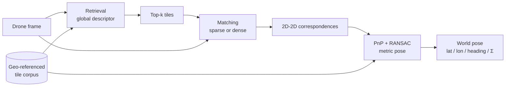
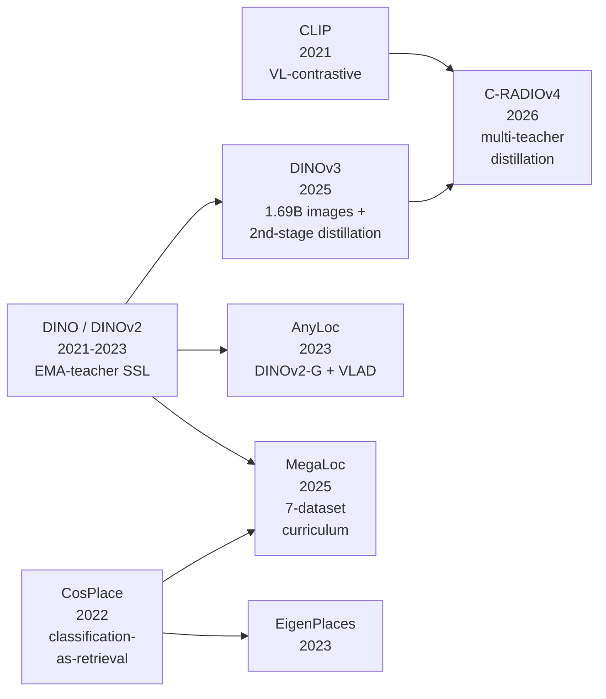
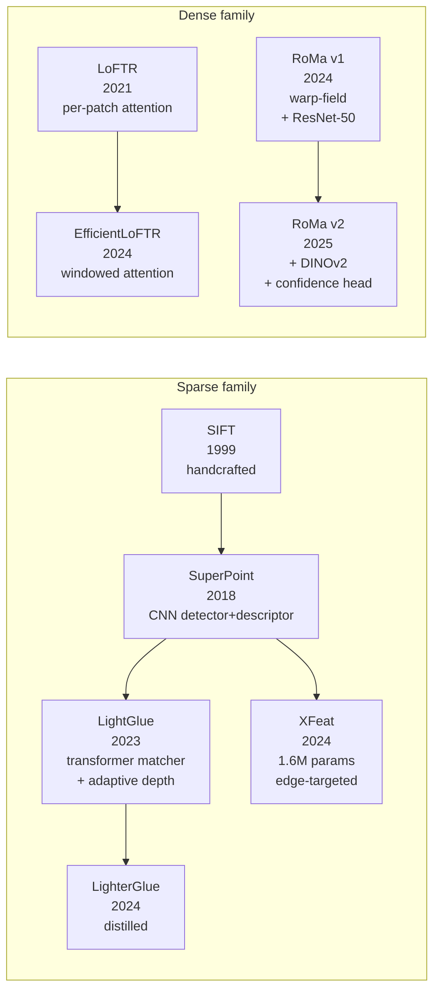
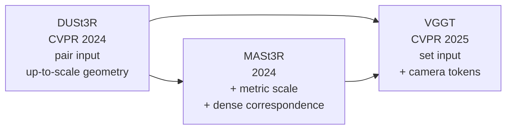
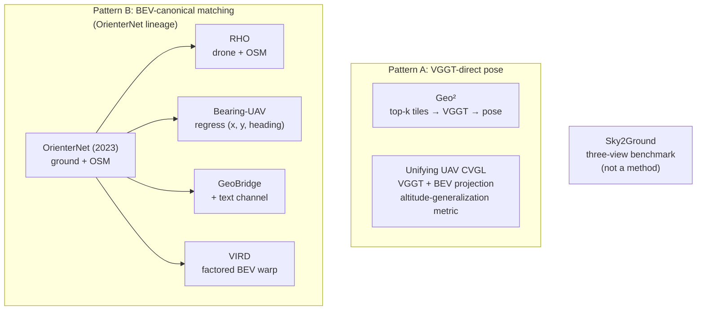

Cross-view visual geo-localization is the task of taking an image captured from a drone, matching it against a corpus of pre-loaded satellite or aerial tiles, and producing a world-frame pose: latitude, longitude, heading, ideally with calibrated uncertainty. Done well, it provides an absolute position anchor that does not drift, does not depend on GPS, and works in any environment where the ground is visible from above.

It is a problem that sits at the intersection of three communities that do not always talk to each other: the cross-view retrieval and matching literature (CVPR, ICCV, ECCV), the SLAM and visual-inertial navigation community (IROS, ICRA, RSS), and the practical drone autopilot ecosystem (PX4, ArduPilot, MAVLink). Each community has its own assumptions, vocabulary, and reference datasets, and the gap between "publishable result on a benchmark" and "deployable component on a Jetson Orin" is still substantial.

I spent the first half of May 2026 surveying this space. A lot of the most relevant signal turned out to be in CVPR 2026 papers from the previous two months, in NVIDIA Isaac ROS release notes from April, and in the quiet abandonment of formerly-promising open-source projects. This post is the survey, organized into seven sections: the problem definition and the canonical pipeline, the production industry state, the academic frontier, adjacent fields with reusable architecture, the engineering "boring layer" that is already standardized, edge-inference reality on real hardware, and a discussion of the most promising tools and the most consequential gaps.

If you are considering work in this area, treat this post as a starting bibliography rather than a finished position. Every claim links to primary source. Where I make a judgment call, I flag it.

> [!info] Scope and timing
> All claims are as of May 2026. Several CVPR 2026 papers cited here only appeared on arXiv in March or April. The field is moving fast enough that some of this will be stale by Q4 2026.

> [!info] Quick glossary (skim if any of these are unfamiliar)
> - **CVGL (Cross-View Geo-Localization)**: predicting where a drone-eye image was taken by matching it against satellite or aerial tiles of the same area.
> - **VPR (Visual Place Recognition)**: the retrieval step. Given a query image, return the top-$k$ most similar tiles from a large corpus, without yet computing a precise pose.
> - **Pose**: position $(x, y, z)$ plus orientation. **3-DoF pose** is $(x, y, \mathrm{heading})$, enough for a drone hovering at known altitude. **6-DoF pose** adds full orientation.
> - **Backbone / feature extractor**: a pretrained CNN or ViT (DINOv2, DINOv3, ResNet-50, ConvNeXt) that turns a raw image into a dense feature map; the rest of the pipeline operates on those features rather than on pixels.
> - **Matcher**: a model that finds pixel-level correspondences between two images, typically by reasoning over the backbone features. Sparse matchers (LightGlue, XFeat) match a few hundred keypoints; dense matchers (LoFTR, RoMa, MASt3R) produce a correspondence at every pixel.
> - **PnP / RANSAC**: Perspective-n-Point + Random Sample Consensus. The classical algorithms that turn 2D-2D correspondences plus a 3D model into a 6-DoF camera pose, robust to outlier matches.
> - **BEV (Bird's-Eye-View)**: a synthesised top-down rasterization. Many drone CVGL methods lift their drone frame into BEV first because matching against a satellite tile is well-posed in BEV but a mess in the original perspective.
> - **VGGT / DUSt3R / MASt3R**: the recent foundation-3D models. They take a pair (or set) of images and regress dense pixel-aligned 3D structure plus camera poses in one forward pass, replacing the classical detect-match-triangulate pipeline.
> - **R@K (Recall at K)**: a retrieval metric. Fraction of queries where the correct tile appears in the top-$K$ retrieved results.
> - **Covariance / Mahalanobis ECE**: how the pose's uncertainty is reported, and how it is evaluated. A pose with a $6\times 6$ covariance that overstates confidence is dangerous in a fused estimator; the ECE on Mahalanobis residuals measures whether the reported uncertainty matches the true error distribution.

## 1. The problem and the canonical pipeline

Before the names and benchmarks, it helps to be concrete about what this localizer actually has to do. The drone hands it a frame (downward-looking or forward-oblique). A pre-loaded corpus of geo-referenced overhead imagery sits on disk: [Sentinel-2](https://sentinels.copernicus.eu/web/sentinel/missions/sentinel-2) at 10 m/pixel, [NAIP](https://www.fsa.usda.gov/programs-and-services/aerial-photography/imagery-programs/naip-imagery/) at 60 cm/pixel, or [Maxar Vivid](https://www.maxar.com/products/vivid-basic) at 30 cm/pixel, depending on coverage and budget. The localizer matches the drone frame against the corpus and returns a world-frame pose, one fix per query frame, somewhere between 1 Hz and 10 Hz depending on model and hardware.

The canonical pipeline the open-source community has converged on is a two-stage retrieve-then-match pattern, with a third stage for metric pose:

> [!info] Background: the three boxes formally
> Each box in the diagram is a separate learnable or solvable subproblem with a standard formulation. Worth pinning down once so the per-method sections below have something to point at.
>
> **Retrieval** computes a global descriptor $\phi(I) \in \mathbb{R}^d$ for a drone frame $q$ and each candidate tile $t_i$, then ranks tiles by cosine similarity:
>
> $$ s(q, t_i) = \frac{\langle \phi(q), \phi(t_i)\rangle}{\|\phi(q)\| \, \|\phi(t_i)\|} $$
>
> **Matching** lifts the top-$k$ tiles to dense or sparse 2D-2D correspondences between drone pixels and tile pixels.
>
> **Pose solving** runs Perspective-n-Point with RANSAC on those correspondences, minimizing reprojection error:
>
> $$ \min_{R, t} \sum_i \rho\big(\| \pi(R X_i + t) - x_i \|^2\big) $$
>
> where $\pi$ is the camera projection and $\rho$ a robust loss that suppresses outliers. The 2025-2026 papers below attack each of those three boxes (and a few new ones, like end-to-end pose regression that skips PnP entirely).

The three stages, in current best-practice form:

1. **Retrieval.** A global image descriptor is computed for the drone frame and matched against pre-computed descriptors of all candidate tiles. The top-k tiles, typically k between 5 and 20, are passed downstream. Until early 2025 this layer was dominated by [AnyLoc](https://anyloc.github.io/), [EigenPlaces](https://github.com/gmberton/EigenPlaces), and [CosPlace](https://github.com/gmberton/CosPlace). Since February 2025 [MegaLoc](https://github.com/gmberton/MegaLoc) (arXiv:[2502.17237](https://arxiv.org/abs/2502.17237)) has displaced most of the older candidates as a single drop-in.
2. **Matching.** Dense or sparse correspondences are established between the drone frame and the retrieved tile(s). Sparse stacks use [XFeat](https://github.com/verlab/accelerated_features) (CVPR 2024) or [DISK](https://github.com/cvlab-epfl/disk) as the feature extractor, and [LightGlue](https://github.com/cvg/LightGlue), or its faster distilled variant LighterGlue, as the matcher. Dense stacks use [LoFTR](https://github.com/zju3dv/LoFTR), [EfficientLoFTR](https://github.com/zju3dv/EfficientLoFTR) (CVPR 2024), or [RoMa](https://github.com/Parskatt/RoMa). The output is a set of 2D-to-2D correspondences with confidence scores.
3. **Metric pose.** The correspondences are lifted to 3D using the tile's georeferencing, and a PnP solver with RANSAC produces a 3-DoF (x, y, heading) or 6-DoF pose with covariance. Most practitioners use [pycolmap](https://github.com/colmap/pycolmap) or OpenCV's `solvePnPRansac`.

Foundation-3D models such as [VGGT](https://github.com/facebookresearch/vggt) (CVPR 2025) and the family of papers that grew out of it in CVPR 2026 collapse stages 2 and 3 into a single feed-forward pass. That architectural shift is the main thing the field is currently absorbing, and it is the reason a 2025-era sparse-feature library and a 2026-era foundation-3D library look almost nothing alike.

The same primitive ends up powering very different deployment shapes. A few worth keeping in mind, because they pull the design in different directions:

- **Filmmakers** want an absolute anchor for orbits, reveals, and sweeping cinematic moves over terrain where GPS is denied (canyons, dense tree canopy, urban high-rise) or jittery (multipath in cities).
- **Search-and-rescue teams** want to localize a drone over canyon walls and tree canopy where satellite GPS is obstructed.
- **Agricultural surveyors and infrastructure inspectors** want repeatable flight lines and consistent mapping coordinates across multi-flight missions.
- **Autonomous-vehicle teams** want high-precision urban localization without depending on RTK base stations.

Same primitive, very different deployment shapes. The rest of this post inventories what is actually available in each layer.

## 2. Academic frontier

The 2025-2026 academic state of the art in CVGL splits cleanly into four families of methods that compose into pipelines. The order they appeared in time, and the order this section walks through them, is the same: **backbones** (general visual feature extractors), **matchers** (correspondences between two images given backbone features), **foundation-3D models** (collapse the matcher + pose-solver into one feed-forward), and **CVGL systems** that compose all three into an actual drone-to-satellite pipeline. A fifth family, **calibrated uncertainty**, wraps any of the above to make the output usable for autopilot fusion.

Within each family there is a visible lineage: methods build on earlier methods in the same family, mostly by swapping one component or adding one head. The diagrams below show those lineages explicitly. The per-method writeups assume the family's shared mechanism is already explained and only describe what each method adds.

### Backbones: the self-supervised lineage

Backbones turn a raw RGB image into a dense feature map. Everything downstream (retrieval, matching, foundation-3D) operates on those features rather than on pixels. The dominant 2026 backbones all descend from one architectural recipe.

**Shared mechanism: EMA-teacher self-supervised pretraining.** The DINO family trains without any labels by setting up two copies of the same network: a *student* that sees one augmented crop of an image, and a *teacher* whose weights are an exponential moving average of the student's. The student is trained to match the teacher's output features (both the global [CLS] token and per-patch tokens) on a *different* augmented crop of the same image. With enough scale, this teaches the student to produce features that are invariant to augmentation but sensitive to scene content, which transfers to almost every downstream visual task. The features land in a ViT or ConvNeXt backbone and can be pooled to a global descriptor for retrieval, used per-patch for dense matching, or fed into a foundation-3D model.

Two retrieval-specific recipes sit on top of this:

- **Classification-as-retrieval** (CosPlace, EigenPlaces, MegaLoc): treat each tile in the training corpus as its own class, train a large softmax classifier on top of the backbone, then discard the classifier at inference and use the trunk's pooled descriptor (L2-normalized, cosine-ranked). No triplets, no contrastive pairs.
- **VLAD aggregation** (AnyLoc): pool the backbone's per-patch features into a much larger global descriptor by clustering + residual encoding. More expressive but heavier.

The 2026 backbones in actual use, as deltas against this shared recipe:

**[AnyLoc](https://anyloc.github.io/) (2023)** = DINOv2-G/1B + NetVLAD aggregation. Strong but heavy; superseded as a default by MegaLoc.

**[CosPlace](https://github.com/gmberton/CosPlace) (2022) / [EigenPlaces](https://github.com/gmberton/EigenPlaces) (2023)** introduced classification-as-retrieval over a ResNet-50 trunk. Still solid small-budget baselines; CosPlace's head design is what MegaLoc inherits.

**[MegaLoc (Berton et al., CVPR-W 2025)](https://arxiv.org/abs/2502.17237)** = CosPlace head + multi-dataset curriculum. The delta is the training data: the union of seven public VPR datasets (SF-XL, Pitts, MSLS, Tokyo, AmsterTime, GSV-Cities, plus cross-view aerial-ground pairs), with a per-batch sampler rotation that lets each dataset's geometry contribute to the gradient without one dominating. Result: SOTA on each set individually, including the cross-view benchmarks the older single-dataset models were not even evaluated on. Code is one `torch.hub.load("gmberton/MegaLoc", "get_trained_model")` line and is the May 2026 default for the retrieval box.

![[blog/assets/research-passes/v3/megaloc-pipeline.png|600]]
*Figure 1: MegaLoc training pipeline, mixing seven datasets per batch with dataset-specific samplers. (Image source: [Berton et al., 2025](https://arxiv.org/abs/2502.17237))*

**[DINOv3 (Oquab et al., Meta, August 2025)](https://ai.meta.com/blog/dinov3/)** = DINOv2 scaled up *and* distilled down. The 7B teacher is the first SSL backbone trained on 1.69B images. The actually-useful delta over DINOv2 is the small variants: instead of training small models from scratch with the EMA-teacher loop (which under-performs at sub-100M params, the lesson from DINOv2), DINOv3 takes the trained 7B teacher and does a *second-stage* distillation into ConvNeXt T/S/B/L (29-198M) and ViT-S/B by matching the teacher's [CLS] and per-patch features on the full corpus. That second stage is what closes the accuracy gap at <100M params; it is the same mechanism C-RADIOv4 uses below with multiple teachers.

For this domain, Meta released both **web-pretrained (LVD-1689M)** and **satellite-pretrained (SAT-493M)** weights. The satellite variant of ConvNeXt-T sees the same image statistics as the drone-to-satellite problem. Surprisingly little of the 2026 CVGL literature has caught up to using SAT-493M as a backbone; the work I have seen still uses MegaLoc or AnyLoc on top of DINOv2 weights.

> If I had to bet on one cheap experiment in this space, it is "MegaLoc head on top of DINOv3 ConvNeXt-T (SAT-493M weights) for drone-to-satellite". Half a weekend of work, possibly the new state of the art for the on-Orin segment.

**[C-RADIOv4 (NVIDIA, January 2026)](https://github.com/NVlabs/RADIO)** takes the DINOv3 second-stage distillation idea and applies it with *three teachers in parallel*: a vision-language model (SigLIP2-g), an SSL model (DINOv3-7B), and a segmentation model (SAM3), all distilled into one ViT-B/L student. The student has three small projection heads (one per teacher) trained with cosine-similarity feature-level losses at each teacher's native granularity: pooled [CLS] for SigLIP2-g (vision-language alignment is global), per-patch for DINOv3 (SSL features are dense), segmentation-conditioned per-pixel for SAM3 (boundary precision). At inference the projection heads are discarded and the student is a drop-in backbone. For CVGL the relevance is that the same forward pass that produces the retrieval descriptor also yields a segmentation prior and a vision-language signal, which is the combination a retrieve-and-segment cross-view pipeline wants. NVIDIA commercial license; usable in research and on NVIDIA hardware.

| Backbone | Year | Params | License | Orin real-time? | Notes |
|---|---|---|---|---|---|
| [AnyLoc](https://anyloc.github.io/) | 2023 | DINOv2-G ~1B | MIT | No | Heavy; superseded by MegaLoc |
| [EigenPlaces](https://github.com/gmberton/EigenPlaces) | 2023 | ResNet-50 | MIT | Yes | Small-budget baseline |
| [CosPlace](https://github.com/gmberton/CosPlace) | 2022 | ResNet-50 | MIT | Yes | Predecessor of MegaLoc |
| [MegaLoc](https://github.com/gmberton/MegaLoc) | Feb 2025 | ResNet-50 | MIT | Yes | 2026 default |
| [DINOv3](https://ai.meta.com/blog/dinov3/) ConvNeXt-T | Aug 2025 | 29M | Meta | Yes | Satellite weights available, underused |
| [DINOv3](https://ai.meta.com/blog/dinov3/) ViT-7B | Aug 2025 | 7B | Meta | No | Workstation teacher only |
| [C-RADIOv4](https://github.com/NVlabs/RADIO) | Jan 2026 | ViT-B/L | NVIDIA commercial | Yes | 3-teacher distillation |

### Matchers: sparse and dense lineages

A matcher takes two images (plus, optionally, sparse keypoint sets) and returns 2D-2D correspondences with confidence. Two lineages, very different mechanisms.

The two families optimize different points on the speed-accuracy curve and serve different deployment tiers.

#### Sparse matchers (Orin-real-time tier)

**Shared mechanism.** A sparse front end (typically SuperPoint) detects ~1000-2000 keypoints per image and emits a per-keypoint descriptor. The matcher then reasons about pairs of descriptors to produce correspondences. The transformer-era pattern (LightGlue and its descendants) is: alternating self-attention within an image's descriptors + cross-attention across the pair, with positional information injected as *rotational* encoding on Q and K vectors so the network reasons about relative geometry without committing to absolute coordinates that would not transfer between images. The output is a soft assignment matrix with a learned "dustbin" column for unmatched features; mutual maxima above a threshold are the final correspondences.

**[SuperPoint (DeTone et al., 2018)](https://arxiv.org/abs/1712.07629)** is the de facto front end: one CNN with two heads, one emitting keypoint scores and one emitting per-pixel descriptors. Replaced handcrafted SIFT/ORB as the descriptor of choice once the transformer matchers landed.

**[LightGlue (Lindenberger et al., ICCV 2023)](https://arxiv.org/abs/2306.13643)** is the canonical transformer matcher and the one everything else is benchmarked against. The shared mechanism above is exactly LightGlue. Its deployment-distinguishing trick is *adaptive depth*: at each transformer layer two small confidence heads predict whether the matching has converged and which features are unlikely to have any match; the first triggers an early exit, the second prunes features from later layers. On easy pairs (drone forward flight over uniform terrain) it can finish after 2-3 of the 9 layers, buying 2-3x throughput at no accuracy cost; hard pairs (post-occlusion re-acquisition) still run the full depth.

![[blog/assets/research-passes/v3/lightglue-attention.png|600]]
*Figure 2: LightGlue alternates self- and cross-attention over the two image's local features, with a learned confidence head that triggers early-exit on easy pairs. (Image source: [Lindenberger et al., 2023](https://arxiv.org/abs/2306.13643))*

**LighterGlue** (same repo, 2024) is a distilled LightGlue at ~3x speed and matched accuracy on the easy regime.

**[XFeat (Potje et al., CVPR 2024)](https://arxiv.org/abs/2404.19174)** breaks the shared mechanism: instead of a SuperPoint front end + a heavy transformer matcher, XFeat is one 1.6M-parameter network that does both. A stack of depthwise-separable convolutions produces a 64-channel feature map at 1/8 resolution; one head emits per-pixel keypoint scores (NMS at inference picks ~4096 keypoints), one emits 64-D descriptors bilinearly sampled at the keypoints; matching is a small MLP scoring concatenated descriptor pairs. There is no transformer attention anywhere in the inference path, which is why XFeat plans cleanly in TensorRT on Jetson Orin Nano. The accuracy gap to LightGlue is modest on typical scenes and larger on extreme viewpoint changes; for drone-to-satellite that gap is absorbed by the downstream PnP + RANSAC.

![[blog/assets/research-passes/v3/xfeat-architecture.png|600]]
*Figure 3: XFeat architecture, with a 1.6M-parameter shared backbone feeding a detector head and a matching MLP. (Image source: [Potje et al., 2024](https://arxiv.org/abs/2404.19174))*

#### Dense matchers (workstation tier)

**Shared mechanism.** Dense matchers skip keypoint detection. Instead they produce a per-pixel correspondence between two images, typically by computing a cost volume over backbone features and refining coarse-to-fine. The two sub-lineages diverge on what runs over the cost volume: LoFTR uses transformer attention over patch tokens at 1/8 resolution then refines to pixel level; RoMa regresses a per-pixel *warp field* in a flow-style architecture with explicit confidence.

**[LoFTR (Sun et al., CVPR 2021)](https://arxiv.org/abs/2104.00680)** is the root: run full self/cross attention over every pair of tokens at 1/8 resolution, then a fine-resolution refinement lifts coarse matches to pixel precision. Accurate but slow (~10 FPS on RTX 4090) because attention is $O(N^2)$ in token count.

**[EfficientLoFTR (Wang et al., CVPR 2024)](https://github.com/zju3dv/EfficientLoFTR)** is one targeted change: group adjacent tokens into 4x4 windows, mean-pool each window to a summary token, run attention over the summary tokens only ($O((N/16)^2)$ cost), and broadcast back through the inverse pooling. The fine-resolution refinement is unchanged. Net: ~2x speed (~30 FPS on RTX 4090) at indistinguishable accuracy, because most of the LoFTR attention turned out to be redundant within local windows.

**[RoMa v2 (November 2025)](https://arxiv.org/abs/2511.15706)** takes a different architectural tack: coarse-to-fine warp-field regression. At the coarsest scale (1/16), a small transformer regresses an initial 2-D flow field between DINOv2 feature maps from the cost volume. That flow is upsampled and refined at 1/8, 1/4, 1/2, with each stage adding a correction delta and a per-pixel confidence. The v2 deltas over v1 are the DINOv2 backbone swap (was ResNet-50, lifting the semantic ceiling on extreme viewpoints) and the explicit confidence head supervised against geometric-consistency labels: at training time a pair of views with known relative pose constructs ground-truth correspondences, and pixels where the predicted match disagrees get a low confidence label. On a Jetson it runs at 1-2 Hz at best, so for drone deployment it sits in the offline / label-quality teacher role rather than the runtime matcher.

| Matcher | Year | Type | RTX 4090 | Orin real-time? | Notes |
|---|---|---|---|---|---|
| [LightGlue](https://github.com/cvg/LightGlue) | 2023 | Sparse | ~80 FPS | Yes | Adaptive depth |
| LighterGlue (same repo) | 2024 | Sparse (distilled) | ~200 FPS | Yes | ~3x LightGlue |
| [XFeat](https://github.com/verlab/accelerated_features) | CVPR 2024 | Sparse (lightweight) | ~150 FPS | Yes (explicit target) | 1.6M params, edge-first |
| [EfficientLoFTR](https://github.com/zju3dv/EfficientLoFTR) | CVPR 2024 | Semi-dense | ~30 FPS | 5-10 Hz | Bridge to dense |
| [RoMa v2](https://arxiv.org/abs/2511.15706) | Nov 2025 | Dense | ~5-10 FPS | No | Workstation only |

### Foundation-3D models: pair → set

**Shared mechanism.** All three foundation-3D models share one architectural skeleton. A ViT encoder produces patch tokens for each input image; a transformer with *cross-image* attention then mixes tokens across all inputs so each image's tokens see the others. Output heads decode different geometric quantities (per-pixel 3D points, per-pixel depth, per-pixel correspondences, camera pose) from those joint features. Training is supervised end-to-end with per-pixel L2 losses against synthetic and real datasets where 3D ground truth is known (Hypersim, BlendedMVS, Co3D, real MVS captures). The unifying insight is that cross-image attention learns "where am I in the other view" implicitly, which collapses the classical detect-match-triangulate pipeline into one feed-forward pass.

The three models are deltas in what they output and how many inputs they accept.

**[DUSt3R (Wang et al., CVPR 2024)](https://arxiv.org/abs/2312.14132)** is the root. Pair input only. Output: two per-pixel 3D-point maps, both expressed in the coordinate frame of image 1. Relative pose between the two views is recovered by a closed-form Procrustes alignment of the predicted points, with no explicit pose head. Depth is recovered up to an unknown global scale factor, which is the main limitation downstream pipelines have to work around. (The DUSt3R pipeline figure lives in [[2026-05-24-vio-drones-2026|the V2 post]] where this family is also covered.)

**[MASt3R (Leroy et al., 2024)](https://arxiv.org/abs/2406.09756)** adds two heads on top of DUSt3R. A *metric-scale head* trained on synthetic-rendered scenes (Hypersim, BlendedMVS) with known absolute scale gives depth in real-world meters; without this supervision the network is up-to-scale (the DUSt3R limitation). A *dense correspondence head* emits a per-pixel feature map for each image; the cross-product of the two feature maps is an $N \times M$ similarity matrix, and per-row argmax (confidence-filtered) yields one correspondence per pixel from image 1 to image 2. A scalar confidence per correspondence is also emitted, which downstream SLAM/VIO back ends use directly as an inverse-variance weight in the factor graph (see [[2026-05-24-vio-drones-2026|the V2 post]] for the MASt3R-Fusion recipe).

![[blog/assets/research-passes/v3/mast3r-pipeline.png|600]]
*Figure 4: MASt3R = DUSt3R + metric-scale head + dense correspondence head + per-correspondence confidence. Those are the two things a SLAM/VIO back end actually needs from a foundation-3D model. (Image source: [Leroy et al., 2024](https://arxiv.org/abs/2406.09756))*

**[VGGT (Wang et al., CVPR 2025)](https://arxiv.org/abs/2503.11651)** is the pair-to-set generalization. Cross-image attention runs over $N$ images instead of 2. The new architectural piece is *camera tokens*: $N$ learnable tokens, one per input image, are appended to the token stream and participate in both self- and cross-image attention; at the output they decode through small MLPs into per-image extrinsics + intrinsics. This gives the network a clean slot to read pose out from, sidestepping the need for an external PnP step. Per-pixel depth + confidence heads round out the output. Training combines per-pixel depth L2, multi-view reprojection consistency, and direct supervision on the camera tokens.

![[blog/assets/research-passes/v3/vggt-overview.png|600]]
*Figure 5: VGGT generalizes the pair to a set, with per-image camera tokens that decode directly to extrinsics. (Image source: [Wang et al., 2025](https://arxiv.org/abs/2503.11651))*

### CVGL systems: composing the family

Eight weeks after VGGT's camera-ready, a wave of CVPR 2026 papers landed that compose backbones + matchers + foundation-3D into actual drone-to-satellite pipelines. They fall into two recognizable patterns.

#### Pattern A: VGGT-direct pose

**Shared mechanism.** Concatenate drone image + candidate satellite tile into VGGT's input set ($N=2$). VGGT runs once, emitting per-image features, a shared 3D point cloud, per-pixel depths, and two camera-token outputs. The tile's extrinsic is the identity in the tile's geo-referenced frame; the drone's extrinsic relative to the tile is therefore the drone's pose in tile coordinates, which combined with the tile's known georeferencing gives the absolute world pose. There is no PnP, no RANSAC. Failure mode: VGGT's camera tokens are only well-conditioned when the input pair shares enough scene overlap; on a near-miss retrieval the extrinsic regression silently produces a wrong pose with high confidence, so a retrieval-quality gate is mandatory in front.

**[Geo² (arXiv:2603.25819)](https://arxiv.org/abs/2603.25819)** is the cleanest instantiation. Runs Pattern A in parallel for each of the top-$k$ retrieved tiles and picks the candidate with the lowest reprojection residual on VGGT's own dense correspondences. SOTA on CVUSA, CVACT, and VIGOR with the largest gain on cross-area splits where older sparse-feature pipelines overfit. License is CC-BY-NC-SA-4.0, research inspiration only for a deployable project.

**[Unifying UAV CVGL via 3D Geometric Perception (arXiv:2604.01747)](https://arxiv.org/abs/2604.01747)** is the drone-altitude specialization. Same VGGT call, but the output 3D point cloud is projected into a gravity-aligned BEV before retrieval and 3-DoF pose against a BEV satellite tile corpus. Evaluated on University-1652 with an altitude-generalization protocol. Useful negative evidence: this paper is the closest a public paper gets to "buildable drone CVGL library", so that design space has already been mapped.

#### Pattern B: BEV-canonical matching (OrienterNet lineage)

**Shared mechanism.** Lift the live drone image *and* the prior (satellite tile, OSM raster, or HD map) into a common canonical view at a fixed metric scale (typically 50 cm/pixel over a tile-sized area around the GPS prior), then recover pose by 3-DoF cross-correlation over $(x, y, \mathrm{heading})$: the BEV image feature map is convolved against the BEV prior feature map across every translation in the search window and every discrete heading rotation (typically 1° steps), producing a correlation volume; the argmax is the predicted pose. The whole pipeline is differentiable end-to-end, so the BEV-lifting encoders are trained against GPS-supervised ground-truth poses with the cross-correlation as the loss layer. The "BEV as canonical view" trick is what makes matching well-posed across modalities that share no pixels (raw ground photo vs OSM vector raster).

**[OrienterNet (Sarlin et al., CVPR 2023)](https://arxiv.org/abs/2304.02009)** is the root paper. Two parallel encoders: a U-Net that lifts a single ground image (with intrinsics) into BEV by predicting per-column depth + unprojecting, and a small CNN that embeds OSM-class rasters (road, building, water, grass) at the same BEV resolution. Pose recovery is the cross-correlation argmax described above. Apache-2.0 code, CC-BY-NC weights.

![[blog/assets/research-passes/v3/orienternet-overview.png|600]]
*Figure 6: OrienterNet lifts a single ground image into a neural BEV, then matches against an OSM raster around a coarse GPS prior to recover a 3-DoF pose. (Image source: [Sarlin et al., 2023](https://arxiv.org/abs/2304.02009))*

**[RHO (arXiv:2603.27758)](https://arxiv.org/abs/2603.27758)** is OrienterNet at drone altitude, with OSM vector geometry as the prior corpus. The advantage over satellite-tile matching is licensing and stability: OSM is permissively licensed at continental scale, and vector representations are invariant to lighting / season / re-imaging cadence. The disadvantage is that OSM coverage and accuracy varies by region. Code at [InSAI-Lab/RHO](https://github.com/InSAI-Lab/RHO).

**[Bearing-UAV (arXiv:2603.22153)](https://arxiv.org/abs/2603.22153)** drops the matching step from Pattern B entirely and regresses $(x, y, \mathrm{heading})$ directly from the drone image + a GPS prior. Most aggressive design claim of the cluster (that matching at altitude is a dead end). Trade-off: a regression model fails silently; the matching-then-correlation pipeline fails visibly (empty top-$k$, low correlation peak), which a downstream consumer can read. For safety-critical use the regression approach needs calibrated uncertainty bolted on. Ships a 90k-image multi-city benchmark.

**[GeoBridge (arXiv:2512.02697)](https://arxiv.org/abs/2512.02697)** adds a text channel to the BEV embedding: drone image + satellite tile + optional text ("urban intersection with roundabout") jointly embed for retrieval. Most useful when the corpus is large enough that visual-only retrieval has many near-duplicates; text disambiguates. Not obvious that the text channel survives in production where a deterministic visual-only pipeline is preferable. Code at [MiliLab/GeoBridge](https://github.com/MiliLab/GeoBridge).

**[VIRD (arXiv:2603.12918)](https://arxiv.org/abs/2603.12918)** improves the perspective-to-BEV warp itself. Instead of learning one monolithic warp end-to-end, VIRD factors it into separately-supervised horizontal and vertical axes (the *dual-axis transformation*), giving much better robustness to camera tilt. The mechanism is independent of the autonomous-driving setting it was published for and transfers cleanly to drones, where camera tilt at altitude is a real failure mode for single-warp methods.

#### Benchmark

**[Sky2Ground (arXiv:2603.13740)](https://arxiv.org/abs/2603.13740)** is not a method but a 51-site benchmark with simultaneous aerial + ground + satellite imagery. Covered in the Datasets subsection below. It earns a mention in the cluster because it is the public-benchmark side of the same 2026 wave.

> The cluster is one paper-idea per VGGT-downstream task. None individually surprise once you have read VGGT; the surprise is the speed of design-space colonization. Eight weeks from VGGT camera-ready to seven follow-up papers, in two recognizable patterns, is fast even by 2026 standards.

### Calibrated uncertainty

A retrieve-match-PnP pipeline returns a pose, but the pose is useless to a flight controller without a covariance and a health flag. This layer wraps any of the above to produce calibrated uncertainty, and it is the most often-ignored part of published cross-view papers.

> [!info] Background: Mahalanobis residuals and calibration plots
> The standard way to check whether a pose's uncertainty is honest is per-axis calibration plots (also called reliability diagrams) plus Expected Calibration Error on Mahalanobis-normalized residuals.
>
> Given a predicted mean $\mu$ and covariance $\Sigma$ from the localizer and a ground-truth pose $\mathrm{GT}$, compute the squared Mahalanobis distance for each test sample:
>
> $$ r = (\mu - \mathrm{GT})^\top \Sigma^{-1} (\mu - \mathrm{GT}) $$
>
> For a perfectly calibrated $k$-DoF estimator, $r$ follows a $\chi^2_k$ distribution. Bin samples by predicted $\sigma$, plot empirical versus nominal coverage, and compute ECE as the area between the curve and the diagonal.
>
> This is the metric that lets you decide whether the sensor is safe to fuse into the autopilot's EKF. Without it, the pose is a number with no honest confidence attached.

Three recipes worth knowing in 2026. Each wraps a different layer of the pipeline.

**[UASTHN (Sun et al., ICRA 2025)](https://arxiv.org/abs/2502.01035) wraps any homography network.** Two parallel epistemic-uncertainty estimators on top: a *deep ensemble* (5 models trained from different inits, mean + disagreement variance) and *CropTTA* (at inference, $K = 8$-$16$ random crops are passed through each model independently, predictions aggregated as sample mean + sample covariance). The two compose multiplicatively in cost ($40$-$80$ forward passes per query) but parallelize on GPU. The homography covariance propagates through the standard Faugeras-Lustman pose-from-homography decomposition by linearization to give a calibrated 6-DoF pose covariance. CC-BY-4.0, code public. Cleanest published recipe for calibrated cross-view uncertainty.

**[PAUL (August 2025)](https://arxiv.org/abs/2508.20066) wraps any sparse matcher at the PnP layer.** Standard RANSAC + PnP assumes correspondence errors are independent Gaussians, but real-world matching errors are spatially clustered (a whole shadow boundary or a whole repeated-texture region tends to be wrong together). PAUL runs DBSCAN clustering on matched keypoints in the source image, estimates per-cluster reprojection variance by running PnP independently on each cluster, then uses cluster-level variance instead of per-point variance in the global weighted PnP cost. Bad regions inflate one cluster term instead of pretending to be many independent inliers, which restores the calibration the standard pipeline loses.

**[Robust 4D-VGGT (April 2026)](https://arxiv.org/abs/2604.09366) wraps VGGT itself.** Extends VGGT to output per-pixel depth uncertainty in addition to depth, and propagates that uncertainty through to the pose covariance. If this lands well, it becomes the obvious foundation for any safety-aware deployment of the Geo² family.

The classical Bayesian deep-learning recipes (MC dropout, evidential deep learning) have largely been superseded by Laplace approximation via [`laplace-torch`](https://github.com/aleximmer/Laplace) (last-layer LA at ~1.5x inference cost) as default, and deep ensembles (5 members, 5x inference cost) where budget allows. UASTHN-style TTA sits on top of either.

### Datasets and benchmarks

The public evaluation surface has matured a lot in the last three years, but it still has shape biases that are worth knowing before reading any leaderboard.

**Ground-to-aerial (the classical setup):**

- **[CVUSA](http://mvrl.cs.uky.edu/datasets/cvusa/)** ([Workman et al., ICCV 2015](https://openaccess.thecvf.com/content_iccv_2015/papers/Workman_Wide-Area_Image_Geolocalization_ICCV_2015_paper.pdf)): ~35k ground panorama / aerial pairs across the US. The default leaderboard for years; biased toward roadside Street View viewpoints.
- **[CVACT](https://github.com/Liumouliu/OriCNN)** ([Liu & Li, CVPR 2019](https://arxiv.org/abs/1903.12351)): Canberra-only pairs with orientation labels. Often reported alongside CVUSA.
- **[VIGOR](https://github.com/Jeff-Zilence/VIGOR)** ([Zhu et al., CVPR 2021](https://arxiv.org/abs/2011.12172)): Drops the one-to-one assumption and adds same-area vs cross-area splits, which exposes overfitting that CVUSA hides.

**Drone-to-satellite (closer to the actual problem):**

- **[University-1652](https://github.com/layumi/University1652-Baseline)** ([Zheng et al., ACM MM 2020](https://arxiv.org/abs/2002.12186)): 1652 university buildings, three views (drone, satellite, ground). Synthetic drone imagery rendered in Google Earth. Still the most-cited UAV retrieval benchmark, but the synthetic drone views are visibly stylized.
- **[SUES-200](https://github.com/Reza-Zhu/SUES-200-Benchmark)** ([Zhu et al., 2023](https://arxiv.org/abs/2204.10704)): 200 sites with real drone imagery at four altitudes (150 / 200 / 250 / 300 m), which makes altitude-generalization measurable.
- **[DenseUAV](https://github.com/Dmmm1997/DenseUAV)** ([Dai et al., 2023](https://arxiv.org/abs/2201.09206)): Dense, low-altitude urban drone-to-satellite, with no GPS assumption.
- **[GTA-UAV](https://github.com/Yux1angJi/GTA-UAV)** ([Ji et al., NeurIPS 2024](https://arxiv.org/abs/2408.16500)): Synthetic from GTA V, 33k+ images covering 81 km². Cheap pretraining data with continuous trajectories.
- **[UAV-VisLoc](https://github.com/IntelliSensing/UAV-VisLoc)** ([Xu et al., May 2024, arXiv:2405.11936](https://arxiv.org/abs/2405.11936)): 11 trajectories across China with paired drone images and satellite tiles, no Google-Earth-rendered drone views. The closest dataset to a deployable evaluation.
- **[VPAir](https://github.com/AerVisLoc/vpair)** ([Schleiss et al., ICRA 2022](https://arxiv.org/abs/2205.11567)): 100 km of real UAV flight over rural and urban Germany, framed as visual place recognition. Useful for retrieval-only evaluation outside the typical satellite-grid setting.

**Three-view (drone + ground + satellite):**

- **Sky2Ground** ([arXiv:2603.13740](https://arxiv.org/abs/2603.13740)): 51 sites with simultaneous aerial, ground and satellite imagery. Mentioned in the cluster above; relevant here as the only recent three-view benchmark I know of.

**Reported metrics.** Retrieval papers report Recall@K (R@1, R@5, R@10) and Average Precision. Full-pose papers report median position error, success rate within X meters (typically 5 / 10 / 25 m), and mean heading error. Calibrated-uncertainty papers add Expected Calibration Error on Mahalanobis-normalized residuals, which is the only metric that lets you decide whether a sensor is safe for EKF fusion.

> [!warning] Leaderboard hygiene
> Same-area splits on University-1652 and CVUSA inflate scores relative to held-out-region splits (the gap is often 30+ points of R@1). When a new paper claims SOTA, check whether they evaluate on VIGOR same-area, VIGOR cross-area, or both. The numbers that matter for deployment are cross-area and cross-altitude.

### Cinema-specific cross-view benchmark: empty

There is no filming-clip cross-view benchmark. Sky2Ground is the closest analog and was released two months ago. This is a real gap in the public evaluation infrastructure.

### Continent-scale ground retrieval as context

[Sarlin et al., NeurIPS 2025, arXiv:2510.26795](https://arxiv.org/abs/2510.26795) hit 68% under 200 m across all of Europe using a proxy-classification plus aerial-prototype trick. Ground retrieval (phone camera into Street View) is now "solved enough" to deprioritize as adjacent competition. Drone-to-satellite is a structurally harder problem because the viewpoint disparity is larger and the corpus is geometrically different.

## 3. Industry production state

The academic ontology above is research-licensed, workstation-tier, and largely absent from shipped product. Production tells a different story: nobody ships satellite-anchored CVGL in May 2026. The four production groups all ship adjacent primitives. Where I can tell from outside, I tag each one with where it sits on the [[#Academic frontier|academic ontology]].

The production-shipped landscape splits cleanly into four groups: NVIDIA (large, well-funded, fast-moving), open-source community projects (small, slow, often stalled), consumer and prosumer drone vendors (Skydio, DJI, Auterion, Anduril, who ship VIO and visual anchors but not satellite matching), and closed defense vendors (large, well-funded, opaque).

### NVIDIA Isaac ROS

[NVIDIA Isaac ROS](https://github.com/NVIDIA-ISAAC-ROS/isaac_ros_common) reached v4.4 on April 30 2026. The relevant package for this discussion is [`isaac_ros_visual_global_localization`](https://github.com/NVIDIA-ISAAC-ROS/isaac_ros_visual_global_localization), shipped since v3.2 in December 2024. Despite the name, it is **visual-only feature-map relocalization**, on a map the user builds with [`isaac_mapping_ros`](https://github.com/NVIDIA-ISAAC-ROS/isaac_mapping_ros). It does not match against satellite or aerial tiles. The technical corridor for satellite-tile matching is intact; the obvious name is already taken.

Other relevant pieces of the v4.x release:

- **cuVSLAM 14+** in v4.4 (April 2026) added RGBD support, but it is still local odometry with no global, map-based correction.
- **`isaac_mapping_ros`** in v4.2.0 (February 2026) added handheld-camera visual map creation and re-localization. This is the closest production-shipped workflow to "build a map, then localize" and matches the typical pre-scouted-shoot pattern of bulk cinematography use cases. Its map source is visual frames, not satellite imagery.
- The companion [`isaac_ros_mapping_and_localization`](https://github.com/NVIDIA-ISAAC-ROS/isaac_ros_mapping_and_localization) repository has 18 stars and 3 contributors, all NVIDIA. Documentation is ground-robot oriented.

Algorithmically the package sits firmly in the **retrieve-then-match-then-PnP** pattern: a sparse [[#Backbones: the self-supervised lineage|backbone]] (DINOv2-class or older), a sparse [[#Matchers: sparse and dense lineages|matcher]] (LightGlue-class), and PnP for pose recovery. The corpus, though, is a user-built **visual feature map** rather than an external geo-referenced satellite tile set, which puts it outside both [[#CVGL systems: composing the family|CVGL system patterns]] above (**Pattern A** VGGT-direct and **Pattern B** BEV-canonical matching both require that external geo-referenced corpus). It is the *local-map* sibling, not the *global-anchor* sibling.

> [!note] The takeaway
> NVIDIA does not ship a cross-view satellite-anchored localizer today. They ship a different, adjacent primitive (build-a-map-then-localize) that absorbs a large fraction of the bulk localization demand without ever needing satellite tiles.

### Open-source projects

[GISNav](https://github.com/hmakelin/gisnav) is the canonical open-source cross-view-localization project for PX4. It has 76 GitHub stars, its last release was August 2024, and it has one active contributor. It switched from feature-matching to [LightGlue](https://github.com/cvg/LightGlue) in v0.67 (May 2024). It injects via MAVLink [`GPS_INPUT`](https://mavlink.io/en/messages/common.html#GPS_INPUT) (message 232), a pragmatic v0 path because PX4's EKF2 fusion path for GPS is more mature than for raw vision.

Beyond GISNav, there is no open-source cross-view geo-localization library with more than 50 stars that has been actively developed in 2025 or 2026. The largest contenders are CVPR-paper-companion research repositories with 4 to 19 stars: useful as references, not as deps.

Mapped onto the ontology, GISNav is approximately [[#CVGL systems: composing the family|**Pattern B** (BEV-canonical matching)]] with a **SuperPoint + LightGlue** front end and PnP solver, but built before the [[#Foundation-3D models: pair → set|foundation-3D wave]] (no MASt3R, no VGGT) and without an explicit [[#Calibrated uncertainty|calibrated-uncertainty layer]] (PnP covariance is reported, calibration is not tested). It is the most direct production embodiment of the pre-2024 academic stack, sustained by one developer's evenings.

### Consumer and prosumer drone vendors

- **Skydio** X10D Asimov v39.301 (August 2025) markets "GPS-denied at high altitudes" capability. The technique is [VIO plus onboard visual anchors](https://www.skydio.com/blog), not satellite matching. The drone industry's marketing-language "GPS-denied" almost never means satellite-imagery matching.
- **DJI** ships no cross-view in [PSDK / OSDK / MSDK](https://developer.dji.com/). Their "Visual Positioning" is a downward VPS for low-altitude hover and landing.
- **Auterion** Skynode X (October 2025) and Skynode S (compact, AI-accelerated) and AI Node 2025 are flight computers plus AI compute. No cross-view package ships out of the box.
- **Anduril** Lattice / Voyager Gateway 1 / Sentry 5G are C2 and data-fusion platforms. Not cross-view.

What Skydio actually ships under the "GPS-denied" label is the **AR/VR VPS pattern** from [[#Closed AR/VR localization platforms|§4 Adjacent fields]] below: build a private session-scoped feature map at takeoff or from a prior scan, then re-localize against it. It is recognizably the same primitive Niantic and ARCore ship for phones. None of the four vendors ship anything from the [[#Academic frontier|CVGL ontology]] above: no satellite-tile [[#Backbones: the self-supervised lineage|retrieval]], no cross-view [[#Matchers: sparse and dense lineages|matcher]], no [[#Foundation-3D models: pair → set|foundation-3D]], no [[#CVGL systems: composing the family|CVGL system pattern]].

### Closed defense vendors

Palantir VNav, Shield AI, Anduril, Red Cat, and Honeywell all have visual-navigation products that almost certainly include satellite-imagery matching in some form. They are closed, accelerated by the Ukraine-Russia conflict, and outside the civilian-developer accessible set. Their existence affects the publication norms (some academic work is now released without weights citing dual-use concerns) but not the buildable open-source landscape.

Where these stacks sit on the [[#Academic frontier|ontology]] is unknowable from outside. The timing and recruiting patterns suggest **sparse-matcher + PnP** pipelines ([[#Matchers: sparse and dense lineages|LightGlue / XFeat tier]]) retrofitted with confidence-calibrated PnP wrappers ([[#Calibrated uncertainty|PAUL-style]] or proprietary equivalents). [[#Foundation-3D models: pair → set|Foundation-3D]] adoption is unlikely given on-platform compute constraints, but the [[#CVGL systems: composing the family|**Pattern B** BEV-canonical approach]] (OrienterNet-style) is plausible at altitude with OSM or proprietary map priors.

> [!warning] License caveat
> Several CVPR 2026 papers in this space are released under CC-BY-NC-SA-4.0 explicitly because of dual-use concerns. Research inspiration only; not deployable as a dependency in a permissively-licensed project.

## 4. Adjacent fields and reusable architecture

The cross-view drone problem is not the only place people have built "match a live camera against a structured prior" systems. AR/VR phone localization, autonomous-driving HD-maps, and even photogrammetry are all attacking adjacent versions of the same primitive. None of them ship satellite-anchored drone code, but the architectural moves they made transfer cleanly. Worth a tour.

> [!info] Background: VPS, hloc, BEV
> A few acronyms are worth pinning down before this section. **VPS (Visual Positioning System)** = a service that turns an image into a global pose, usually backed by a server-side feature database and proprietary scan data. **hloc (Hierarchical Localization)** = the de facto open-source library that runs the classical retrieve-then-match-then-PnP pipeline; the architecture template, not just the code, is what gets reused. **BEV (Bird's-Eye-View)** = a top-down rasterization of the scene, used as a canonical frame both AR/VR phone localizers and recent drone CVGL papers reduce their problem into before matching against a satellite or OSM raster.

### Closed AR/VR localization platforms

- **Niantic Lightship VPS / LGM**: 10 million scanned locations, 1 million+ activated, and roughly 150 trillion parameters in aggregate (sum across more than 50 million tiny per-scene ACE / ACE-Zero networks, not a single monolithic model). Niantic SDK 4.0 (2026, [lightship.dev](https://lightship.dev/)) added ROS 2 bindings. Closed SDK, locked to pedestrian phone scans. The ACE / ACE-Zero / MicKey research code is open under a non-commercial license.
- **Google ARCore Geospatial API** uses Street View plus aerial imagery, with on-device VIO and cloud-side matching. Last documentation update April 2026. Requires an ARCore-certified phone sensor stack and Street View coverage. Not usable for drones.
- **Apple Vision Pro, Magic Leap 3, Snap Lens Cloud**: local persistence only, no global VPS for drones.

The single most transferable AR/VR mechanism for drones is OrienterNet's BEV-canonical matching, which is now covered as the root of Pattern B in the CVGL systems subsection above.

### Autonomous driving

HD-map plus lidar plus GPS. No satellite-anchored visual localization. Mobileye REM, Tesla FSD, Waymo all use different primitives. There is no transferable blueprint here, only the general intuition that a structured prior (the HD map) plus a neural matcher works.

### Reusable open architecture

- **hloc** ([cvg/Hierarchical-Localization](https://github.com/cvg/Hierarchical-Localization)) v1.4 (July 2023, with active patch maintenance), 4.1k GitHub stars. This is the de facto OSS template: hloc plus a modern retriever (MegaLoc) plus a modern matcher (LightGlue or MASt3R variant). The architecture is borrowable even if the upstream packaging is not used directly.
- **MASt3R-SLAM** is the real-time monocular SLAM port of MASt3R; covered in [[2026-05-24-vio-drones-2026#The IMU-coupling family|the V2 post]] alongside the rest of the foundation-3D SLAM/VIO family.
- **Pix4D** added [georeferenced Gaussian Splatting](https://www.pix4d.com/) to its commercial product in 2025. Photogrammetry productizing GS-as-georeference implies that GS-as-localization-prior is no longer speculative; it is the next obvious wedge.

> The pattern across the AR/VR, automotive, and OSS-template worlds is the same: a structured prior (a scanned mesh, an HD map, an OSM raster, a COLMAP reconstruction) plus a neural matcher that lifts the live image into the prior's canonical frame. Three distinct industries converged on the same recipe; the drone cross-view problem is just a different choice of prior.

## 5. The standardized engineering layer

A surprising amount of the perceived "novelty" of a cross-view localization library is already standardized in MAVLink and PX4. Most of the design surface that a v0 library would otherwise have to invent already has a wire format.

### MAVLink wire format

| Message | What it is | Why it matters |
|---|---|---|
| [`GLOBAL_POSITION_SENSOR`](https://mavlink.io/en/messages/common.html#GLOBAL_POSITION_SENSOR) (296) | Per-sensor global position with `eph`/`epv` 1σ uncertainty, `GLOBAL_POSITION_SRC_VISION` source, `GLOBAL_POSITION_UNHEALTHY` flag | The "correct" modern wire format for a visual global localizer. Designed for multi-sensor fusion. |
| [`GLOBAL_VISION_POSITION_ESTIMATE`](https://mavlink.io/en/messages/common.html#GLOBAL_VISION_POSITION_ESTIMATE) (101) | Pose with 6x6 covariance upper triangle, `reset_counter` | The older, still-widely-used global vision pose message. Carries real covariance. |
| [`ODOMETRY`](https://mavlink.io/en/messages/common.html#ODOMETRY) (331) | Generic odometry with `quality` (0-100) | Used by VIO and SLAM frontends; PX4 EKF2 reads its covariance fields directly when non-NaN. |
| [`GPS_INPUT`](https://mavlink.io/en/messages/common.html#GPS_INPUT) (232) | Fake GPS injection | The pragmatic v0 path GISNav uses, because PX4's GPS fusion is more mature than its global vision fusion. |

### State vocabulary

Drone autopilots have a standardized fix-quality enum: [`GPS_FIX_TYPE`](https://mavlink.io/en/messages/common.html#GPS_FIX_TYPE), with values `NO_GPS / NO_FIX / 2D_FIX / 3D_FIX / DGPS / RTK_FLOAT / RTK_FIXED / STATIC / PPP`. Internal richer states should be mapped down to this on the wire. Inventing a new vocabulary just produces an enum your downstream consumers cannot read.

### PX4 EKF2 fusion

PX4's main state estimator is **EKF2** (an extended Kalman filter that fuses IMU, GPS, magnetometer, baro, and optionally vision into a single attitude + position + velocity state). EKF2 reads vision covariance directly from MAVLink `ODOMETRY` covariance fields if they are non-NaN. Ship real, calibrated covariance, get free fusion. Ship NaN, fall back to the scalar `EKF2_EVP_NOISE` and `EKF2_EVA_NOISE` parameters. The `reset_counter` on every vision message handles discrete pose jumps (loop closure, re-init) correctly in PX4 already.

> [!info] What does `reset_counter` actually do?
> Visual localizers occasionally jump: a re-initialization after loss-of-track, a loop closure that snaps the trajectory back onto the map, a new keyframe-pose anchor. To a Kalman filter, an unexpected jump in the measurement looks like a giant innovation and produces a transient state spike. `reset_counter` is the MAVLink convention for telling EKF2 "this jump is intentional, do not treat it as an outlier, just re-anchor your delta-pose chain at the new value." Implementations that do not increment `reset_counter` on each re-init introduce mysterious filter divergences that look like sensor bugs but are actually wire-protocol bugs. Always increment on every discontinuous pose change.

### Tile cache and provider abstraction

- [PMTiles](https://github.com/protomaps/PMTiles) v3 spec: single-file, range-queryable, serverless, around 70% smaller than MBTiles. Currently the best on-disk format for a drone-side tile cache.
- [STAC](https://stacspec.org/) (SpatioTemporal Asset Catalog) is the consolidating catalog standard. Adopted by Maxar (rebranded **Vantor** in 2025/2026), Microsoft Planetary Computer (now also with a private-data offering in preview), Planet, NASA, AWS, Esri, and Google Earth Engine.
- License reality: **NAIP** is public domain. **Sentinel-2** is Copernicus open data. **PDOK** (Netherlands) is open. **Esri**, **Bing**, and **Maxar-Vantor** require commercial license for ML-derivative use. Do not bake Esri tiles into a redistributable drone tile cache without a contract.

> [!warning] Tile licensing trips people up
> Many academic cross-view papers train on Bing or Esri tiles under the assumption of academic fair use. Productizing the same pipeline immediately runs into license-incompatibility issues. Stay on NAIP, Sentinel-2, NAIP-equivalents (regional public-domain), and Planetary Computer open collections if you want to ship.

### What about a safety standard?

There is no civilian "vision-localization safety" standard as of May 2026. DO-178C, ARP4754A, ED-279A, and JARUS SORA 2.5 do not apply to consumer drones. The practical stance for a permissively-licensed open library is to ship calibrated covariance plus `reset_counter` plus an `UNHEALTHY` flag plus `STATUSTEXT` severity, and declare the output an "advisory measurement aid to a certified autopilot, not a primary safety estimator".

## 6. Edge inference reality

This section is the one that surprised me the most. The sparse-feature stack genuinely fits on a Jetson Orin. The foundation-3D stack genuinely does not, even with the most aggressive 2026 quantization.

> [!info] Background: the memory-bandwidth speed-of-light
> Before debating quantization or kernel rewrites, it is worth computing the floor. For inference dominated by parameter reads, the theoretical minimum per-frame time on a memory-bound device is $t_{\min} = \frac{N_{\text{params}} \cdot b_{\text{dtype}}}{B}$, where $N_{\text{params}}$ is parameter count, $b_{\text{dtype}}$ is bytes per parameter (2 for FP16, 1 for INT8), and $B$ is device memory bandwidth (Jetson Orin Nano ~ 68 GB/s, Orin AGX ~ 200 GB/s). VGGT at 1B params in FP16 has a $t_{\min}$ of about 10 ms on Orin AGX just to read the weights once. Quoted RTX 4090 numbers (~1 TB/s bandwidth) do not translate by simple ratio when the bottleneck is bandwidth and not FLOPs; estimate the floor first, *then* decide whether quantization buys you anything meaningful.

### What fits, what doesn't

| Model | Params | Quant path | RTX 4090 | Jetson Orin AGX | Verdict |
|---|---|---|---|---|---|
| XFeat + LighterGlue | ~2M total | FP16 / INT8 | 150+ FPS | 30+ Hz | Comfortable edge real-time |
| DINOv3 ConvNeXt-T (SAT-493M) | 29M | FP16 + TRT | ~60 FPS | 5-10 Hz | Realistic edge backbone |
| DINOv3 ConvNeXt-S | 50M | FP16 + TRT | ~40 FPS | Borderline | Single-stream only |
| MegaLoc (ResNet-50) | ~26M | FP16 + TRT | ~80 FPS | ~15 Hz | Comfortable retriever |
| EfficientLoFTR | ~10M (semi-dense) | FP16 | ~30 FPS | 5-10 Hz (untested) | Treat as unknown until measured |
| LightGlue (FP8) | ~10M | FP8 (SM89+) | 5.97x speedup | Not applicable | FP8 requires Hopper/Ada, Orin is Ampere |
| VGGT (full) | ~1B | FP16 | Hundreds of images/sec | Does not fit | Workstation-only |
| QuantVGGT (W4A4) | ~1B | W4A4 PTQ | 2.5x vs FP16 | Not on TRT yet | Tracking, not deployable |

### Foundation-3D on the edge: the work-in-progress

The 1B-parameter VGGT class is not currently deployable on Orin. Three parallel research efforts are trying to close the gap:

- **QuantVGGT** ([ICLR 2026, arXiv:2510.03037](https://arxiv.org/abs/2510.03037)) is W4A4 post-training quantization via Hadamard rotation plus channel smoothing. Real-hardware 2.5x speedup, 3.7x memory cut, at least 98% accuracy on Co3D, 7-Scenes, NRGBD. Not yet on TensorRT or Jetson.
- **LiteVGGT** ([CVPR 2026, arXiv:2512.04939](https://arxiv.org/abs/2512.04939)) gives 10x speedup via geometry-aware cached token merging. Workstation-scale today.
- **PAGE-4D** ([ICLR 2026, arXiv:2510.18601](https://arxiv.org/abs/2510.18601)) extends VGGT to 4D (the fourth dimension is time: instead of treating each image set independently, PAGE-4D enforces temporal coherence across consecutive frames, so the predicted 3D structure does not jitter frame-to-frame on a video stream). Runs at 43.2 FPS on a datacenter GPU. Not edge.

None of the three has hit a TensorRT-on-Orin port at the time of writing. The earliest one that does becomes the obvious foundation-3D edge backbone overnight.

### Numerical precision: a real gotcha on Orin

- **LightGlue FP8** gives a 5.97x speedup on Hopper / Ada datacenter GPUs. It does not transfer to Jetson Orin: FP8 tensor cores require CUDA compute capability SM89 or higher (Hopper / Ada), and Orin is SM87 (Ampere).
- **NVFP4** is Blackwell-only (SM100+).
- TensorRT 10.x in JetPack 6.2 is the production target. INT8 and FP16 are the practical knobs on Orin. W4A8 via [ModelOpt](https://github.com/NVIDIA/TensorRT-Model-Optimizer) is the next frontier (QuantVGGT-style).
- **TensorRT-on-Orin** has documented numerical-correctness failure cases (flat-plane outputs vs correct DGX output) for some 3D models, the same class of bug that bit me with FP16 softmax overflow during my earlier ONNX/TensorRT work on video segmentation. Always verify Orin numerics independently of a workstation reference.

> [!warning] Two-tier story is the only honest one
> If you want a foundation-3D cross-view localizer in 2026, you are committing to a two-tier deployment: a lab / workstation tier that runs the full model and an edge tier that runs a sparse fallback. Doubles maintenance cost. Plan accordingly.

## 7. Discussion

That's the full inventory: production layer, academic frontier, adjacent fields, the engineering wire format, and what actually fits on Orin. A few patterns cut across all of it.

**The most promising single library to start from today is hloc + MegaLoc + LightGlue.** This stack is mature, well-documented, permissively-licensed, has multiple actively-maintained components, and reproduces published numbers across most benchmarks. It is the realistic Q2 2026 baseline for any open-source cross-view localization work. Swap in [pycolmap](https://github.com/colmap/pycolmap) for the metric-pose stage. Add UASTHN-style CropTTA for cheap uncertainty.

**The most consequential gap in open source is calibrated uncertainty for cross-view drone pose, packaged as a library.** UASTHN exists and the recipe is clear. Nobody has wrapped it as a turnkey component. Whoever does that ships the most useful single piece of infrastructure this subfield is currently missing.

**The most consequential gap in evaluation is a cinema-specific benchmark.** Sky2Ground is close but built for general aerial-ground matching, not cinematography flight patterns. A small benchmark (50-100 clips, varied altitude, varied terrain, varied time of day, with synchronized GPS ground truth) would be high-leverage to publish.

**The architectural inflection point is real.** VGGT-grounded approaches dominate CVPR 2026 in this subfield. Anyone publishing a sparse-feature baseline in Q4 2026 or later will be evaluated against Geo² and "Unifying UAV CVGL via 3D Geometric Perception" rather than against LightGlue. The sparse stack is not dead (it is the deployable edge tier) but the publish-and-cite frontier has moved.

**The publish-versus-deploy gap is widening, not narrowing.** The best models on the leaderboard are gated by either licensing (CC-BY-NC variants), by compute (datacenter-only), or by both. A practitioner-friendly survey of "what is the SOTA you can actually ship under Apache-2.0 on a Jetson" is increasingly different from a survey of "what is the SOTA on University-1652".

**The MAVLink and PX4 layer is more standardized than newcomers realize.** A first cross-view localizer should target `GLOBAL_POSITION_SENSOR` (296) with real covariance, fall back to `GPS_INPUT` (232) for older flight stacks, and map internal richer state down to `GPS_FIX_TYPE` on the wire. Do not invent.

**The next twelve months: three things to watch.**

1. **Foundation-3D edge inference.** Will QuantVGGT or LiteVGGT reach a TensorRT path on Orin? If yes, the sparse / foundation tier split closes. If no, the two-tier story stays.
2. **OSM-as-prior** for drones. OrienterNet showed the pattern for ground images. RHO and Bearing-UAV start to apply it for drones. The combination of free worldwide structured prior (OSM) plus a foundation-3D matcher is a structurally different localization recipe than satellite-tile matching, and may end up complementary rather than competitive.
3. **Cinema-specific datasets.** Whether anyone publishes the obvious benchmark. If they do, the field gains a useful evaluation surface; if not, every cinematography-oriented project will reinvent its own.

**Open questions left at the end of the survey.**

- How does cross-view performance degrade with overhead-tile age (Sentinel-2 from a year ago vs last month)?
- What is the actual achievable Hz on Orin for a calibrated full stack (DINOv3 + LightGlue + pycolmap + UASTHN TTA) end to end? No published numbers as of May 2026.
- Does OSM-as-prior degrade gracefully in regions with sparse OSM coverage (rural Africa, large parts of South America)? RHO and Bearing-UAV are urban-biased.
- How well do these stacks handle the temporally-changing environment problem (snow, foliage, construction)? Almost nothing in the literature addresses this explicitly for drones.

That is the survey. If you are picking up this work, the bibliography above is your starting point.
