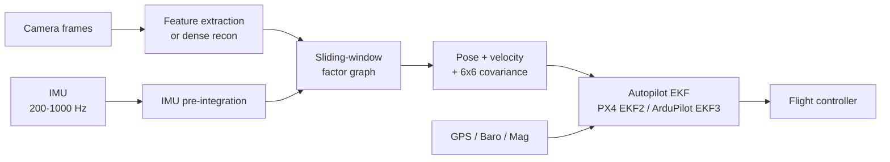
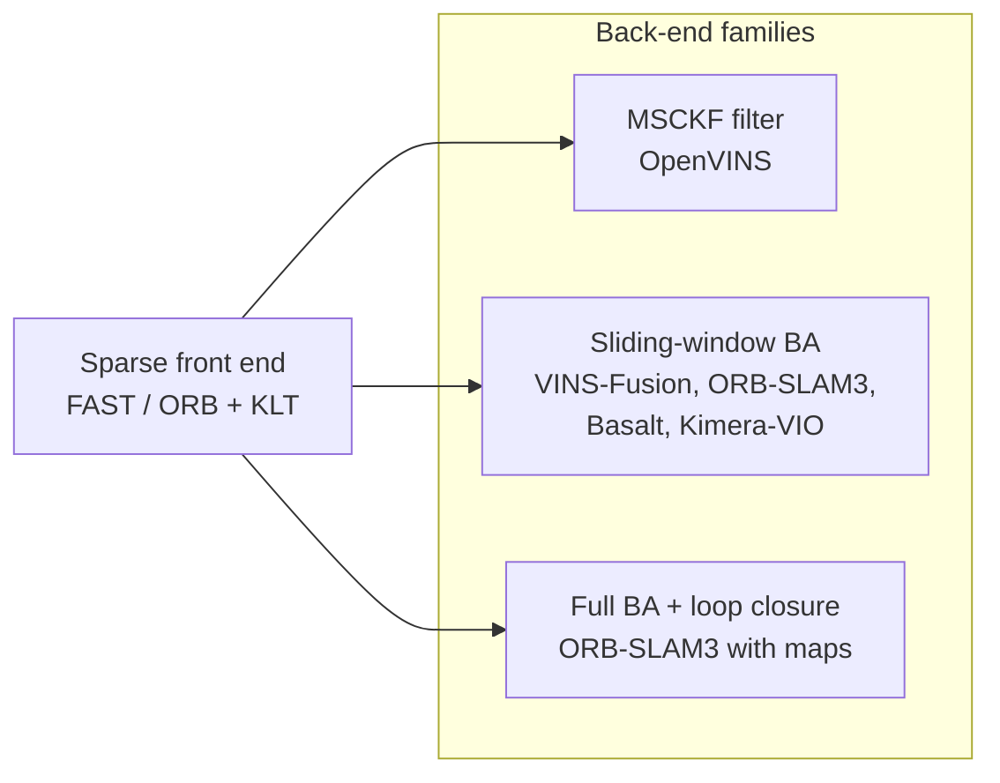
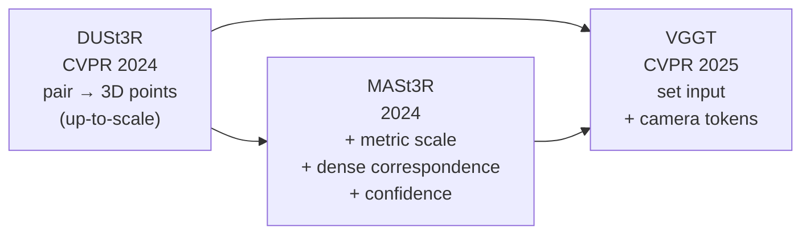
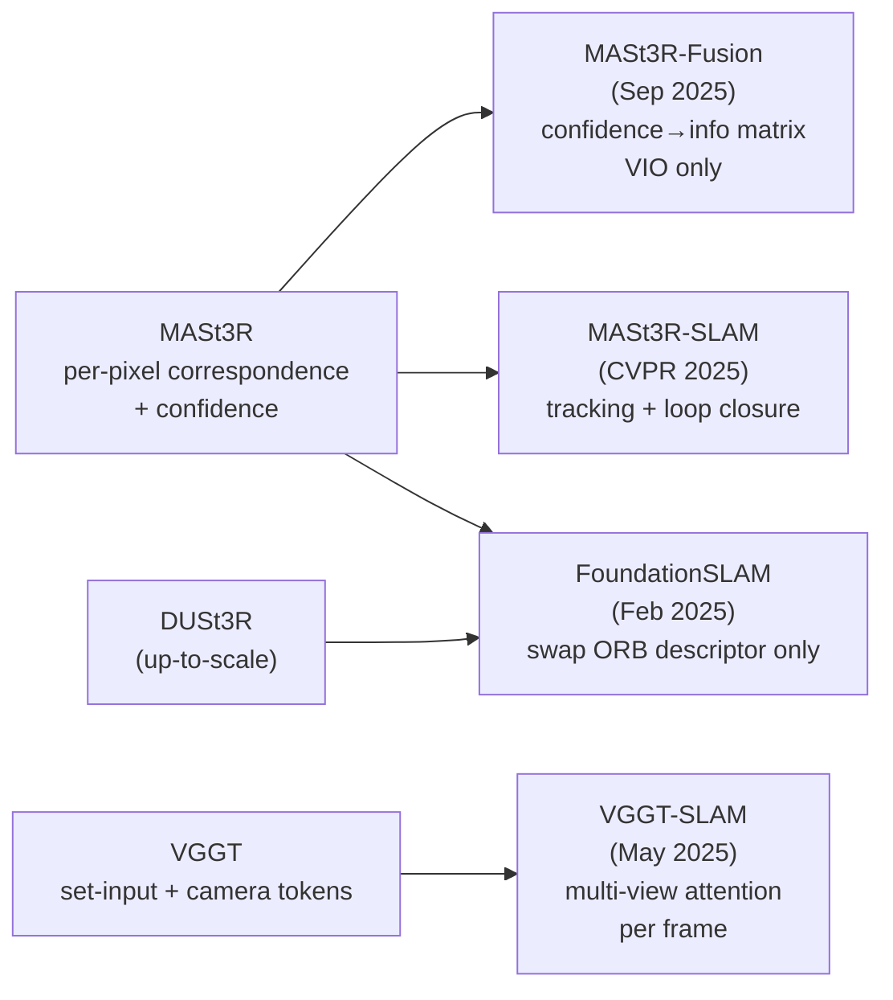

> [!note] About this post
> This is the second entry in [[series/research-passes|Research Passes]]: a structured pre-build survey before deciding whether to write an open-source library on top of visual-inertial odometry (VIO). The first pass covered [[blog/2026-05-23-drone-to-satellite-localization-2026|drone-to-satellite visual geo-localization]]. The format is the same: industry, academia, adjacent fields, the standardized engineering layer, edge inference reality, and a discussion of the most promising libraries and remaining gaps.

A drone in flight needs to know two things at the rate the flight controller asks for them: where it is, and how it is moving. It also needs to know, honestly, *when it does not know*. Visual-inertial odometry is the perception module that turns a calibrated camera and an IMU into a 6-DoF pose, a body-frame velocity, and a covariance that the autopilot can fuse with GPS, magnetometer, and barometer.

The reference open-source state of this five years ago was bleak. The canonical commodity module, the Intel RealSense T265, was discontinued in 2021. The most-cited open codebases (VINS-Fusion, ORB-SLAM3) stopped receiving substantive commits around the same time. The companies that did have working VIO (DJI, Skydio, ModalAI) kept the stack closed. Open-source drone autonomy projects worked around the gap by bolting an off-the-shelf depth camera onto a frozen 2021 algorithm and a pile of glue.

By May 2026 the picture has changed in two opposite directions at once. The production layer has consolidated around NVIDIA's cuVSLAM, which closes the "I need VIO on a Jetson" question for most teams. The research frontier has moved to foundation-3D priors tightly coupled with IMU, with a half-dozen serious papers shipped or in flight. The middle ground (a permissively-licensed, well-maintained, foundation-3D-aware Python VIO that runs on the edge) is still missing. The point of this post is to inventory all three layers, and then explain why, after thirty hours of reading, I do not think the middle ground is the right place to spend the next six months.

A fair warning before diving in: VIO sits at an unusually crowded intersection of computer vision, optimization, sensor fusion, and embedded systems. The glossary below covers the acronyms that show up most often. Skim it if any of them are unfamiliar; come back to it as needed.

> [!info] Quick glossary (skim if any of these are unfamiliar)
> - **VIO (Visual-Inertial Odometry)**: estimating where a camera-plus-IMU rig is in space, frame by frame, by combining what the camera sees with what the IMU feels.
> - **IMU (Inertial Measurement Unit)**: the small accelerometer + gyroscope chip on the drone. Measures linear acceleration and angular velocity at 200-1000 Hz; integrating it gives noisy short-term motion.
> - **SLAM**: Simultaneous Localization and Mapping. VIO + a persistent map + loop closure (recognising you've been here before and correcting accumulated drift).
> - **EKF / EKF2 / EKF3**: Extended Kalman Filter. The fusion algorithm inside the autopilot (PX4 calls it EKF2, ArduPilot EKF3) that combines GPS, IMU, magnetometer, barometer, and the visual pose estimate into one consistent state.
> - **6-DoF pose**: position $(x, y, z)$ plus orientation (3 angles or a quaternion). "DoF" = degrees of freedom.
> - **Covariance**: the $6\times 6$ matrix the VIO ships alongside the pose to express *how confident* it is. Big diagonal entries = uncertain estimate; the autopilot uses this to weight the visual measurement against GPS and IMU.
> - **MAVLink**: the wire protocol drone autopilots speak. `ODOMETRY (331)` is the message a VIO source publishes its pose + covariance on.
> - **Foundation-3D model**: a large pretrained network (notably DUSt3R, MASt3R, VGGT, and the streaming variant CUT3R) that takes a pair (or set) of images and regresses dense 3D structure plus camera poses in a single forward pass, replacing the classical detect-match-triangulate pipeline.
> - **Factor graph**: the data structure modern VIO back ends optimize over, with variables (poses, velocities, biases) as one kind of node and *factors* (measurement constraints) as the other.
> - **ATE / RPE**: Absolute Trajectory Error / Relative Pose Error. The two standard accuracy metrics in VIO papers. They measure drift, not calibration of uncertainty.

## 1. The problem and the canonical pipeline

Before touching any of the names above, it helps to be concrete about what a VIO module actually owes the rest of the drone. The answer is small. Take camera frames and IMU samples. Spit out *where* the drone is, *how fast* it is moving, *how sure* you are about both, and a flag that says *I have lost the plot, do not trust me*. Everything downstream (autopilot EKF, gimbal, obstacle avoidance) consumes those four things and nothing else.

> [!info] Background: IMU pre-integration in one paragraph
> The IMU runs at 200-1000 Hz; the camera at 20-30 Hz. A direct fusion would either burn cycles re-evaluating IMU residuals every time the optimizer touches a camera state, or throw away most of the IMU samples.
>
> **Pre-integration** (Forster et al., RSS 2015) sidesteps that. Between two keyframes $i$ and $j$, it summarizes all the IMU samples into a single relative-motion constraint $(\Delta R_{ij}, \Delta v_{ij}, \Delta p_{ij})$ on rotation, velocity, and position. The constraint depends only on the samples in between and on the *bias* state, not on the global pose.
>
> The trick that makes this practical: the constraint can be rewritten so that re-linearization at a new bias estimate is a cheap $O(1)$ update, instead of re-integrating from scratch. Every modern tightly-coupled VIO (VINS-Fusion, ORB-SLAM3, OpenVINS, cuVSLAM, MASt3R-Fusion) uses this idea.

> [!info] Background: what the back end is actually optimizing
> The back end is searching for a state $\mathbf{x}$ (all the poses, velocities, biases, and 3D landmarks in the sliding window) that *best explains every measurement we have*. "Best explains" means the predicted measurements line up with the observed ones, weighted by how much we trust each measurement.
>
> Three families of measurements feed in:
> - **Visual reprojection**: where a 3D landmark *should* land in pixel coordinates vs where the detector said it landed.
> - **IMU pre-integration**: the relative motion the IMU implies between two keyframes vs the relative motion the poses imply.
> - **Prior**: a summary of everything we used to know but pushed out of the active window.
>
> Wrap each family in an inverse-covariance Mahalanobis norm, add a robust kernel to the visual term to suppress outliers, and the cost is:
>
> $$ J(\mathbf{x}) = \sum_{(i,j) \in \mathcal{E}_{IMU}} \| r_{ij}^{IMU}(\mathbf{x}) \|^2_{\Sigma_{ij}^{IMU}} + \sum_{(k,\ell) \in \mathcal{E}_{vis}} \rho\big( \| r_{k\ell}^{vis}(\mathbf{x}) \|^2_{\Sigma_{k\ell}^{vis}} \big) + \| r^{prior}(\mathbf{x}) \|^2_{\Sigma^{prior}} $$
>
> Gauss-Newton iterates $\mathbf{x}$ until this is minimized. The *covariance* of the optimal $\mathbf{x}$, recovered from the Hessian at the minimum, is what gets reported on the MAVLink wire. That is the back end's honest statement of how uncertain the pose still is.

A modern VIO stack looks more or less like this regardless of whether the front end is sparse-feature (ORB / FAST), dense-photometric (DSO / SVO), or foundation-3D (MASt3R / VGGT). The differences sit in two places:

1. **Front end.** Sparse features are cheap and well-understood, but fail on textureless or specular scenes. Dense photometric methods handle texture-poor scenes but are sensitive to exposure. Foundation-3D models like MASt3R or VGGT regress dense geometry from a pair of views and degrade much more gracefully on the failure modes that bit classical methods.
2. **Back end.** Sliding-window factor graphs (GTSAM, Ceres, or a custom solver) marginalize old states and produce a *real* covariance. Kalman-filter back ends are cheaper but easier to bias. Either way, the marginalized 6x6 covariance is what the autopilot expects on the MAVLink wire, and the way that covariance is computed is the bit that downstream estimators trust or distrust.

What the autopilot *actually* needs, beyond the pose, is a calibrated covariance, a `reset_counter` that flips when the estimator restarts or loop-closes a discrete jump, and a health enum (HEALTHY / DEGRADED / LOST) so the flight controller can decide whether to keep the VIO in the fusion or fall back to GPS-only. Surprisingly few open-source VIO implementations get all three of those right, even today.

## 2. Academic frontier: foundation-3D meets IMU

Production has consolidated. Research is doing the opposite. There is a visible sprint underway, and it has a single shape: take a pairwise foundation-3D model (DUSt3R, MASt3R, VGGT) and bolt IMU pre-integration onto it. To see why, it helps to first look at where the *classical* VIO families end up and what bites them.

### Classical VIO families (the baseline being displaced)

Every modern open-source VIO from 2014-2024 sits in one of three back-end buckets, all sharing the same sparse-feature front end (FAST or ORB corners + descriptor matching + KLT tracking).

**Shared failure mode.** All three buckets share the same Achilles' heel: when the front end runs out of corners (white walls, motion-blurred frames, glassy surfaces, low light), the back end has nothing to optimize against and the trajectory drifts on IMU alone until corners come back. The differences between MSCKF (filter, $O(n)$ cost in state size, no loop closure) and sliding-window BA (graph optimizer, marginalizes old states, can do loop closure) are real but secondary. Both die on the same scenes.

This is why production converged on cuVSLAM and Voxl 2 (both classical-VIO under the hood) for the easy 95% of flight envelopes, and why nobody open-sources the *robustness* tricks each vendor uses to push the failure boundary outward (multi-camera fisheye rigs at Skydio, hardware-tuned sensor stacks at ModalAI). The 2024-2026 academic sprint takes the opposite tack: replace the sparse front end with one that does not have that failure mode in the first place.

### The foundation-3D root (brief recap)

DUSt3R outputs up-to-scale 3D points from a pair. MASt3R adds the two things a SLAM/VIO back end actually wants: metric scale (depth in real meters, no per-deploy scale calibration) and a dense correspondence head with per-correspondence confidence. VGGT generalizes pair → set with camera tokens that decode straight to extrinsics. The architectural details (shared ViT encoder + cross-image attention + per-pixel decoder heads) are covered in the [[2026-05-23-drone-to-satellite-localization-2026#Foundation-3D models: pair → set|V3 post's Foundation-3D section]] and not repeated here.

![[blog/assets/research-passes/v2/dust3r-pipeline.png|600]]
*Figure 1: DUSt3R is the root: a pair of images go in, dense pixel-aligned 3D points come out, no classical pose estimation or stereo calibration required. (Image source: [Wang et al., 2023](https://arxiv.org/abs/2312.14132))*

### The IMU-coupling family

**Shared mechanism: how foundation-3D plugs into a VIO/SLAM back end.** All four systems share one recipe. Per keyframe pair, the foundation-3D model emits dense pixel correspondences with a scalar confidence $c_i \in [0, 1]$ per correspondence. Each correspondence becomes a *visual reprojection factor* in a sliding-window factor graph: residual $\mathbf{r}_i$ = predicted minus observed pixel position, with information matrix $\Sigma_{\text{vis}, i}^{-1} = c_i / \sigma_{\text{base}}^2$. The confidence-into-information-matrix line is the key trick: hand-tuned reprojection sigmas that every classical VIO has hidden in a per-scene config file simply go away. The IMU side is unchanged from 2018-vintage VIO: preintegrated body-frame measurements between keyframes contribute their own factor with covariance propagated from IMU noise spec sheets. Optional GNSS factors give absolute position constraints with their reported standard deviation. The back end is a standard iSAM2 / GTSAM / g2o sliding-window optimization. The four systems below differ in *where* in this recipe the foundation model is plugged in, and how much of the rest of the stack they keep.

#### MASt3R-Fusion (the cleanest plug)

[MASt3R-Fusion (Sep 2025, arXiv:2509.18613)](https://arxiv.org/abs/2509.18613) is the headline paper. It does exactly the shared mechanism above and nothing more: MASt3R between consecutive keyframes, dense correspondences with confidence into a sliding-window factor graph, IMU pre-integration on the side, optional GNSS, iSAM2 back end. The novelty is the confidence-into-information-matrix line. Accuracy gains show up on EuRoC, KITTI-360, and TartanAir sequences with low texture or aggressive motion blur, where VINS-Fusion and ORB-SLAM3 lose tracking. Two deployment blockers: research-licensed weights, and forward-pass inference is workstation-only.

![[blog/assets/research-passes/v2/mast3r-fusion-pipeline.png|600]]
*Figure 2: MASt3R-Fusion folds dense MASt3R correspondences with per-pixel confidence into a sliding-window factor graph alongside IMU pre-integration and GNSS factors. (Image source: [arXiv:2509.18613](https://arxiv.org/abs/2509.18613))*

#### MASt3R-SLAM and VGGT-SLAM (push to full SLAM)

Where MASt3R-Fusion is *VIO* (poses + uncertainty out the back), these two are *SLAM*: same front end pushed all the way to a map, with loop closure and re-localization.

The delta to the shared recipe is one additional thread. A tracking thread runs the foundation model paired against the most-recent keyframe; new keyframes are spawned by the usual heuristics (parallax above threshold, or fixed frame-count interval). A *loop-closure thread* maintains a global image-retrieval index (NetVLAD or similar) over all keyframes; when a new keyframe's descriptor cosine-matches an old one above a threshold, the two are passed through the foundation model again, the resulting correspondences are confidence-gated, and a long-range pose factor is inserted into the global graph. A full Levenberg-Marquardt or iSAM2 update propagates the closure back through the trajectory. The dense map is a by-product: per-keyframe 3D points accumulate into a global point cloud.

[MASt3R-SLAM (Murai et al., CVPR 2025)](https://arxiv.org/abs/2412.12392) is the canonical instantiation, ~15 FPS on RTX 4090 at 512x384. [VGGT-SLAM (Maggio et al., May 2025)](https://arxiv.org/abs/2505.12549) swaps MASt3R for VGGT and uses its multi-view attention: each new frame attends to the whole local window of recent keyframes in one forward pass instead of pair-by-pair triangulation. Accuracy gains on long trajectories with revisits are real; FPS drops below MASt3R-SLAM (multi-view attention is not free). Both are research-licensed, both workstation-tier.

![[blog/assets/research-passes/v2/mast3r-slam-overview.png|600]]
*Figure 3: MASt3R-SLAM uses MASt3R's dense correspondences as both tracking and mapping front end, with image-retrieval loop closure on top. (Image source: [Murai et al., 2024](https://arxiv.org/abs/2412.12392))*

#### FoundationSLAM (swap descriptors, keep everything else)

[FoundationSLAM (Cho et al., Feb 2025, arXiv:2502.02649)](https://arxiv.org/abs/2502.02649) is the most pragmatic move. Keep ORB-SLAM3 exactly as it is, swap only the descriptor. ORB detects FAST corners as before, but at each keypoint location MASt3R or DUSt3R per-pixel features are bilinearly sampled instead of the 256-bit binary ORB descriptor. Matching switches from Hamming distance to cosine similarity on 256-D float descriptors; the matching topology, back-end bundle adjustment, covisibility graph, DBoW2 place recognition, and multi-map merging are bit-identical to ORB-SLAM3. Most of the robustness gain at roughly half the inference cost of MASt3R-SLAM, and you inherit five years of back-end bug fixes for free. Lowest-risk integration in the cluster precisely because the swap is local: if the foundation descriptor is worse on some scene, the system degrades to "ORB-SLAM3 with slightly worse features" rather than failing in a novel way.

A handful of CVPR 2026 and ICRA 2027 submissions tackle the IMU-tight-coupling story for VGGT and **CUT3R** (Wang et al., CVPR 2025) explicitly. CUT3R is the streaming variant of MASt3R: instead of pure pairwise inference (which forgets everything between calls), CUT3R maintains a continuous temporal state across frames as a small set of persistent tokens that get updated each new frame. The architectural delta is one extra cross-attention block that lets the per-frame tokens read from and write to the persistent-state tokens. The result is that the model can do incremental online reconstruction at near-MASt3R quality without the pair-by-pair re-computation, which is the obvious enabler for real-time VIO. Half a dozen labs are racing each other to publish IMU-coupled CUT3R; the field will be churning over the next year.

> Worth noting: the 18-month sprint from DUSt3R (CVPR 2024) to MASt3R-Fusion (Sep 2025) to a half-dozen IMU-coupled follow-ups (May 2026) is the same colonization-of-design-space pattern the [[2026-05-23-drone-to-satellite-localization-2026#CVGL systems: composing the family|V3 post]] observed in the cross-view cluster. Same root cause: one foundation model opens up cheap downstream integration in N tasks. Three months between the model and the first downstream paper; another nine months and the design space is mostly explored.

### Calibrated uncertainty for VIO

The same calibration story from the V3 post applies. Most VIO papers report ATE / RPE error statistics but not calibrated covariance. For autopilot fusion, ATE is the wrong metric: what matters is whether the reported 1-sigma envelope actually contains the true pose with 68% probability across the operating envelope. [Laplace approximation](https://github.com/aleximmer/Laplace) on the front end and proper marginalization in the back end are both required. The deep-learning VIO papers that get this right are still rare.

> [!info] Calibration methodology for VIO
> Per-axis reliability diagrams plus Expected Calibration Error on Mahalanobis-normalized residuals across position and orientation. A perfectly calibrated 6-DoF estimator gives $r = (\mu - \mathrm{GT})^\top \Sigma^{-1} (\mu - \mathrm{GT}) \sim \chi^2_6$. Plot empirical vs nominal across a held-out test set, separately for HEALTHY and DEGRADED segments. This is the *only* metric that lets you decide whether the VIO is safe to fuse into EKF2.

## 3. Industry production state

The academic story above is workstation-tier, research-licensed, and absent from any shipped drone in May 2026. Production tells a different story: two consolidated proprietary stacks, four closed vendors, and an open-source rear that is mostly classical-VIO library code from 2014-2024. Below I tour the production stack and tag where each one sits on the [[#Classical VIO families (the baseline being displaced)|classical-VIO ontology]] above.

### NVIDIA Isaac ROS cuVSLAM

The dominant production stack on Jetson Orin is [Isaac ROS Visual SLAM](https://nvidia-isaac-ros.github.io/repositories_and_packages/isaac_ros_visual_slam/index.html), wrapping the closed `cuVSLAM` core that has been shipping inside Isaac since 2021. cuVSLAM v14 shipped with [Isaac ROS 4.0 in October 2025](https://github.com/NVIDIA-ISAAC-ROS/isaac_ros_visual_slam/releases) and added IMU integration, RGBD support, loop closure with a global pose graph, and improved per-frame uncertainty.

In practice, if a drone team has chosen Jetson Orin as the compute platform, cuVSLAM is the answer to "I need VIO that works". The ROS 2 wrappers are Apache-2.0, the core is closed but free to use, latency is in the single-digit milliseconds per stereo pair on Orin AGX, and it integrates with `nav2` and `isaac_ros_perceptor`. The only honest reasons to *not* use cuVSLAM are:

- The target compute platform is not Jetson Orin (Raspberry Pi 5, Rockchip RK3588, Qualcomm RB5, etc.).
- The application needs to ship source-level customisation of the SLAM back end (multi-camera rigs, custom IMU pre-integration, novel sensor combinations).
- The licensing or supply-chain requirements forbid closed binaries.

For the cinematography use case, none of those reasons are persuasive. cuVSLAM v14 plus an IMX477 on Orin Nano is a perfectly reasonable real-time VIO front end.

Algorithmically cuVSLAM sits in the [[#Classical VIO families (the baseline being displaced)|**sliding-window BA with loop closure**]] bucket: **sparse-feature** front end, **tightly-coupled IMU pre-integration**, global pose graph for re-detection. No [[#The foundation-3D root (brief recap)|foundation-3D]] anywhere. The robustness gains over the open-source classical libraries come from hardware-tuned sensor integration and proprietary engineering, not from a fundamentally different algorithm class.

### ModalAI Voxl 2

[ModalAI Voxl 2](https://www.modalai.com/products/voxl-2) is the second consolidated production option: a Qualcomm QRB5165-based flight computer that ships with the company's [Voxl SDK](https://docs.modalai.com/voxl-sdk/), including a stereo-VIO front end (`voxl-qvio-server`), the integration with PX4, and proprietary hardware-accelerated depth and tracking. Cost is in the $1500 range fully built; the platform is targeted at customers who want a finished module rather than an SDK they need to integrate themselves. The VIO stack is closed-source. Algorithmically it sits in the [[#Classical VIO families (the baseline being displaced)|same bucket as cuVSLAM]] (sparse-feature stereo-VIO with sliding-window BA), just on a Qualcomm DSP instead of an NVIDIA GPU.

### Drone vendors

The four obvious consumer / commercial vendors all keep their VIO closed: [Skydio](https://www.skydio.com/) and [DJI](https://www.dji.com/) on the consumer side (Skydio is the more documented of the two; from public talks the pattern is multi-camera fisheye rigs with deep-learned obstacle understanding fused into a classical VIO back end, plus per-airframe IMU pre-integration tuning), and [Auterion](https://auterion.com/) and [Anduril](https://www.anduril.com/) on the defense / commercial-grade side (Auterion ships PX4 enterprise plus tested camera/IMU bundles but leaves the VIO layer to the integrator, typically cuVSLAM or ModalAI; Anduril's Ghost and Lattice systems include proprietary perception stacks). None release code.

Where I can read the public talks (Skydio mostly), the algorithm class is the [[#Classical VIO families (the baseline being displaced)|same **sliding-window BA** bucket]] as cuVSLAM and Voxl, with deep-learned *obstacle understanding* fused in as an extra factor type rather than deep-learned tracking. [[#The foundation-3D root (brief recap)|Foundation-3D]] is absent. The robustness gain comes from the multi-camera fisheye rig and per-airframe IMU tuning, both of which sit at the sensor/integration layer rather than in the algorithm class.

### Open-source projects, briefly

With the production picture closed (cuVSLAM, Voxl, Skydio, DJI all kept the back end private), the open-source landscape ends up being dominated by classical VIO libraries that most teams treat as papers-with-code rather than live dependencies. Two of them still get substantive commits.

| Project | Front end | Back end | IMU support | Last substantive commit | License | Notes |
|---|---|---|---|---|---|---|
| [VINS-Fusion](https://github.com/HKUST-Aerial-Robotics/VINS-Fusion) | Sparse (KLT) | Ceres BA | Tightly coupled | Late 2021 | GPL-3.0 | Reference mono/stereo VIO with loop closure |
| [ORB-SLAM3](https://github.com/UZ-SLAMLab/ORB_SLAM3) | Sparse (ORB) | g2o BA | Tightly coupled | 2022 | GPL-3.0 | Multi-map and re-localization differentiator |
| [OpenVINS](https://github.com/rpng/open_vins) | Sparse (FAST + KLT) | MSCKF filter (Multi-State Constraint Kalman Filter) | Tightly coupled | 2025 (active) | GPL-3.0 | Clean ROS 2 wrapper; filter back end |
| [Basalt](https://gitlab.com/VladyslavUsenko/basalt) | Sparse | Square-root BA | Tightly coupled | 2025 (active) | BSD-3 | Cleanest modern classical implementation |
| [Kimera-VIO](https://github.com/MIT-SPARK/Kimera-VIO) | Sparse + dense mesh | GTSAM | Tightly coupled | 2025 (active) | BSD-2 | Mesh reconstruction as a side product |

If you are starting a new project that needs classical VIO under a permissive license today, **Basalt** or **Kimera-VIO** are the right starting points. Basalt is the cleanest modern classical reference: square-root bundle adjustment (numerically stable for long sliding windows where standard BA loses precision), a small modern C++17 codebase, and a BSD-3 license that is fine for commercial products. Kimera-VIO is heavier but earns its keep when downstream code wants the dense mesh reconstruction it produces as a side effect of tracking. OpenVINS is the cleanest MSCKF implementation but its GPL-3.0 license complicates redistribution (any product that ships GPL-3.0 code must release source for the whole product on request, which is awkward for commercial drone platforms and a non-starter for closed integrators). The two GPL-3.0 reference codebases (VINS-Fusion, ORB-SLAM3) are stuck in 2021-2022 and treat better as papers-with-code than as live dependencies.

The table maps directly onto the [[#Classical VIO families (the baseline being displaced)|classical-VIO ontology]] above: **OpenVINS** is the MSCKF filter; **VINS-Fusion**, **ORB-SLAM3**, and **Basalt** are sliding-window BA; **Kimera-VIO** is sliding-window BA with a dense mesh side channel; ORB-SLAM3 additionally does full-BA loop closure with map merging. None of them have a [[#The foundation-3D root (brief recap)|foundation-3D]] front-end option in 2026; the [[#The IMU-coupling family|academic IMU-coupling papers]] are research-licensed and not directly drop-in to any of these codebases.

## 4. Adjacent fields and reusable architecture

One more place worth looking before deciding what to build: fields that have already solved adjacent versions of this problem. AR/VR has shipped consumer VIO on phones for almost a decade. Autonomous driving has shipped fleet-scale VIO at highway speeds. Both have lessons. Neither releases code, but both teach you what to insist on.

### AR/VR and autonomous driving

Two adjacent industries ship VIO at scale and both keep their stacks closed, but both teach something. [ARKit](https://developer.apple.com/augmented-reality/) and [ARCore](https://developers.google.com/ar) have shipped consumer-grade VIO at millimeter precision on commodity phones since 2017; the lesson there is engineering discipline (ruthless sensor calibration, conservative health enums, per-device tuning) is what moves VIO from "publishable" to "shippable". Mobileye's [REM](https://www.mobileye.com/technology/rem-mapping/) and Tesla's full-stack pipeline are the production references at car speeds; the lesson there is that even very good VIO is always fused with GPS, HD-maps, and wheel odometry, treating each source as best-effort. The drone equivalent is EKF2 fusion of VIO `ODOMETRY` with GPS, magnetometer, and barometer: never ship a VIO that assumes it is the only source of truth.

### Reusable open architecture

- **[GTSAM](https://github.com/borglab/gtsam)**: Georgia Tech's factor-graph optimizer. Permissive license. Still the reference back end for tightly-coupled IMU.
- **[Ceres Solver](https://github.com/ceres-solver/ceres-solver)**: Google's non-linear least-squares library. Used by VINS-Fusion and many others.
- **[gtsam_points](https://github.com/koide3/gtsam_points)**: modern GTSAM extension for LiDAR / dense factor types; relevant for any IMU + visual + depth fusion.

These three are the unambiguous toolchain that any new VIO project should start from.

## 5. The standardized engineering layer

All the front-end and back-end choices above don't matter if the wire format between the VIO and the autopilot is wrong. Fortunately the wire format is well-specified. Unfortunately, most open-source VIO implementations get one or two details of it subtly wrong in ways that bite during real flights.

### MAVLink wire format

The wire format for "I am a visual pose source feeding the autopilot" is well-specified, and getting it right is most of the systems-engineering work.

| Message | ID | Purpose |
|---|---|---|
| [`ODOMETRY`](https://mavlink.io/en/messages/common.html#ODOMETRY) | 331 | Pose + velocity + 6x6 covariance + `reset_counter` |
| [`VISION_POSITION_ESTIMATE`](https://mavlink.io/en/messages/common.html#VISION_POSITION_ESTIMATE) | 102 | Pose only (legacy; use ODOMETRY) |
| [`VISION_SPEED_ESTIMATE`](https://mavlink.io/en/messages/common.html#VISION_SPEED_ESTIMATE) | 103 | Velocity only |
| [`ATT_POS_MOCAP`](https://mavlink.io/en/messages/common.html#ATT_POS_MOCAP) | 138 | Motion-capture pose (indoor benchmarking) |

`ODOMETRY` (331) is the right primary channel. The 6x6 covariance must be a *real* marginalized covariance, not a hand-tuned identity scaled by gain. The `reset_counter` field is critical: any time the back end performs a discrete jump (re-initialization, loop closure, large outlier rejection), the counter must increment so EKF2 can correctly handle the discontinuity. Implementations that leave `reset_counter` at zero are a known cause of EKF2 misfusion.

### PX4 EKF2 fusion

PX4's [EKF2](https://docs.px4.io/main/en/advanced_config/tuning_the_ecl_ekf.html) handles `ODOMETRY` natively. The relevant parameters are `EKF2_HGT_REF`, `EKF2_EV_CTRL`, `EKF2_EV_NOISE_MD`, `EKF2_EVA_NOISE`, `EKF2_EVP_NOISE`, `EKF2_EVV_NOISE`, plus the offsets `EKF2_EV_POS_X/Y/Z`. The fusion gracefully demotes the visual source when its reported covariance grows or its `reset_counter` increments; that is the contract the VIO must implement on its side.

For ArduPilot, the equivalent is EKF3 with `VISO_TYPE` and the [companion-computer odometry interface](https://ardupilot.org/copter/docs/common-vio-tracking-camera.html).

### State enum

A drone autopilot expects a discrete health enum from the VIO, independent of the covariance. The de facto convention is:

| State | Meaning | Autopilot action |
|---|---|---|
| `HEALTHY` | Pose + covariance reliable | Fuse normally |
| `DEGRADED` | Pose available but uncertain | Inflate covariance, optionally demote |
| `LOST` | No reliable pose | Stop fusion, fall back to GPS-only |

The transition logic between these states is the part that almost every published VIO leaves to the integrator. A real drone needs hard rules for when to declare LOST (consecutive failed front-end matches, covariance trace exceeding threshold, IMU bias divergence) and when to allow recovery to HEALTHY. cuVSLAM and ModalAI Voxl both ship explicit state machines for this; the open-source classical libraries mostly do not.

## 6. Edge inference reality

Wire format is fine. Algorithms are fine. The remaining question is whether any of this actually fits on the drone.

The short answer for sparse-feature VIO is *yes, comfortably*. For foundation-3D VIO in 2026, *no, not even close*. To see why, it helps to start from the floor: the speed of light set by memory bandwidth before any compute happens.

> [!info] Background: the memory-bandwidth speed-of-light (same as V3)
> For inference dominated by parameter reads, the theoretical minimum per-frame time on a memory-bound device is $t_{\min} = \frac{N_{\text{params}} \cdot b_{\text{dtype}}}{B}$, where $N_{\text{params}}$ is parameter count, $b_{\text{dtype}}$ is bytes per parameter (2 for FP16, 1 for INT8), and $B$ is device memory bandwidth (Jetson Orin Nano ~ 68 GB/s, Orin AGX ~ 200 GB/s). For MASt3R at ~280M parameters in FP16, the bandwidth floor on Orin AGX is around 3 ms per inference *just to read the weights once*. A real forward pass on a 512x384 image pair is closer to 80 ms on RTX 4090, 350-400 ms on Orin AGX. Compute is the bottleneck, not bandwidth.

### What fits on Jetson Orin

| Stack | Front end | Back end | Orin AGX rate | Verdict |
|---|---|---|---|---|
| cuVSLAM v14 | Stereo sparse | Custom CUDA | 100+ Hz | Production-grade |
| Basalt | Sparse + KLT | Square-root BA | 50-80 Hz | Reference for OSS edge VIO |
| OpenVINS | FAST + KLT | MSCKF filter | 30-60 Hz | Cleanest filter back end |
| Kimera-VIO | Sparse + mesh | GTSAM | 20-30 Hz | Mesh adds cost but useful for downstream |
| MASt3R-SLAM | MASt3R dense | Pose graph | ~3 Hz | Not edge-real-time |
| VGGT-SLAM | VGGT dense | Incremental graph | <1 Hz | Workstation-only |

The sparse-feature stacks fit comfortably. Foundation-3D does not, full stop, in May 2026.

### What does not fit

Foundation-3D models do not fit at edge real-time, full stop, in May 2026. MASt3R inference at 512x384 is around 80 ms on RTX 4090 and 4-5x slower on Orin AGX, before adding the factor-graph optimization. VGGT is larger again. Real-time foundation-3D VIO on Orin is a 2027-2028 problem driven by [Orin Thor](https://www.nvidia.com/en-us/autonomous-machines/embedded-systems/jetson-thor/) (announced for late 2026), [PAGE-4D](https://arxiv.org/abs/2511.04832)-style efficient transformers, and possibly FP8 deployment via TensorRT 10. None of those are shippable today.

### The realistic short-term recipe

The honest 2026 deployment recipe for a drone that wants the foundation-3D benefits is two-tier:

1. **On-drone, real-time**: classical sparse-feature or stereo-photometric VIO (cuVSLAM, Basalt, OpenVINS). 30-60 Hz on Orin.
2. **Off-drone, post-flight**: foundation-3D pose refinement (MASt3R-SLAM, VGGT-SLAM) for accurate trajectory reconstruction, used by photogrammetry / VFX / dataset-builder workflows.

The two tiers solve different problems and there is no honest single-stack story that bridges them in 2026.

### Numerical precision caveat

The same TensorRT-on-Orin numerical-correctness caveat from V3 applies. FP16 with FP32 accumulation is the usual safe path for transformer-heavy front ends; native FP16 can silently degrade some 3D models. Always verify edge numerics against a workstation reference before trusting the deployment.

## 7. Discussion

That's the full landscape: a consolidated production layer, a sprinting research frontier, an engineering layer with well-defined contracts, and an edge-deployment reality that splits the two cleanly into 2026's and 2027's problems. The question I started this pass to answer was whether building another open-source VIO library on top of all that is worth six months of work. Below: the libraries I'd watch, the gaps that remain, and the decision the inventory points to.

### Most promising libraries to track

- **[Basalt](https://gitlab.com/VladyslavUsenko/basalt)** for any classical-VIO build under a permissive license.
- **[OpenVINS](https://github.com/rpng/open_vins)** for MSCKF-style filter back ends with a clean ROS 2 wrapper.
- **[GTSAM](https://github.com/borglab/gtsam)** as the back-end of choice for any new factor-graph project.
- **[MASt3R-SLAM](https://github.com/rmurai0610/MASt3R-SLAM)** and **[MASt3R-Fusion](https://arxiv.org/abs/2509.18613)** as research dependencies for foundation-3D experiments and offline post-flight refinement.
- **[Isaac ROS Visual SLAM](https://nvidia-isaac-ros.github.io/repositories_and_packages/isaac_ros_visual_slam/index.html)** if the deployment platform is Jetson Orin.

### Gaps that remain

1. **A permissively-licensed foundation-3D VIO that runs real-time on the edge.** Closing this is a 2027+ problem driven by hardware, not algorithms.
2. **Cinema-grade post-flight pose recovery from drone footage.** Useful for VFX, photogrammetry, dataset reconstruction; not covered by either NVIDIA's roadmap or the academic VIO papers, which optimize for ATE on EuRoC rather than dense, drift-free reconstruction at film resolutions.
3. **Calibrated VIO at scale.** Most published VIO does not produce a reliability-diagram-grade covariance. Any deployment into EKF2 fusion has to add that layer itself.
4. **Multi-camera fisheye rigs with deep priors.** Skydio-style multi-camera robustness is unreplicated in open source.

### Three things to watch over the next twelve months

1. **Orin Thor performance.** If foundation-3D models hit real-time on a 200-TOPS edge platform in late 2026, the two-tier recipe collapses into a single-tier one and the entire VIO landscape shifts. Worth tracking [NVIDIA Embedded](https://developer.nvidia.com/embedded-computing) release notes.
2. **Calibrated foundation-3D VIO papers.** Whichever lab first publishes a foundation-3D VIO with proper Mahalanobis-calibrated covariance becomes the default reference for safety-critical fusion. The cluster around MASt3R-Fusion plus laplace-style last-layer Bayesian heads is the natural source.
3. **Whether Isaac ROS Apache-2.0 wrappers expand to expose more of cuVSLAM.** A trend over Isaac ROS 4.x has been to surface more of the cuVSLAM internals as configurable parameters; if the back end becomes pluggable, the calculus for building an alternative VIO weakens further.

---

If you have spotted something missing, especially a 2026 paper or library, [email me](mailto:egor@egordmitriev.dev) or open an issue on [this blog's repo](https://github.com/egordm/egordm.github.io). I will revise.
