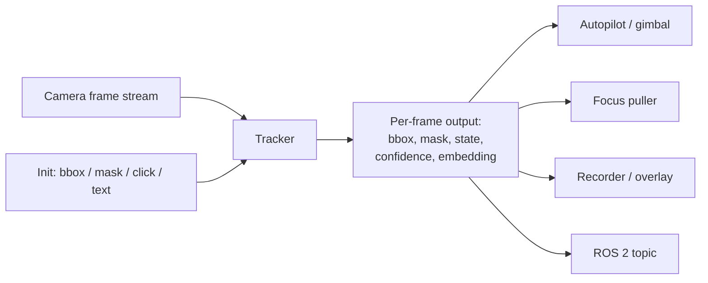
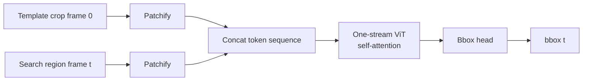
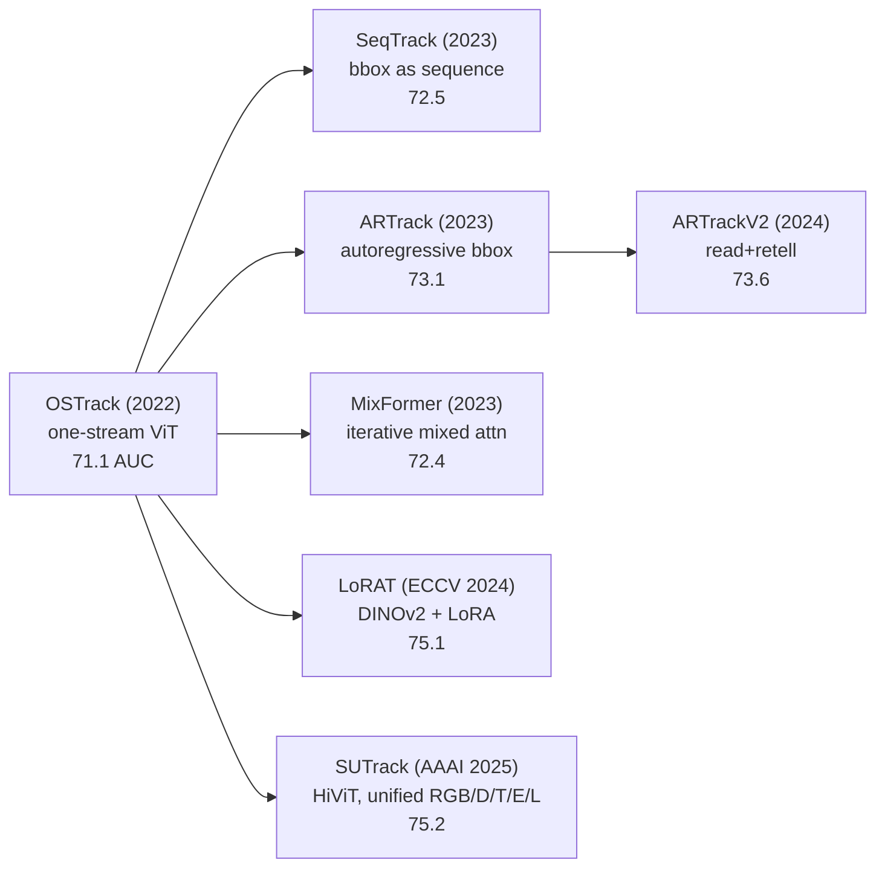
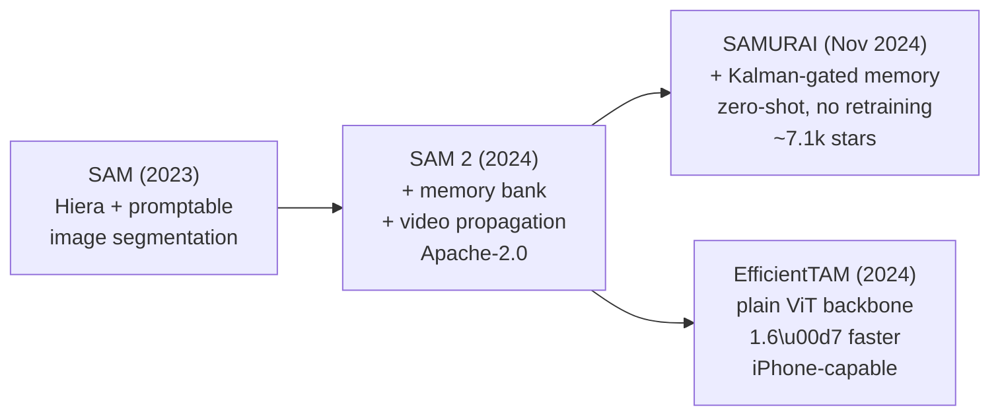

Long-term single-object visual tracking is the task of taking a clicked subject in frame 0 of a video, and returning where that subject is in every subsequent frame, through partial and full occlusions, scale and viewpoint changes, motion blur, exposure shifts, and the presence of other objects of the same class. Done well, it gives an autonomous cinematography drone the only piece of perception it really needs from the camera: a bounding box and mask of the person it is supposed to be following, plus an honest signal for when it has lost them.

It is also a task where the gap between *publishable result on LaSOT* and *deployable component on a Jetson Orin* is unusually wide. The academic literature is in a quiet plateau: the top of the LaSOT leaderboard moved from ~70 AUC in 2022 to ~75 in 2025, and the differences between the top five methods are dominated by which foundation backbone they fine-tune. The deployment landscape is the opposite, explosive activity from two closed-source vendors (DJI and Skydio) and an under-served open-source middle that is mostly research scripts the authors explicitly warn are not for real-world use.

I spent the first half of 2026 surveying this space while building [kubrick-tracking](https://github.com/egordm/kubrick), a real-time foundation-model tracker for autonomous drone cinematography. This post is the survey, organized into seven sections: the problem and the canonical pipeline, the academic frontier organized by family rather than by leaderboard rank, the production state of the industry, adjacent fields with reusable architecture, the engineering layer everyone re-invents, edge-inference reality on real hardware, and a discussion of where the most consequential gaps are.

If you are considering work in this area, treat this post as a starting bibliography rather than a finished position. Every claim links to primary source. Where I make a judgment call, I flag it.

> [!info] Scope and timing
> All claims are as of May 2026. Some of the deployment numbers come from a measured optimization sprint on SAMURAI documented separately in [[2026-05-16-optimizing-samurai-part-1|the Optimizing SAMURAI series]] (three parts, ending May 18). The field is moving fast enough that some of this will be stale by Q4 2026.

> [!info] Quick glossary (skim if any of these are unfamiliar)
> - **SOT (Single-Object Tracking)**: given a clicked or boxed subject in frame 0, output its location in every subsequent frame. The task this whole post is about.
> - **VOS (Video Object Segmentation)**: similar to SOT, but the output is a pixel-precise mask rather than a bounding box. SAM 2 lives here; SOT and VOS are converging fast.
> - **LaSOT / GOT-10k / UAV123**: the standard benchmarks. LaSOT averages ~83 seconds per clip and is the de-facto long-term reference. UAV123/UAV20L are aerial. GOT-10k tests one-shot generalization to unseen classes.
> - **Template / search region**: the classical tracking idiom. A *template* is the cropped subject from frame 0 (and sometimes refreshed); the *search region* is a larger window around the predicted location in the current frame. The model decides where the template "is" inside the search region.
> - **One-stream tracker**: a ViT that takes template and search region concatenated as one token sequence and lets self-attention do the cross-talk. Replaced the older two-stream Siamese trackers in 2022.
> - **Mask propagation / memory bank**: the SAM 2 idiom. Past frames' features and mask predictions are kept in a fixed-size buffer; the current frame cross-attends to that buffer to predict the next mask. No explicit template/search crop.
> - **AUC (Area Under the Curve)**: the standard LaSOT success metric. Higher is better; current ceiling ~75.
> - **AO / SR (GOT-10k)**: Average Overlap and Success Rate, the GOT-10k metrics.
> - **Re-acquisition / long occlusion**: the open problem. Subject leaves the frame or is fully occluded for several seconds, then reappears. Standard trackers either keep tracking nothing in particular or latch onto a distractor.
> - **ROS 2**: the de-facto robotics middleware. Trackers that ship into real robots end up as ROS 2 nodes.
> - **ORT / TRT / CoreML**: ONNX Runtime, NVIDIA TensorRT, Apple's CoreML, the three deployment runtimes that matter for foundation-model tracking on edge devices.

## 1. The problem and the canonical pipeline

Before the leaderboards and benchmarks, it helps to be concrete about what this tracker actually has to do. A camera (drone, gimbal, handheld) hands it a frame and a one-shot initialization: a bounding box, a mask, a click point, or a text prompt. From the next frame onwards, the tracker emits a bounding box, optionally a pixel-precise mask, an explicit state (`tracked`, `occluded`, `lost`, `reacquired`), and a calibrated confidence. A downstream consumer (autopilot, gimbal, recorder, focus puller) uses those to do something physical: keep the subject centered in the shot, predict where to point the gimbal next, decide whether to keep flying or hover.

The contract sounds simple. It is not, because the failure modes are all *implicit*:

- **Short occlusions** (1-2 s, a tree, a passing person) need to be ridden out without latching onto whatever else is in the search region.
- **Long occlusions** (5-30 s, subject behind a building, or out of frame as the drone re-positions) need an honest "I have lost them" state and an aggressive re-acquisition path when they reappear.
- **Same-class distractors** (the runner is one of 30 in a marathon) need the tracker to disambiguate based on appearance over many frames, not just the current crop.
- **Scale and viewpoint changes** (zoom, drone moves from above to ground level) need a template representation that survives geometric warps.
- **Motion blur and exposure shifts** are constant on drones: small platforms vibrate, autoexposure hunts.
- **Init failures** (subject is small at takeoff, prompt is ambiguous) need to be detected, not silently turned into garbage tracks.

The canonical academic pipeline (2022-2025) treats this as a *pair-wise* search: template features from frame 0 plus search features from frame $t$ go through a transformer, which outputs a bounding box. Roughly:

$$
\text{bbox}_t = f_\theta(\text{search}_t,\ \text{template}_0,\ \text{template}_t^{\text{update}})
$$

The interesting differences are in how $f_\theta$ is parameterized, whether the template is updated (and if so how), and what historical context beyond the most recent template is preserved. The promptable-segmentation lineage (SAM 2 family, see [[#Promptable foundation-model trackers: SAM \u2192 SAM 2 \u2192 SAMURAI \u2192 EfficientTAM|§2 promptable foundation-model trackers]]) breaks this pattern by replacing template/search with a streaming memory bank of past features and mask predictions, which turns out to handle many of the failure modes above for free.

Downstream consumers also impose hidden requirements that the academic benchmarks do not measure:

- **Latency** has to fit a control loop, typically 30 FPS = 33 ms per frame end-to-end on the target hardware (a Jetson Orin AGX, an iPhone-class NPU, or a Snapdragon-class DSP).
- **Explicit failure states** matter more than raw AUC. An autopilot can handle "I have lost them" gracefully; it cannot handle "here is a bbox of a different person, with high confidence".
- **State semantics** must be machine-consumable. The `state` enum (`tracked`/`occluded`/`lost`/`reacquired`) and a *calibrated* confidence (an honest probability, not a raw mask-logit max) are the integration contract.

Most published trackers ignore both of the second-class consumer requirements. The benchmarks reward AUC; they do not penalize a tracker for silently following the wrong subject. This gap is the recurring theme of the rest of the post.

> [!info] What this survey does and does not cover
> **Covers**: long-term single-object tracking with foundation-model components, suitable for autonomous cinematography drones. Both bbox and mask outputs. Open-source and academic state of the art plus production vendors where evidence is visible from outside.
>
> **Does not cover**: multi-object tracking-by-detection (MOT: surveillance, traffic, marathon-finish-line use cases with 10-50 simultaneous tracks). Different problem, different ontology. Briefly cross-referenced in [[#Adjacent fields and reusable architecture|§4 Adjacent fields]]. Also does not cover 6D pose estimation, scene reconstruction, or visual-inertial odometry; those are [[2026-05-24-vio-drones-2026|the V2 post]] and friends.

## 2. Academic frontier

The current academic frontier divides cleanly into five families, each with its own shared mechanism, its own lineage of incremental work, and its own characteristic failure modes. I cover them in roughly chronological order of when they became the dominant thread.

| Family | Core mechanism | Headline method (May 2026) | LaSOT AUC |
|---|---|---|---|
| **Transformer SOT** (one-stream) | ViT with concatenated template+search tokens | SUTrack-L, LoRAT-L | 75.2 / 75.1 |
| **Temporal token propagation** | Compress target into tokens passed frame-to-frame | ODTrack, HIPTrack | 74.0 / 72.7 |
| **Promptable foundation models** | Streaming memory bank over past frames' features+masks | SAMURAI | ~74 zero-shot |
| **Foundation-feature re-ID** | DINOv2/SAM/CLIP embeddings as instance descriptors | MASA, LoRAT, CiteTracker | varies |
| **Aerial/edge-specific** | View-invariant tiny ViTs with adaptive computation | AVTrack-MD | (UAV SOTA) |

The first two families are the standard *transformer-tracker* line and its temporal-modeling refinements. The third, promptable foundation models, is the most consequential development of the last two years; it is what an autonomous cinematography drone built in 2026 actually wants to run. The fourth is the re-identification thread, currently more developed on the MOT side than on SOT but cross-pollinating fast. The fifth is the only thread explicitly thinking about edge deployment on drone-class hardware.

### Transformer SOT trackers: the one-stream lineage

The dominant academic thread since 2022 has been the *one-stream ViT* tracker. The shared mechanism is straightforward: concatenate template-image tokens and search-region tokens into a single sequence, run a standard ViT, decode bounding box from the search-region output.

The shared mechanism in one paragraph: the ViT's self-attention does template-search cross-talk for free, so the older Siamese two-stream design (separate template encoder + separate search encoder + explicit cross-correlation) collapses into a single forward pass. This was the OSTrack contribution; everything since has been variations on the backbone, the head, and what extra signal feeds into the token sequence.

The lineage:

Per-method deltas, briefly:

- **[OSTrack](https://github.com/botaoye/OSTrack)** (ECCV 2022, MIT) is the *one-stream* paper that most of the rest builds on. 71.1 AUC. The reference design.
- **[SeqTrack](https://github.com/chenxin-dlut/SeqTrackv2)** (CVPR 2023, MIT) reformulates bbox prediction as autoregressive token generation rather than a regression head. 72.5 AUC. Influences ARTrack.
- **[ARTrack](https://github.com/MIV-XJTU/ARTrack)** (CVPR 2023, non-commercial) generalizes the autoregressive idea: bbox tokens are *generated* across frames, not just regressed. ARTrackV2 (CVPR 2024) adds an explicit "retell appearance" step and ships 3.6× faster.
- **[MixFormer](https://github.com/MCG-NJU/MixFormer)** (CVPR 2022 / NeurIPS 2023, non-commercial) is the iterative-mixed-attention variant. MixFormerV2 distills it to a very fast student (up to 165 FPS).
- **[LoRAT](https://github.com/LitingLin/LoRAT)** (ECCV 2024, Apache-2.0) is the cleanest "scale via foundation backbone + LoRA" result: DINOv2 ViT-L/g, LoRA-tuned on tracking data, 75.1 AUC at 52-119 FPS, ViT-g trained in 25.8 GB VRAM. The interesting result is that with LoRA, the backbone choice (DINOv2 vs MAE vs random init) explains most of the variance.
- **[SUTrack](https://github.com/chenxin-dlut/SUTrack)** (AAAI 2025, non-commercial) tops the leaderboard at 75.2 AUC with a HiViT backbone and a single model unified across RGB, RGB-D, RGB-T, RGB-E (event), and RGB-L (LiDAR).

![[blog/assets/research-passes/v1/lorat-architecture.png]]
*LoRAT architecture (Liting Lin et al., ECCV 2024). Template and search patches enter a frozen DINOv2 ViT; only LoRA adapters and the MLP head are trained.*

The story this family tells: by 2024-2025, the **architecture of the head and the training recipe stopped mattering much**. The gains are coming from *which pretrained backbone you LoRA-tune*. LoRAT and SUTrack agree to within 0.1 AUC despite very different head designs. LaSOT-ext, where LoRAT-L leads at 56.6 vs SUTrack-L at 53.6, is the harder benchmark where backbone choice matters more.

### Temporal token propagation: escaping the pair-wise paradigm

The transformer SOT family above all share a structural blind spot: prediction at frame $t$ depends on the template (from frame 0, plus an optional updated template) and the search region at frame $t$. *Nothing in between* contributes signal. Distinct works in 2024 escape this by adding explicit temporal state.

Shared mechanism: a compact representation of the target (tokens, learnable queries, or a "historical prompt") is propagated from frame to frame and made available to the tracker at every step. This is different from template *update*, which is point-in-time refresh; this is *running memory*.

The methods:

- **[ODTrack](https://github.com/GXNU-ZhongLab/ODTrack)** (AAAI 2024, non-commercial) compresses the target into tokens and passes them frame-to-frame, much like a low-bandwidth video codec. 74.0 AUC.
- **[AQATrack](https://github.com/GXNU-ZhongLab/AQATrack)** (CVPR 2024, non-commercial) uses autoregressive *learnable queries* in a sliding window, conceptually similar to a recurrent attention mechanism. 71.4 AUC.
- **[EVPTrack](https://github.com/GXNU-ZhongLab/EVPTrack)** (AAAI 2024, non-commercial) generates explicit visual prompts from previous frames and feeds them as conditioning. 70.4 AUC.
- **[HIPTrack](https://github.com/WenRuiCai/HIPTrack)** (CVPR 2024, non-commercial) layers a **plug-in historical prompt network** on top of a *frozen* base tracker. 72.7 AUC, +1-2 AUC over the base. The plug-in design is the interesting part: it suggests that historical conditioning is mostly orthogonal to the backbone-and-head architecture, and can be retrofitted to any pretrained tracker.

The story this family tells: **2-3 AUC of LaSOT performance comes from better historical conditioning alone**, achievable by plug-in modules on top of a frozen one-stream tracker. This is roughly the same gain people are chasing by training larger backbones from scratch.

Two practical notes. First, all four methods above are non-commercially licensed (GXNU-ZhongLab and WenRuiCai both ship under research-only). For a permissive open-source project, none of them are drop-in. Second, the temporal mechanism is structurally what SAMURAI gets *for free* from the SAM 2 memory bank, which is the segue to the next family.

### Promptable foundation-model trackers: SAM → SAM 2 → SAMURAI → EfficientTAM

The most consequential thread of the last two years is the *promptable video segmentation* lineage. SAM 2 and its derivatives do not look like trackers at all: there is no template, no search region, no bounding-box head. The model is a **recurrent mask-propagation network with a streaming memory bank**.

![[blog/assets/research-passes/v1/sam2-architecture.png]]
*SAM 2 architecture (Ravi et al., Meta 2024). Segmentation prediction is conditioned on the current prompt and/or previously observed memories, processed in a streaming fashion.*

The shared mechanism in one paragraph: the image encoder produces a feature map for the current frame; the memory attention block cross-attends to a fixed-size buffer of past frames' features and past mask predictions; the mask decoder produces the current mask; the memory encoder writes the new frame's features (conditioned on its own predicted mask) into the buffer for future frames. The prompt is applied once at frame 0 and is implicitly carried by the memory bank thereafter. This is structurally very different from template-search SOT, and it is the reason the family has different failure modes (and different strengths).

Lineage:

Per-method deltas:

- **[SAM](https://github.com/facebookresearch/segment-anything)** (Meta, 2023, Apache-2.0) is the still-image promptable segmenter. Hiera ViT image encoder + prompt encoder + mask decoder. Not a tracker; the foundation everything below builds on.
- **[SAM 2](https://github.com/facebookresearch/sam2)** (Meta, 2024, Apache-2.0) adds the memory bank and the memory encoder, making it a *streaming video* segmenter. The shipped weights cover Hiera-Tiny / Small / Base+ / Large at multiple resolutions. ~44 FPS on Hiera-Large on an A100. **Notably, MPS support is broken upstream** ([PR #123](https://github.com/facebookresearch/sam2/pull/123) abandoned), which matters if your dev machine is a Mac.
- **[SAMURAI](https://github.com/yangchris11/samurai)** (arXiv 2411.11922, Nov 2024, Apache-2.0) is the breakout. Same SAM 2 weights, no retraining, **+7.1 AUC over base SAM 2 on LaSOT-ext** purely from *motion-aware memory selection*: a small Kalman filter predicts where the target will be next, and the memory attention weights memory frames by Kalman-IoU before cross-attending. This is the cleanest demonstration that the SAM 2 memory bank had latent capacity nobody was using. ~7.1k GitHub stars by May 2026.

![[blog/assets/research-passes/v1/samurai-pipeline.png]]
*SAMURAI pipeline overview (Yang et al., 2024). Motion-aware memory selection via Kalman-gated scoring, applied to SAM 2's memory bank without retraining.*
- **[EfficientTAM](https://github.com/yformer/EfficientTAM)** (2024, Apache-2.0) swaps the Hiera backbone for a plain ViT, trims memory cross-attention, and ships ~1.6× faster than SAM 2 Hiera-B+ with comparable J&F (segmentation accuracy) on standard VOS benchmarks. Critically, MPS works. ~10 FPS on iPhone 15 Pro Max in their own reporting.

![[blog/assets/research-passes/v1/efficienttam-architecture.png]]
*EfficientTAM architecture (Yformer, 2024). Lightweight ViT image encoder with efficient memory cross-attention, trained on SA-1B + SA-V for unified image/video segmentation.*

The story this family tells: the SAM 2 memory bank is doing more work than its authors initially designed for. **SAMURAI's +7.1 AUC on LaSOT-ext from a Kalman wrapper, with zero training**, is a stronger signal about the underlying mechanism than any of the supervised gains in the transformer-SOT family. And EfficientTAM proves the backbone is interchangeable, which opens the deployment path discussed in [[#6. Edge inference reality|§6 Edge inference reality]].

The family also has under-explored capacity:

- **Out-of-view and re-acquisition**. SAMURAI alone (no external re-ID head) handles short-to-medium out-of-view events on its own. Empirical measurement on a 4-clip pilot showed post-out-of-view centroid drift *smaller* than pre-out-of-view, contradicting the intuition that errors compound across the recurrence. The memory bank acts as an averaging filter, not an error amplifier.
- **Same-class distractors**. On a 200-frame clip with four runners in the same outfit, SAMURAI tracks the right one throughout without an external appearance discriminator. The motion-aware memory selection is doing implicit instance disambiguation.

Both of these are findings from my own POC work on the kubrick-tracking integration. They are not published as separate results, because nobody has published the right benchmark to measure them, which is itself the gap.

> [!note] The fork ecosystem around SAM 2
> SAM 2's release in 2024 triggered an unusually broad fork ecosystem. The most relevant for tracking integration:
>
> - [`Gy920/segment-anything-2-real-time`](https://github.com/Gy920/segment-anything-2-real-time) (585 stars) is a webcam streaming wrapper around the upstream `vos_optimized=True` path. UX layer, not a perf innovation.
> - [`dxlcnm/segment-anything-2-real-time-onnx`](https://github.com/dxlcnm/segment-anything-2-real-time-onnx) (5 stars) ships a 5-file ONNX export with a hand-rewritten RoPE. Closest analog to my own export work.
> - [`wp133716/samurai-tensorrt`](https://github.com/wp133716/samurai-tensorrt) (5 stars) ports SAMURAI to TensorRT in a 4-file ONNX split, Python + C++. No published latency numbers as of May 2026.
> - [`tier4/sam2_trt_inference`](https://github.com/tier4/sam2_trt_inference) (51 stars) is the only project with honest reproducible TRT numbers, but for image segmentation rather than video tracking.
>
> Stars are low because video-tracking-on-edge is a small audience. The ecosystem is one or two contributors per fork.

### Foundation-feature re-ID: instance embeddings from large pretrained models

The fourth family is conceptually orthogonal to the tracker itself: it asks how to get a *stable per-instance descriptor* that survives appearance changes, so a tracker that has lost its subject can re-acquire by template-matching against a vector store rather than against a single template image.

Shared mechanism: take a large pretrained backbone ([DINOv2](https://github.com/facebookresearch/dinov2), SAM ViT-H, [CLIP](https://github.com/openai/CLIP) / [OpenCLIP](https://github.com/mlfoundations/open_clip)) and either (a) use its features directly as an instance descriptor, (b) train a small adapter that turns its features into a discriminative embedding using self-supervised pseudo-pairs.

![[blog/assets/research-passes/v1/masa-training-pipeline.png]]
*MASA training pipeline (Li et al., CVPR 2024). SAM generates exhaustive masks on unlabeled images; strong augmentations create pseudo-pairs for self-supervised instance similarity learning.*

The methods:

| Method | Foundation backbone | What it does | License |
|---|---|---|---|
| **[MASA](https://github.com/siyuanliii/masa)** (CVPR 2024 Highlight) | SAM ViT-H / GroundingDINO / Detic / R-50 | Trains an adapter that produces appearance embeddings for any region SAM proposes, using *unlabeled static images* + heavy augmentation as pseudo-pairs | Apache-2.0 |
| **[LoRAT](https://github.com/LitingLin/LoRAT)** (ECCV 2024) | DINOv2 ViT-L/g (LoRA-tuned) | Uses DINOv2 features as the *tracking backbone* itself, not as a separate re-ID head | Apache-2.0 |
| **[CiteTracker](https://github.com/NorahGreen/CiteTracker)** (ICCV 2023) | CLIP | Correlates image patches with CLIP text/image features to inject open-vocab semantics | research |
| **[DINOv2](https://github.com/facebookresearch/dinov2)** (Meta, 2023) |, (self-supervised ViT pretrain) | Provides the features the above are built on; OpenCLIP plays a similar role in CLIP-flavored stacks | Apache-2.0 (DINOv2) / MIT (OpenCLIP) |

The story this family tells: **the obvious recipe for "foundation-model re-ID for SOT-with-occlusion" is SAMURAI + MASA-style cached DINOv2/SAM embeddings**. The local tracker (SAMURAI) handles short-term mask propagation; the re-ID cache (MASA-style embeddings, computed at init from the masked crop) handles the global re-acquisition after a long occlusion ends. No published tracker does exactly this combination, it is one of the cleaner novelty corridors.

I built a research-only validation of the OpenCLIP-patch-NN variant of this idea ("POC #05" in my own notebooks) and it works: R@1 of 1.00 on a small targeted benchmark. But empirically, *the bare SAMURAI memory bank handles the cases I expected to need re-ID for*. The re-ID layer in my own tracker stayed on the research bench as a contingency rather than shipping in the production pipeline. The lesson, generalized: **measure the unextended baseline before designing the extension**.

### Aerial- and edge-specific tracking: the AVTrack thread

The fifth family is the only one explicitly thinking about deployment on drone-class hardware. The shared mechanism: ViT-Tiny / DeiT-Tiny / EVA02-Tiny backbones, view-invariant pretraining or auxiliary losses, *adaptive token computation* (skip processing patches that look like background).

The methods:

- **[AVTrack](https://github.com/wuyou3474/AVTrack)** (ICML 2024, MIT) is the original: ViT-Tiny with a view-invariance loss, adaptive token computation, real-time on CPU. State-of-the-art on UAV123, UAVDT, VisDrone, DTB70 within its weight class.
- **AVTrack-MD** (TCSVT 2025, same repo) adds multi-distillation and pushes the aerial-benchmark numbers further.

This family is the smallest in the survey for two reasons. First, the aerial domain is consistently 5-10 AUC behind general-purpose LaSOT for the same architecture, and most leaderboard-chasing work simply skips UAV evaluation. Second, edge-aware design has been mostly absent from CVPR-tier tracking work, the assumption is that someone else will handle the deployment layer, and "someone else" turns out to be the foundation-model deployment community ([[#6. Edge inference reality|§6 Edge inference reality]]).

The headline numbers from the aerial domain confirm both points: no UAV123 number from the SAMURAI authors despite SAMURAI being demonstrably the strongest zero-shot tracker; no AVTrack number on LaSOT despite AVTrack being demonstrably the only real-time-on-CPU contender. The two communities barely talk.

### Datasets and benchmarks

The shared evaluation tier is well-established and not controversial:

| Tier | Datasets | Role |
|---|---|---|
| **General-purpose long-term SOT** | [LaSOT, LaSOT-ext](http://vision.cs.stonybrook.edu/~lasot/) | The de-facto leaderboard. Avg 83 s per clip. LaSOT-ext is the harder generalization split (150 sequences, 15 unseen classes). |
| **One-shot generalization** | [GOT-10k](http://got-10k.aitestunion.com/) (test, 180 clips) | Trained on *disjoint* classes from test. Catches overfitting to training-class appearance. |
| **Aerial / UAV** | [UAV123, UAV20L](https://cemse.kaust.edu.sa/ivul/uav123), [UAVDT](https://sites.google.com/view/grli-uavdt), DTB70 | Small targets, viewpoint changes, motion blur, motion-blur-from-vibration. UAV20L specifically is the long-term aerial split. |
| **Promptable VOS (mask)** | [DAVIS 2017](https://davischallenge.org/), [YouTube-VOS](https://youtube-vos.org/), [SA-V](https://ai.meta.com/datasets/segment-anything-video/) (Meta) | Where SAM 2 reports. Not a SOT leaderboard, but cross-applicable. |
| **Long-term re-acquisition** | OxUvA | 6+ years old, rarely reported in modern work. The category-killer everyone agrees they should evaluate on and almost nobody does. |

The novel benchmarks in my own work:

- **Isaac Sim aerial scenarios** (~50-100 scripted clips with perfect ground truth *including during full occlusion*). Allows continuous re-acquisition latency / recall measurement, which is impossible in real-world data because nobody knows where the subject is when it is occluded.
- **Cinematic public-domain excerpts** (20-40 short clips). Qualitative + consistency metrics. Tests cinematic motion, focus pulls, motion blur from drone vibration.
- **Real drone follow-cam** (~20-30 curated clips with manual long-occlusion annotations). The hardest tier; comes online with hardware integration.

The dataset gap that matters most: **no academic benchmark measures re-acquisition latency on long out-of-view events**. OxUvA is the closest, and almost nobody reports it. Every modern tracking paper that uses LaSOT effectively measures "did the tracker stay roughly on the subject" and ignores the "did the tracker honestly report when it had lost it" question. The lost-state honesty axis is missing entirely.

### The takeaway from §2

Five families, one consolidating pattern. **The architectural choices in trackers have stopped explaining most of the variance**; backbone and training data dominate. The most consequential development of the last two years is **promptable foundation models** (SAM 2 → SAMURAI), which gets you a zero-shot SOTA tracker without training a tracker at all. The next research dividend is plausibly **plug-in historical conditioning** (HIPTrack style) and **foundation-feature re-ID** (MASA style), both of which compose with the foundation-tracker family rather than competing with it.

The integration gap, the thing every paper above implicitly assumes someone else will solve, is what the next section is about.

## 3. Industry production state

The academic ontology above is mostly research-licensed, mostly workstation-tier, and largely absent from any drone you can buy in May 2026. Production tells a different story: two consolidated closed-source vendors with strong consumer tracking, an under-served open-source middle that is mostly inference scripts the authors explicitly warn against using in production, and a small but visible robotics-adjacent fork ecosystem. Where I can tell from outside, I tag each one with where it sits on the [[#Academic frontier|academic ontology]] above.

### DJI ActiveTrack 360°

[DJI ActiveTrack 360°](https://www.dji.com/) is the only commercial single-subject follow-cam tracker shipping on consumer drones in May 2026. DJI does not publish architecture details; what is observable from the outside is that it tracks reliably through short occlusions, recovers from medium ones, handles same-class distractors most of the time, and ships with a usable "select subject by tapping in the app" UX.

Where it sits on the ontology is unknowable in detail, but the timing and the visible behaviour are consistent with a **promptable mask-propagation** core (the visible mask overlay in the app, the recovery from occlusion, the smoothness through partial occlusion) layered on top of a **classical Kalman-filtered bbox** for the autopilot interface. It is plausibly closer to the [[#Promptable foundation-model trackers: SAM \u2192 SAM 2 \u2192 SAMURAI \u2192 EfficientTAM|SAM 2 / SAMURAI family]] than to the [[#Transformer SOT trackers: the one-stream lineage|template-search transformer family]], the failure-mode signature (graceful through occlusion, occasional mask-decoder hallucination when the subject is small) matches.

> [!note] The takeaway
> DJI ships the only consumer-grade long-term subject tracker on a drone. It is closed, and its existence is the reason anyone building an open-source equivalent has to be honest about the gap to "good enough for an end user". The reference quality bar is well-defined; the recipe is not.

### Skydio (and the consumer-cinematography exit)

[Skydio](https://www.skydio.com/) shipped the second-best consumer follow-cam tracker through 2023 (Skydio 2+, R1, R2 / X2). In **August 2023, Skydio exited the consumer cinematography market entirely**, pivoting to defense and public-safety platforms (X10D Asimov, August 2025). The consumer subject-tracking stack went with them.

This exit is the most consequential industry event in the consumer-tracking landscape since DJI launched ActiveTrack. It left DJI as the only commercial player a cinematographer or amateur can buy. The current Skydio defense stack still does subject tracking, but behind an export-controlled API. The tracking quality from public-released defense footage is consistent with a continued generational lead over DJI in some failure modes (faster occlusion recovery, better small-target acquisition) but the recipe is permanently inaccessible.

Where Skydio's tracker sits on the ontology is similarly opaque. Their 2018-2022 publications (when they were more open) emphasized depth-from-stereo + classical SOT; modern signs (especially the smoothness on long occlusions) suggest a foundation-segmentation upgrade, but nothing is published.

### Open-source robotics-adjacent

The open-source ecosystem closest to long-term drone-tracking is currently three repositories deep:

- **[FoundationPoseROS2](https://github.com/ammar-n-abbas/FoundationPoseROS2)** (273 stars, last updated Oct 2025) wraps SAM 2 + FoundationPose for 6D pose estimation on robot manipulators. Algorithmically it composes SAM 2's [[#Promptable foundation-model trackers: SAM \u2192 SAM 2 \u2192 SAMURAI \u2192 EfficientTAM|mask propagation]] with a per-frame pose head; ROS 2 plumbing is reusable for any SAM 2-based tracker. **Not subject tracking, not aerial**, but it is the closest existing demonstration of "foundation segmentation in a ROS 2 node".
- **[leggedrobotics/segment-anything-2-tracking-ros-2](https://github.com/leggedrobotics/segment-anything-2-tracking-ros-2)** (6 stars, April 2025) is the closest spiritual neighbour: SAM 2 → ROS 2 image stream. Tiny, no drone control, no benchmark, no edge inference path. Confirms the gap rather than filling it.
- **[NVIDIA Isaac ROS](https://github.com/NVIDIA-ISAAC-ROS/isaac_ros_common)** ships a `visual_global_localization` package and a `cuvslam` package, but **no SOT tracker**. The closest Isaac primitive to long-term subject tracking is image-based feature-map relocalization ([discussed in the V3 post](#)), which is a different problem.

None of these three projects ships a streaming, real-time, edge-deployable, drone-targeted single-object tracker. The integration gap is real.

### The upstream research repos

The third tier of "open-source production" is the upstream research repos themselves. They are downloadable, often Apache-2.0, and explicitly warned against for production use:

- **[yangchris11/samurai](https://github.com/yangchris11/samurai)** (~7.1k stars). Inference scripts over LaSOT/GOT-10k folders. **The FAQ explicitly says: no streaming, no webcam support, no library API.** It is the dominant *reference* implementation but is not a deployable component.
- **[facebookresearch/sam2](https://github.com/facebookresearch/sam2)** (the upstream SAM 2). Ships a streaming `SAM2VideoPredictor` API but with the same caveat: built for offline VOS evaluation, no fixed-latency guarantees, MPS broken, no edge runtime.
- **[siyuanliii/masa](https://github.com/siyuanliii/masa)** (~1.4k stars). MMDetection configs, not an installable library.
- **[LitingLin/LoRAT](https://github.com/LitingLin/LoRAT)** (Apache-2.0). Training and evaluation scripts; the most permissively-licensed of the top-leaderboard methods, but again not a library.

None of them is `pip install`-able as a tracker with a stable API. The integration work to wrap any of them in a streaming, multi-subject, state-machine-equipped contract is *every project's homework*.

### The integration gap, summarized

A reasonable diagnostic question: in May 2026, is there a single open-source tool that gives you "follow this subject, return bbox+state every frame, run at ≥30 FPS on a Jetson Orin"? The honest answer is **no**:

| Requirement | Where it lives today |
|---|---|
| Mask propagation foundation model | SAM 2 / SAMURAI / EfficientTAM upstream, all research scripts |
| Streaming inference API | Nowhere open-source. Closest: `dxlcnm/segment-anything-2-real-time-onnx` (5 stars, ONNX only). |
| Explicit `lost` / `occluded` state | Nowhere open-source. SAMURAI silently tracks the wrong thing when it loses the subject. |
| Multi-subject orchestration (K=1..4) | Nowhere open-source. SAM 2 supports it internally; no library exposes it cleanly. |
| Edge runtime (TRT / CoreML / DSP) | Hand-rolled per project. `wp133716/samurai-tensorrt` is the closest, no published numbers. |
| ROS 2 integration | `leggedrobotics/segment-anything-2-tracking-ros-2` (6 stars), nothing else. |
| Reproducible aerial benchmark | Nothing comparable to LaSOT but for drone follow-cam. |

This is the gap [kubrick-tracking](https://github.com/egordm/kubrick) and similar in-progress projects are trying to fill. The contribution is not algorithmic, the algorithm is decided (SAMURAI on EfficientTAM-Ti @ 512). The contribution is the *integration*, in the same shape that ROS / Open3D / llama.cpp are contributions: nobody publishes a paper on it, everyone needs it.

> [!warning] Closed-source defense vendors
> Palantir VNav, Shield AI, Anduril, Red Cat, and Honeywell all have visual-tracking components in some form. They are closed, accelerated by the Ukraine-Russia conflict, and outside the civilian-developer accessible set. Their existence affects the publication norms (a handful of CVPR 2025-2026 papers are released without weights citing dual-use concerns) but not the buildable open-source landscape.

## 4. Adjacent fields and reusable architecture

Three adjacent fields cross-pollinate with long-term SOT and are worth knowing about:

### Multi-object tracking (MOT)

The MOT side of the wall (surveillance, traffic, marathon-finish-line, multi-pedestrian) has a different ontology (tracking-by-detection: a detector emits boxes every frame, an association layer links boxes across frames into tracks) and a different reference set ([ByteTrack](https://github.com/ifzhang/ByteTrack), [BoT-SORT](https://github.com/NirAharon/BoT-SORT), [OC-SORT](https://github.com/noahcao/OC_SORT), [BoostTrack](https://github.com/vukasin-stanojevic/BoostTrack)). The shared mechanism is *Kalman filtering on per-track state* + *Hungarian association*; deep learning enters as the appearance descriptor in some variants (StrongSORT, DeepSORT-PaddleDetection).

The interesting cross-pollination is **[MASA](https://github.com/siyuanliii/masa)** ([[#Foundation-feature re-ID: instance embeddings from large pretrained models|§2 foundation-feature re-ID]]), which sits at the boundary: it produces instance appearance embeddings learned from SAM-segmented unlabeled images, which is a re-ID head that any tracker (MOT or SOT) can use. MASA is the most direct evidence that MOT and SOT are converging at the appearance-descriptor layer.

For an autonomous cinematography drone, MOT is the wrong tool: it solves a fundamentally different problem (assignment across many simultaneous detections). But for crowd-resilience evaluation in SOT, "can the tracker hold the right runner through a marathon crowd of 30", the MOT benchmark and association ideas are reusable.

### Promptable image segmentation (without video)

The image-only SAM family is much larger than the video family:

| Project | Stars | Image / Video | Notes |
|---|---|---|---|
| **[MobileSAM](https://github.com/ChaoningZhang/MobileSAM)** | 5.8k | Image only | TinyViT 5M params. 12 ms/image GPU. |
| **[EfficientSAM](https://github.com/yformer/EfficientSAM)** | 2.5k | Image only | Predecessor to EfficientTAM. |
| **[NanoSAM](https://github.com/NVIDIA-AI-IOT/nanosam)** | 879 | Image only | ResNet18-distilled MobileSAM. **8 ms on Jetson Orin Nano FP16**. mIoU 0.706. |
| **[SlimSAM](https://github.com/czg1225/SlimSAM)** | 358 | Image only | SAM-v1 pruning + distillation. NeurIPS 2024. |
| **[FastSAM](https://github.com/CASIA-IVA-Lab/FastSAM)** |, | Image only | YOLO-based. Lower SAM alignment than MobileSAM. |

**Only EfficientTAM ships video-equivalent SAM in a smaller package.** Everything else is image-only, which is structurally insufficient for tracking (no memory across frames, no mask propagation). The deployment recipes (TRT, CoreML, DSP) and the per-platform calibration patterns are reusable across image and video, but the model itself is not.

The lesson: when reading "edge SAM" benchmarks, distinguish image vs video. NanoSAM's 8 ms on Orin Nano FP16 is real but does not get you a tracker.

### 6D pose estimation on robots

[FoundationPose](https://github.com/NVlabs/FoundationPose) and its derivatives (including [FoundationPoseROS2](https://github.com/ammar-n-abbas/FoundationPoseROS2)) solve a different problem (6-DoF object pose from a depth+RGB stream, conditioned on a CAD model) but share substantial plumbing with SAM 2-based tracking: same memory-bank-style temporal smoothing, same ROS 2 wrapping patterns, same TRT-on-Orin deployment constraints. For a tracking library architect, FoundationPoseROS2 is the closest existing example of "foundation model + ROS 2 + Orin" in the open source ecosystem.

### Reusable architecture

The pieces of architecture that ought to be reusable across all of the above, and currently aren't:

- A streaming `Frame` / `Track` / `Source` / `Sink` contract with calibrated confidence and explicit `state`.
- A foundation-model bundle format (the four-module ONNX split SAM 2 / SAMURAI / EfficientTAM all converge on: `image_encoder`, `memory_attention`, `mask_decoder`, `memory_encoder`).
- A per-platform precision policy (CUDA-MIXED-INT8, CoreML-MIXED-FP16, ORT-CPU-FP32, ORT-DML-FP16) with measured numerical tolerances rather than ad-hoc per-project tuning.
- A reproducible "long-occlusion recall" benchmark, ideally drawing on Isaac Sim's perfect-GT-through-occlusion capability.

None of these exist as standalone open-source artifacts today. The closest thing to all of them combined is the work I am doing in kubrick-tracking, but it is project-specific by design rather than a community standard.

## 5. The standardized engineering layer

The "boring layer" of long-term tracking, the parts that should be standardized across vendors so that an autopilot, a recorder, and a focus puller can interoperate, is mostly *un*standardized in May 2026.

### What is standardized

- **ROS 2 message types** for `sensor_msgs/Image`, `geometry_msgs/Point`, `vision_msgs/BoundingBox2D` exist and are widely used. Subject tracking outputs land naturally as `vision_msgs/Detection2DArray` or `vision_msgs/ObjectHypothesisWithPose`, both of which are stable.
- **ONNX as a model interchange format** is the de-facto standard for moving a trained PyTorch model into a non-Python runtime. The four-module SAM 2 split is a community convention; no formal standard.
- **OpenCV `Tracker` API** is the legacy reference for the *single-tracker* surface. It is functionally dead (no foundation-model trackers expose it) but its shape (`init`, `update` → bbox) is the historical baseline against which modern APIs are designed.

### What is not standardized

- **The tracking-state vocabulary**. There is no agreed-upon enum for `tracked` / `occluded` / `lost` / `reacquired`. Every project rolls its own (or, more commonly, lacks the concept entirely).
- **Calibrated confidence**. "Confidence" in published trackers is usually a raw mask-logit max or an objectness score; whether it is calibrated against IoU is rarely tested.
- **Init prompt modality**. SAM 2 accepts bbox / mask / clicks; SAMURAI accepts bbox only; LoRAT accepts bbox; AVTrack accepts bbox. Text-prompted init (via Grounding-DINO) is a separate research thread without a stable API.
- **Multi-subject orchestration**. SAM 2 supports it internally; no API contract documents the K-subject cost model or the assignment behaviour. Pricing models for autonomous drone services that bill per-subject have no reference implementation to point at.

### What about a safety standard?

There is no equivalent of [DO-178C](https://en.wikipedia.org/wiki/DO-178C) (avionics software) or [ISO 26262](https://en.wikipedia.org/wiki/ISO_26262) (automotive functional safety) for foundation-model trackers. The closest thing is the *ML systems* discussion in [ISO 21448 SOTIF](https://en.wikipedia.org/wiki/ISO_21448) (Safety Of The Intended Functionality), which is aimed at automotive ADAS and applies only by analogy. For consumer drones flying around people, the answer for the moment is liability + insurance, not certification.

This is mostly a feature, not a bug, for a research-and-shipping project: the rules are loose enough to ship. It does mean that "honest failure states" is *the* differentiator from a safety perspective, even without a formal standard to gate on.

## 6. Edge inference reality

The deployment numbers are where the gap between academic claims and shipped product is widest. The reference fact, baselined by [`tier4/sam2_trt_inference`](https://github.com/tier4/sam2_trt_inference) on the closest published benchmark:

| Hardware | Precision | Encoder ms | Decoder ms | Post ms | Total ms (image, 94 bboxes) |
|---|---|---|---|---|---|
| L40s | FP32 | 45 | 83 | 15 | 168 |
| L40s | FP16 | 23 | 63 | 13 | 123 |
| RTX 3070 Ti | FP16 | 60 | 276 | 46 | 414 |
| **Jetson Orin AGX** | **FP16** | **135** | **308** | **93** | **611** |

These are image-segmentation numbers (no video memory, 94 bboxes per image). The single-bbox single-frame video case is faster (encoder dominates at ~135 ms + ~5 ms decoder ≈ **140 ms on Orin FP16** for SAM 2 base_plus), but that is still 4× over the realistic 33 ms / 30 FPS target. **Encoder dominates.**

### What fits, what doesn't

The path from 140 ms to 33 ms on Orin is not a single optimization, it is a stack:

| Lever | Estimated gain | Effort | Risk |
|---|---:|---|---|
| **EfficientTAM swap** (Hiera-Tiny → plain-ViT-Tiny) | 1.6× | medium | accuracy may not hold under SAMURAI's motion-aware memory |
| **Resolution reduction** (1024 → 512) | 2-3× | low | small accuracy hit, well-characterized |
| **MIXED-INT8 / FP16 quantization** | 1.5-2× | high | calibration sensitivity per-module |
| **Skip mask-logits upsample** | 1.5-2× | low | downstream API change |
| **TensorRT (vs ORT CUDA)** | 1.3-2× | medium | engine-cache cold-start complexity |
| **Pipelining across stages** | 1.2-1.5× | medium | jitter in p99 |

Stacked, the realistic budget reaches **20-40 ms per frame on Orin AGX** for SAMURAI on EfficientTAM-Ti @ 512. Measured numbers from my own work (full TensorRT chained runtime on RTX 4090):

- **MIXED-INT8**: 9.7 ms / 103 FPS / mIoU 0.98 on RTX 4090.
- **FP16**: 9.15 ms / 109 FPS / mIoU 0.99 on RTX 4090.
- **Orin AGX projection** (RTX 4090 × INT8:FP16 ratio + measured Orin Hiera-Tiny encoder time): ~30-35 ms / 28-33 FPS at MIXED-INT8.

These numbers are the spine of [[2026-05-16-optimizing-samurai-part-1|the Optimizing SAMURAI series]] (parts 1-3, May 2026). Part 1 covers the ONNX export saga; part 2 covers TensorRT, the FP16 softmax catastrophe, and the chained runtime; part 3 covers the Apple Silicon CoreML path. The numbers above are the consequence; the work to get there is in those three posts.

> [!info] A realistic deployment timeline
> The path from "SAM 2 / SAMURAI exists upstream" to "real-time on Orin" is roughly 4-8 weeks of focused integration work for one engineer who knows the area. Most of that time is not on the model, it is on the ONNX export (which the upstream code is not export-friendly), the precision calibration (per-module, with different sensitivities), the engine-cache strategy (engines are JetPack-version-pinned), and the streaming inference loop. The model itself is solved.

### Foundation-feature re-ID on the edge: the work-in-progress

The re-ID lever from [[#Foundation-feature re-ID: instance embeddings from large pretrained models|§2 foundation-feature re-ID]] is more expensive than the base tracker on edge. OpenCLIP ViT-B-16 on MPS runs ~17 ms per crop; on Orin AGX FP16 it is ~10 ms. For a tracker already running at 30 ms, adding 10 ms per `lost` event is acceptable; doing it every frame is not. The right architecture is **trigger re-ID only when `state == lost`**, not on every frame. The contention is whether the re-ID lever is needed at all, since SAMURAI alone appears to handle the long-occlusion cases in practice, but the deployment plumbing has to be ready in case wider evaluation says otherwise.

### Numerical precision: a real gotcha on Orin

A subtle issue specific to TensorRT 10.x on Jetson: pure INT8 quantization of the SAM 2 image_encoder fails on TRT 10.16 because of a fusion-engine constraint (a fused FP16 overflow site that cannot be constrained per-layer). MIXED-INT8, where most of the encoder is INT8 but specific layers stay FP16, works and is what I ship. The diagnostic experience is unpleasant: pure INT8 builds successfully and produces visibly wrong masks at certain resolutions. This is the kind of failure mode that does not appear in published benchmarks and is the reason [[2026-05-17-optimizing-samurai-part-2|part 2 of the Optimizing SAMURAI series]] spends a full section on FP16-softmax overflow.

## 7. Discussion

Three observations from across the survey:

**The algorithm is solved; the integration is wide open.** The dominant pattern across [[#2. Academic frontier|§2]] is that backbone-and-data dominates architecture-and-recipe at the top of the leaderboard. The most consequential 2024-2025 development is a *zero-shot* Kalman wrapper on top of SAM 2 (SAMURAI) that beats most supervised methods on LaSOT-ext. Meanwhile [[#3. Industry production state|§3]] shows that nobody open-source has shipped a streaming, edge-deployable, multi-subject, state-machine-equipped tracker. The contribution that is *most* needed and *least* incentivized, the integration in the same shape as ROS, Open3D, llama.cpp, is the missing layer.

**The benchmarks are pointing in the wrong direction.** LaSOT measures "did the tracker stay roughly on the subject"; it does not penalize a tracker for silently following the wrong subject after the real one is occluded. None of the standard benchmarks measure the *honesty* of the lost-state signal that any downstream consumer actually needs. Building those benchmarks (Isaac Sim with perfect occlusion ground truth, real drone follow-cam with manual long-occlusion annotation) is not glamorous but it is what would change the field's incentives.

**Foundation models keep paying surprising dividends.** SAMURAI is the headline (Kalman gating on the existing memory bank, +7.1 AUC on LaSOT-ext with zero training). The empirical surprise from my own POCs, that the bare SAMURAI memory bank handles long out-of-view and same-class distractors without an external re-ID head, points the same direction: the SAM 2 memory bank has latent capacity that was not designed for, and the right research moves are the ones that *probe* that capacity rather than wrapping it in additional machinery.

### Recommended starting set

If you are starting work in this area in May 2026, the cheapest path to a useful baseline is:

1. **Read SAMURAI first** ([arXiv 2411.11922](https://arxiv.org/abs/2411.11922)). It is the most consequential paper in the space and the cleanest entry point to the SAM 2 family.
2. **Run the upstream SAMURAI repo on a clip you care about**. Verify the failure modes match what the paper claims. Render frame 0 with the init bbox overlaid as a PNG before trusting any tracker output; the silent failure mode of "tracked a different subject from the start" is the most expensive in this domain.
3. **Profile before optimizing**. Use a per-op PyTorch profiler to find the real bottlenecks; you will be surprised.
4. **For deployment: search [samexporter](https://github.com/vietanhdev/samexporter) and [wp133716/samurai-tensorrt](https://github.com/wp133716/samurai-tensorrt) before writing your own ONNX export**. Both are partial but get you most of the way.
5. **For aerial-specific work, read AVTrack-MD** ([arXiv 2412.20002](https://arxiv.org/pdf/2412.20002)) for the only published real-time-on-CPU aerial SOT recipe, and treat it as the lower-bound baseline.
6. **For re-ID, treat it as a contingency, not a default**. SAMURAI alone handles more of the long-occlusion problem than the published architecture suggests; do not design a re-ID layer into your production interface until your measurements say you need one.

### Where the gap will be filled

The integration gap will close in one of three ways. NVIDIA Isaac ROS could ship a `sam2_tracker` package (currently absent across all 65 NVIDIA-ISAAC-ROS repos in May 2026, but plausible by end of 2026). A consumer drone vendor that lost the closed-source race could open-source a tracker as a positioning move (most plausible candidate: a defense vendor releasing a sanitised civilian version). A community project (like [kubrick-tracking](https://github.com/egordm/kubrick) or similar) could hit critical mass.

The most likely outcome is some combination of the three, with no single dominant project, much like the early ROS days. The integration is hard enough and the audience is small enough that the field will not consolidate around one library; it will consolidate around a *set of conventions* (the four-module ONNX split, the streaming `Frame` / `TrackedSubject` contract, the per-platform precision policy) and then leave the libraries plural.

My own integration bet lives at [kubrick-tracking](https://github.com/egordm/kubrick); the design and deployment story will surface in subsequent posts and the repo itself. The bet, in one line: the field's center of gravity will shift from "publish another +1 AUC on LaSOT" to "ship something a drone autopilot can actually consume", and the dominant artifacts will be libraries and benchmarks rather than papers.

## References

The reading list for the survey, in priority order:

1. **SAMURAI**, Liu et al., [arXiv 2411.11922](https://arxiv.org/abs/2411.11922) · [code](https://github.com/yangchris11/samurai). The single most consequential 2024 paper.
2. **SAM 2**, Ravi et al., [arXiv 2408.00714](https://arxiv.org/abs/2408.00714) · [code](https://github.com/facebookresearch/sam2). The substrate.
3. **EfficientTAM**, Xiong et al., [arXiv 2411.18933](https://arxiv.org/abs/2411.18933) · [code](https://github.com/yformer/EfficientTAM). The deployable backbone.
4. **LoRAT**, Lin et al., ECCV 2024, [arXiv 2403.05231](https://arxiv.org/abs/2403.05231) · [code](https://github.com/LitingLin/LoRAT). DINOv2-as-backbone recipe.
5. **SUTrack**, Chen et al., AAAI 2025, [arXiv 2412.19138](https://arxiv.org/abs/2412.19138) · [code](https://github.com/chenxin-dlut/SUTrack). Current LaSOT leader.
6. **MASA**, Li et al., CVPR 2024 Highlight, [arXiv 2406.04221](https://arxiv.org/abs/2406.04221) · [code](https://github.com/siyuanliii/masa). Foundation-feature re-ID.
7. **AVTrack / AVTrack-MD**, Wu et al., ICML 2024 + TCSVT 2025, [code](https://github.com/wuyou3474/AVTrack). Only real-time-on-CPU aerial SOT.
8. **HIPTrack**, Cai et al., CVPR 2024, [arXiv 2311.02072](https://arxiv.org/abs/2311.02072) · [code](https://github.com/WenRuiCai/HIPTrack). Best clean illustration that historical prompts > template updates.
9. **ODTrack**, Zheng et al., AAAI 2024, [arXiv 2401.01686](https://arxiv.org/abs/2401.01686) · [code](https://github.com/GXNU-ZhongLab/ODTrack). Video-level token propagation.
10. **DINOv2**, Oquab et al., [arXiv 2304.07193](https://arxiv.org/abs/2304.07193) · [code](https://github.com/facebookresearch/dinov2). The foundation backbone.

Companion posts in this series:

- [[2026-05-23-drone-to-satellite-localization-2026|V3, Drone-to-satellite visual geo-localization]]: the "where am I in world coordinates" half of the autonomous drone perception stack.
- [[2026-05-24-vio-drones-2026|V2, VIO for drones]]: the "where am I relative to a few seconds ago" half. SAMURAI's Kalman gating is conceptually related to the IMU-coupled filtering in VIO; the [[2026-05-24-vio-drones-2026#Classical VIO families (the baseline being displaced)|sliding-window BA family]] is the same intellectual lineage applied to a different sensor.
- [[2026-05-16-optimizing-samurai-part-1|Optimizing SAMURAI part 1, From research checkpoint to ONNX Runtime]]: the deployment story for the SAM 2 / SAMURAI family. Three parts ending May 18.
