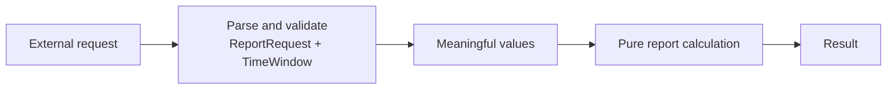

> [!abstract] Programming with Invariants, Part 1
> Model meaningful inputs, validate at boundaries, and let the rest of the code do its job.

You want to write a calculation. Before you reach it, the function checks whether a count is positive, whether two timestamps have timezones, and whether the end comes after the start. The next function checks some of the same things.

Every check has a reason. Together, they make it hard to find the reason the function exists.

There is an opposite failure, too: none of the checks exist. The function looks clean, works on the inputs we tried, and quietly assumes that every future caller will obey rules we never stated.

I kept running into these questions in my projects. We were supposed to be implementing algorithms, but their bodies kept acquiring defensive checks. A number was annotated as an `int`, although the function needed a positive count. Two arguments were annotated as timestamps, although what the function needed was a valid interval.

The missing piece was often a model of the input, not another condition in the method.

Let's work through a smaller version. We need to plan a report over a period of time. The report uses fixed-size buckets, and a final partial bucket still counts. How many buckets do we need?

## The checks we never wrote

Start with just the calculation:

```python
from datetime import UTC, datetime, timedelta


def unchecked_bucket_count(
    start: datetime, end: datetime, minutes: int
) -> int:
    duration_us = (end - start) // timedelta(microseconds=1)
    bucket_us = minutes * 60 * 1_000_000
    return (duration_us + bucket_us - 1) // bucket_us


print(unchecked_bucket_count(
    start=datetime(2026, 9, 11, 9, tzinfo=UTC),
    end=datetime(2026, 9, 11, 8, tzinfo=UTC),
    minutes=60,
))
```

```text
-1
```

All three arguments have the annotated types. The end simply precedes the start, and the function returns a negative bucket count. Nothing complains.

The short function was not wrong to rely on assumptions. It was wrong to accept arbitrary inputs without a place that establishes those assumptions. A successful example with the dates in order would not expose that bug.

The answer is not to remove checks indiscriminately. It is to make the guarantees explicit and decide where they become trustworthy.

## The calculation under the checks

One response is to put all the checks in the function. The inputs are Python objects, not yet strings from an HTTP request.

```python
from datetime import UTC, datetime, timedelta


def bucket_count_by_hand(
    start: datetime, end: datetime, minutes: int
) -> int:
    if type(minutes) is not int or minutes <= 0:
        raise ValueError("minutes must be a positive integer")
    if start.tzinfo is None or start.utcoffset() is None:
        raise ValueError("start must have a timezone")
    if end.tzinfo is None or end.utcoffset() is None:
        raise ValueError("end must have a timezone")

    start = start.astimezone(UTC)
    end = end.astimezone(UTC)
    if end <= start:
        raise ValueError("end must be after start")

    duration_us = (end - start) // timedelta(microseconds=1)
    bucket_us = minutes * 60 * 1_000_000
    return (duration_us + bucket_us - 1) // bucket_us
```

The last three lines implement the calculation:

$$
\text{buckets} = \left\lceil\frac{\text{duration}}{\text{bucket width}}\right\rceil.
$$

The integer form keeps a partial bucket exact without converting the duration to a floating-point number. A 90-minute window needs two 60-minute buckets.

The preceding code establishes what those three lines are allowed to assume. The width is positive. The timestamps identify instants. The interval has a positive duration.

Those assumptions are the useful part of an **invariant**: a fact the later code can rely on. But at the moment, the only place to discover them is inside this function. A second consumer of the same interval has to find the rules, remember them, and decide whether to check them again.

## One rule already has a type

Pydantic already has a name for a positive integer: `PositiveInt`. At a validated function boundary, we can use it instead of writing the positive-count check ourselves.

This is the signature change; the remaining body stays as above:

```diff
+from pydantic import ConfigDict, PositiveInt, validate_call

+@validate_call(config=ConfigDict(strict=True))
 def bucket_count_by_hand(
-    start: datetime, end: datetime, minutes: int
+    start: datetime, end: datetime, minutes: PositiveInt
 ) -> int:
-    if type(minutes) is not int or minutes <= 0:
-        raise ValueError("minutes must be a positive integer")
```

Strict mode is deliberate. The previous version refused `True`, `1.0`, and `"1"` as counts; the new boundary should not quietly accept them through conversion.

Passing `minutes=0` now produces a Pydantic `ValidationError` before the calculation runs. It includes:

```text
Input should be greater than 0
```

The annotation and the check are different things. `PositiveInt` describes the constraint. [`validate_call`](https://docs.pydantic.dev/latest/concepts/validation_decorator/) enforces it at runtime. Remove the decorator and an ordinary Python call does not suddenly know how to enforce positivity.

This is a useful small improvement. It does not yet solve the more interesting problem.

## Two timestamps are not a window

Each of these timestamps is reasonable on its own:

```text
start: 2026-09-11 09:00 +02:00
end:   2026-09-11 08:30 +00:00
```

Read only the clock labels and the interval looks backwards. Put them on the same timeline:

```text
               start                         end
                 │                            │
UTC            07:00 ───────── 08:00 ─────── 08:30
                 └──────── 90 minutes ────────┘

start's clock  09:00 +02:00
end's clock                                  08:30 +00:00
```

We need to compare instants, not stripped clock labels. Python distinguishes naive and timezone-aware datetimes, and its [arithmetic rules](https://docs.python.org/3/library/datetime.html#datetime-objects) make that distinction consequential.

This is also where we have to decide what the application means. A birthday, a local calendar month, and an interval of elapsed time are not interchangeable. Our report covers **two instants supplied with explicit offsets**. We will normalize them to UTC. That is a choice for this report, not advice to erase timezone information from every application. Local schedules can encounter repeated or missing clock times, a separate problem described in [PEP 495](https://peps.python.org/pep-0495/).

Let's give the interval its own type.

```python
from typing import Self

from pydantic import (
    AwareDatetime,
    BaseModel,
    ConfigDict,
    Field,
    PositiveInt,
    field_validator,
    model_validator,
)


class Frozen(BaseModel):
    model_config = ConfigDict(frozen=True)


class TimeWindow(Frozen):
    start: AwareDatetime = Field(description="inclusive start instant")
    end: AwareDatetime = Field(description="exclusive end instant")

    @field_validator("start", "end")
    @classmethod
    def to_utc(cls, value: datetime) -> datetime:
        return value.astimezone(UTC)

    @model_validator(mode="after")
    def require_positive_duration(self) -> Self:
        if self.end <= self.start:
            raise ValueError("end must be after start")
        return self
```

The model owns both the representation and the relationship. Its field validation requires timezone information and normalizes the instants. Its model validator then checks their order. `Frozen` shares the configuration with the request model below and prevents normal field reassignment.

This does not eliminate the order check. It gives that check one owner.

Scott Wlaschin's [*Making illegal states unrepresentable*](https://fsharpforfunandprofit.com/posts/designing-with-types-making-illegal-states-unrepresentable/) illustrates the broader modelling move: choose a representation that expresses the valid combinations, rather than ask each consumer to reconstruct the business rule. Our interval uses a checked constructor to establish its relationship.

The distinction is close to Alexis King's argument in [*Parse, don't validate*](https://lexi-lambda.github.io/blog/2019/11/05/parse-don-t-validate/): after establishing something useful about an input, preserve that knowledge in the value you pass onwards. A check that returns nothing leaves every later consumer to reconstruct the assurance.

Our Python model is not King's Haskell proof. An `Annotated` constraint is not a refinement that ordinary Python type checkers prove. Here, validated construction establishes the guarantee, and our code must preserve it.

## Put the checks where the input arrives

A request combines the interval with the bucket width. We can parse that request once, before calling the calculation.

```python
class ReportRequest(Frozen):
    window: TimeWindow = Field(description="period covered by the report")
    minutes: PositiveInt = Field(
        strict=True, description="elapsed minutes in each full bucket"
    )


request = ReportRequest.model_validate(
    {
        "window": {
            "start": "2026-09-11T09:00:00+02:00",
            "end": "2026-09-11T08:30:00+00:00",
        },
        "minutes": 60,
    }
)
```

Parsing timestamp strings is intentional here. Guessing the timezone of a string without an offset is not. The count remains strict.

Now the calculation can say what it does:

```python
def bucket_count(window: TimeWindow, minutes: PositiveInt) -> int:
    duration_us = (window.end - window.start) // timedelta(microseconds=1)
    bucket_us = minutes * 60 * 1_000_000
    return (duration_us + bucket_us - 1) // bucket_us


print(request.window.start.isoformat())
print(bucket_count(request.window, request.minutes))
```

```text
2026-09-11T07:00:00+00:00
2
```

There is no decorator on this internal function. The request already established the facts it needs. Its annotations still describe the inputs and let a type checker check their ordinary types.

The structure is small:



An HTTP handler can own the left-hand side and write the response on the right. The calculation needs neither HTTP nor a database. This is an application of Gary Bernhardt's [*Functional Core, Imperative Shell*](https://www.destroyallsoftware.com/screencasts/catalog/functional-core-imperative-shell): decisions over values can stay separate from effects.

## Don't put a checkpoint at every doorway

It is tempting to keep adding `@validate_call`: to the calculation, to the helper it calls, and to the next helper too. It feels safer.

First ask what new fact each layer would establish. If all it sees is the same unchanged interval, passed by code that just validated it, we have brought the defensive repetition back under a decorator.

Bertrand Meyer makes this distinction explicitly in [*Applying Design by Contract*](https://se.inf.ethz.ch/~meyer/publications/computer/contract.pdf), particularly “Who should check?”: the caller must guarantee a precondition, but guaranteeing it does not require testing it before every call. The surrounding program may already establish it.

Runtime checks do work. Sometimes that work is tiny; sometimes it scans a collection or runs in a tight loop. A blanket performance claim would be misleading. But repeated checks still need a reason, just as repeated computation does.

That does not mean “validate once at startup, then trust everything forever.” A database result is new external data. A mutable value may no longer satisfy an earlier check. A calculation can produce an invalid result from valid inputs because the calculation is wrong.

Nor does “pure” mean “contains no `if`.” A branch that implements a discount, a threshold, or the final partial bucket is business logic. We are removing repeated questions about an unchanged input, not decisions the operation exists to make.

In this example, keep `bucket_count` inside the trusted core. If it becomes a public API that accepts arbitrary callers, revisit that boundary. A positive annotation alone will not prevent somebody from passing zero.

## Test the rule where it lives

The custom order rule deserves a test:

```python
import pytest
from pydantic import ValidationError


def test_window_is_refused_when_end_precedes_start() -> None:
    # Arrange
    start = datetime(2026, 9, 11, 9, tzinfo=UTC)
    end = datetime(2026, 9, 11, 8, tzinfo=UTC)

    # Act & Assert
    with pytest.raises(ValidationError, match="end must be after start"):
        TimeWindow(start=start, end=end)
```

The calculation deserves a different test:

```python
def test_partial_bucket_counts_when_width_does_not_divide_window() -> None:
    # Arrange
    window = TimeWindow(
        start=datetime(2026, 9, 11, 7, tzinfo=UTC),
        end=datetime(2026, 9, 11, 8, 30, tzinfo=UTC),
    )

    # Act
    result = bucket_count(window, minutes=60)

    # Assert
    assert result == 2
```

Replacing the ceiling calculation with floor division would break the second test. The first would still pass. That is exactly the distinction we want: valid inputs do not prove a correct algorithm.

There is no need to repeat Pydantic's positive-integer test matrix in every report consumer. Test the custom rule we wrote, the integration that matters, and the computation we own. When an invariant moves out of a function, its duplicated consumer tests should not remain as a monument to the old design.

## Did we actually write less code?

The complete comparison includes `Frozen`, `TimeWindow`, `ReportRequest`, their validators, and the calculation. Count all of them. Comparing only the final three-line body with the original function would hide the cost of the model.

For one small function, that cost may not pay back in lines. A type is not automatically an improvement because it has a name.

The gain becomes clearer across a program. A query planner, a report formatter, and a calculation can consume the same window. Its representation and order rule stay in one place. They do not each need another implementation, another error message, and another collection of validation tests.

```text
Before:  each consumer owns its work + copies of the window rules
After:   the window owns its rules; each consumer owns its work
```

In my projects, constraints on probabilities, significance levels, and positive counts let us remove manual guard blocks. We also removed tests that only repeated those declared bounds. The worthwhile change was not moving the same checks into a miscellaneous helper. It was making the contract visible in the interface, so the repeated work no longer belonged to each algorithm.

There are limits. [Pydantic has deliberate validation bypasses](https://docs.pydantic.dev/latest/concepts/models/), and freezing a model does not make every nested object immutable. Local calendar schedules need a different model from this UTC instant window. None of this excuses ignoring a new failure mode.

But it changes the question you ask while reading a function. Instead of “did we remember every defensive check here?”, you can ask “given these inputs, does this calculation do the right thing?”

That is the code I wanted to write in the first place.

Arrays make the same idea harder: `float` is not enough when two operands must share an axis, and a valid array on its own may be invalid beside another one. That is the next layer of the story.

## References

- Meyer, B., "Applying 'Design by Contract'," *Computer* 25(10), 1992, pp. 40–51. [PDF](https://se.inf.ethz.ch/~meyer/publications/computer/contract.pdf)
- King, A., "Parse, don't validate," 2019. [Post](https://lexi-lambda.github.io/blog/2019/11/05/parse-don-t-validate/)
- Bernhardt, G., "Functional Core, Imperative Shell," Destroy All Software, 2012. [Screencast](https://www.destroyallsoftware.com/screencasts/catalog/functional-core-imperative-shell)
- Wlaschin, S., "Making illegal states unrepresentable," 2013. [Post](https://fsharpforfunandprofit.com/posts/designing-with-types-making-illegal-states-unrepresentable/)
- Python: [datetime](https://docs.python.org/3/library/datetime.html), [PEP 495](https://peps.python.org/pep-0495/).
- Pydantic: [validation decorator](https://docs.pydantic.dev/latest/concepts/validation_decorator/), [models](https://docs.pydantic.dev/latest/concepts/models/).
