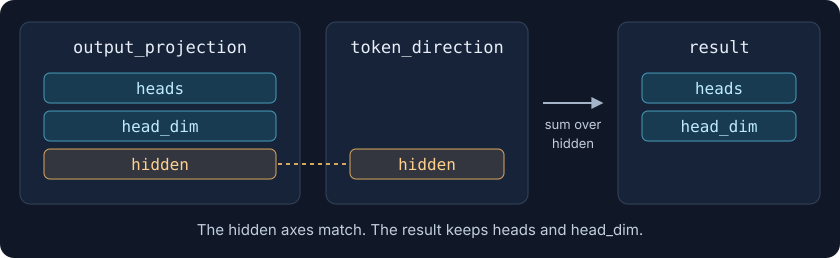
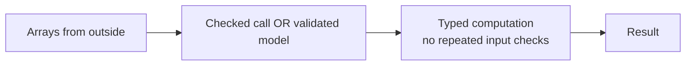

> [!abstract] Programming with Invariants, Part 2
> [Part 1](./let-your-types-carry-the-rules) moved input rules into meaningful values. Arrays make the same problem relational: an input can be valid on its own and wrong beside another one.

Reading machine-learning code often means doing several jobs at once. There is an equation to understand, an optimized implementation of it, and the mechanics of getting tensors into the right place. Somewhere between a reshape and a contraction, you lose track of what an axis means.

The code might be correct. That does not make it easy to follow.

Consider a small operation from an attention-head attribution calculation in one of my projects. Here is a deliberately mechanical way to write it, with the calculation spread across reshapes and elementwise operations. We will use float32 tensors on the CPU and leave precision-management details out of the example.

```python
import torch


def head_directions(
    output_projection: torch.Tensor, token_direction: torch.Tensor
) -> torch.Tensor:
    heads, head_dim, hidden = output_projection.shape
    flattened = output_projection.reshape(heads * head_dim, hidden)
    weighted = flattened * token_direction
    summed = weighted.sum(dim=-1)
    return summed.reshape(heads, head_dim)
```

Flatten two axes, multiply, sum, and restore the axes we just flattened.

Each step is familiar. The operation they implement is less obvious. Which parts are mathematical choices, and which parts only arrange the data for the next line? Does the second argument contain a direction for each head, or one direction shared by all of them?

The `Tensor` annotations do not answer those questions. You can read the callers, then their callers, but first let's see what this function is actually trying to calculate.

## Find the operation underneath the mechanics

Each attention head produces a vector. The output projection maps that vector into the model's hidden space. We also have a direction in that hidden space, associated with the token we want to examine.

This operation brings that direction back into each head's coordinates. Later code can score a head's value vector against the result.

For this example, the output projection is already arranged by head:



For each head and each coordinate within that head, we take a dot product over `hidden`:

$$
D_{h,d} = \sum_{e=1}^{E} W_{h,d,e}\,u_e.
$$

Here, $W$ is the output projection, $u$ is the token direction, and $D$ is the result. The `hidden` axis disappears because we sum over it. `heads` and `head_dim` survive.

We can write that contraction directly with `einsum`:

```python
def head_directions(
    output_projection: torch.Tensor, token_direction: torch.Tensor
) -> torch.Tensor:
    return torch.einsum("hde,e->hd", output_projection, token_direction)
```

The flattening and restoration are gone. The expression says which axes interact and which survive. That is the substantial improvement: we state the operation instead of spelling out the mechanics used to perform it.

## Name the rearrangements as well

For this contraction, [`einops.einsum`](https://einops.rocks/api/einsum/) offers a smaller improvement: we can replace the letters with full axis names. It is not a different algorithm or a replacement for the idea of einsum.

```python
from einops import einsum, rearrange


def head_directions(
    output_projection: torch.Tensor, token_direction: torch.Tensor
) -> torch.Tensor:
    return einsum(
        output_projection,
        token_direction,
        "heads head_dim hidden, hidden -> heads head_dim",
    )
```

It takes the tensors first and the pattern last. The longer pattern saves the reader from decoding the letters.

But [einops](https://einops.rocks/) is useful for much more than this small change. Its operations express common array patterns that otherwise become chains of views, reshapes, permutations and reductions.

Take the preparation step we skipped earlier. Suppose a projection matrix arrives with shape `(hidden, heads * head_dim)`. We need to split its second axis and move the hidden axis to the end.

With a reshape and a permutation:

```python
flat_projection = torch.arange(12, dtype=torch.float32).reshape(3, 4)
by_hand = flat_projection.reshape(3, 2, 2).permute(1, 2, 0)
```

With [`rearrange`](https://einops.rocks/api/rearrange/):

```python
by_name = rearrange(
    flat_projection,
    "hidden (heads head_dim) -> heads head_dim hidden",
    heads=2,
)
print(by_name.shape)
```

```text
torch.Size([2, 2, 3])
```

The results have identical values. But the second version says which axis we split, what its parts mean, and where they go. It also derives `head_dim` from the supplied head count instead of making us repeat it.

There is more than reshaping here: `reduce` describes reductions over named axes, `repeat` introduces repeated axes, and `pack`/`unpack` combine and recover groups of dimensions. The [tutorials](https://einops.rocks/1-einops-basics/) are worth a read. Many chains of `reshape`, `squeeze`, and `permute` become easier to follow when written as one named transformation.

## Put the same story in the interface

Einops explains what the body does. An annotation explains what callers can supply and what they get back. We can use both:

```python
from typing import Literal as Shape

from tenspec.torch import Float


def head_directions(
    output_projection: Float[Shape["heads head_dim hidden"]],
    token_direction: Float[Shape["hidden"]],
) -> Float[Shape["heads head_dim"]]:
    return einsum(
        output_projection,
        token_direction,
        "heads head_dim hidden, hidden -> heads head_dim",
    )
```

The body did not change. But the signature now tells the same story as the equation: two inputs share `hidden`, and the result keeps the other two axes.

These are [Tenspec](https://egordmitriev.dev/tenspec/) annotations. `Float` describes floating-point tensors; the shape describes their axes. We will come back to the slightly awkward `Literal as Shape` import.

There is no decorator here. **Nothing is checked at runtime yet.** The annotations are already useful to a reader, and ordinary type checkers still see tensor arguments and a tensor return. They do not prove that the equation preserves the declared shape.

That distinction matters. An interface can explain an operation before we decide where to enforce it.

## A result is not evidence that the inputs made sense

Let's give the operation small values we can inspect. There are two heads, two coordinates per head, and three hidden coordinates.

```python
projection = torch.arange(1, 13, dtype=torch.float32).reshape(2, 2, 3)
direction = torch.tensor([1.0, 0.0, -1.0])

print(head_directions(projection, direction))
```

```text
tensor([[-2., -2.],
        [-2., -2.]])
```

The first dot product is easy to follow:

```text
projection row       [1, 2,  3]
token direction      [1, 0, -1]
                      ↓  ↓   ↓
products             [1, 0, -3]   → sum = -2
```

Suppose the caller accidentally supplies a direction of length one:

```python
wrong_direction = torch.ones(1)
print(head_directions(projection, wrong_direction))
```

```text
tensor([[ 6., 15.],
        [24., 33.]])
```

No exception. The result even has the expected shape, `(2, 2)`.

For Torch tensors, `einops.einsum` delegates the contraction to [`torch.einsum`](https://docs.pytorch.org/docs/2.14/generated/torch.einsum.html), which allows dimensions carrying the same subscript to broadcast. A size of one is compatible with a size of three. Here, the single value acts across the hidden axis, so the first result becomes `1 + 2 + 3`.

PyTorch did what we asked. It did not know that we intended one supplied coordinate for every hidden dimension.

This is a constructed bad input, not a claim that this particular bug occurred in a research run. It illustrates why “the operation runs” and “the operands satisfy our model” are different statements. Checking only the output shape would miss it.

## Require agreement where it matters

For this operation, the two `hidden` axes must have equal lengths. We can write that check ourselves:

```python
def head_directions_by_hand(
    output_projection: torch.Tensor, token_direction: torch.Tensor
) -> torch.Tensor:
    if output_projection.ndim != 3:
        raise ValueError("output_projection must have three axes")
    if token_direction.ndim != 1:
        raise ValueError("token_direction must have one axis")
    if output_projection.shape[2] != token_direction.shape[0]:
        raise ValueError("the hidden dimensions must agree")
    return einsum(
        output_projection,
        token_direction,
        "heads head_dim hidden, hidden -> heads head_dim",
    )
```

That checks the geometry. It still does not state the floating dtype requirement. More importantly, the rules now live in the body, separate from the interface that callers read.

The declared version already says which axes must agree. To enforce it at a public function boundary, we can apply `checked` to the existing function:

```python
from pydantic import ValidationError
from tenspec import checked


checked_head_directions = checked(head_directions)

try:
    checked_head_directions(projection, wrong_direction)
except ValidationError as error:
    print(error.errors()[0]["msg"])
```

```text
Value error, expected hidden=3, but the array has hidden=1, with {'heads': 2, 'head_dim': 2, 'hidden': 3}
```

The first argument establishes the axis sizes for this call. The second must agree with the existing `hidden` size. The check refuses the input before the contraction runs. Declared return constraints are checked too.

Writing `@checked` above a function definition is the usual spelling. Here, keeping a separate checked entry point lets us compare the two behaviors without copying the function body.

The shape requirement is stricter than broadcasting compatibility, deliberately. It is not a claim that broadcasting is bad. Broadcasting is useful when the algorithm calls for it. An accidental broadcast should not become part of the algorithm merely because the array library permits it.

## This is not a new problem

[Jaxtyping](https://docs.kidger.site/jaxtyping/) already does this well: named shapes, relationships between arrays, and runtime checks, with a much broader range of array backends. Its shape notation is a direct influence on Tenspec.

I tried adopting it several times in my projects. What kept getting in the way was fitting those declarations into the rest of my tooling and the Pydantic models I already used.

One source of friction is that Python tooling can interpret a shape string as a forward reference to a class. Jaxtyping's [FAQ](https://docs.kidger.site/jaxtyping/faq/) documents the resulting Ruff and flake8 errors. That is not the same as saying jaxtyping has no static-checker support: it supports checking the underlying array type. It also supports dataclasses, with documented limitations around stringified annotations.

Tenspec does not escape every tooling wrinkle either. It exports `Shape`, but Ruff 0.16.6 does not recognize that renamed re-export as `Literal`. The direct import at the start of our example is the [documented workaround](https://egordmitriev.dev/tenspec/type-checkers.html). It keeps ordinary undefined-name checks enabled.

The requirement was not “a type checker that can prove my tensor algorithm.” Neither the annotations here nor a clean type-check run provide that proof. I wanted one declaration that remained useful in typed Python code and could participate in the validation boundaries my projects already had.

## The same relationship can belong to a model

In [Part 1](./let-your-types-carry-the-rules), a model established the facts the calculation needed. We can do the same with these arrays.

This is an alternative to the checked function boundary, not another mandatory layer around it:

```python
from pydantic import BaseModel, ConfigDict, Field
from tenspec import TensorContracts


class ProjectionInputs(TensorContracts, BaseModel):
    model_config = ConfigDict(frozen=True, arbitrary_types_allowed=True)

    projection: Float[Shape["heads head_dim hidden"]] = Field(
        description="output projection arranged by attention head"
    )
    direction: Float[Shape["hidden"]] = Field(
        description="token direction in the model's hidden space"
    )


inputs = ProjectionInputs(projection=projection, direction=direction)
print(head_directions(inputs.projection, inputs.direction))
```

```text
tensor([[-2., -2.],
        [-2., -2.]])
```

The model validates the relationship between its fields. Its consumer calls the original, undecorated calculation.



This is the same boundary placement as before, not an instruction to introduce a model for every pair of tensors. Use the model when the pair is a meaningful value in the application. Use the checked function when the call itself is the boundary. Tenspec also has standalone validation for boundaries that fit neither form.

Array mutation remains important. A frozen model prevents normal field reassignment; it does not freeze a tensor's storage. These guarantees describe what validation established, not a promise that arbitrary later mutations are harmless.

## One step further: properties of the values

Shape and dtype do not describe every requirement. A matrix of log probabilities can have the right dimensions and still contain a positive entry. A pair of tensors can have matching shapes but sit on different devices.

Tenspec lets these requirements participate in the same declaration. For log probabilities, we can define a reusable `NonPositive` property and write `Float[Shape["masks tokens"], NonPositive]`. The class supplies a validation method that reads the array and raises on a violation. The rule then works at a function boundary or on a model field, without another copy of the check in each consumer. The [custom-property guide](https://egordmitriev.dev/tenspec/custom-checks.html#a-property-of-your-own) shows the implementation.

Relationships between operands matter too. A shared device variable can require both inputs to live on the **same device**, without hard-coding CPU or a particular GPU. That also distinguishes two different CUDA devices. The [shared-variable documentation](https://egordmitriev.dev/tenspec/array-annotations.html#shared-variables) covers the spelling, alongside shared dtype constraints. These declarations check agreement; they do not move or cast tensors to make them agree.

This is the extension I wanted beyond shape annotations: a place for application-specific array rules, not just more names for dimensions. But the ability to add a requirement is not a reason to add it everywhere.

## Don't declare everything you can check

An early integration in my projects made this mistake. We put additional constraints on numerical functions because those constraints were available. The signatures became longer, without a good account of what each requirement protected.

The projection above is a useful counterexample. Does it actually require a non-empty head axis?

```python
empty_projection = torch.empty(0, 2, 3)
print(head_directions(empty_projection, direction).shape)
```

```text
torch.Size([0, 2])
```

The operation has a coherent empty result. A later consumer might require at least one head, but that does not make non-emptiness a requirement of this contraction.

Likewise, PyTorch can carry out this shape calculation on metadata-only tensors. If a boundary must deliver actual measurements, requiring materialized data there makes sense. Adding the same requirement to every mathematical leaf does not follow.

`Float` also does not mean “these operands share exactly one dtype and device.” Our examples prepare both as CPU float32 tensors. If another boundary accepts arbitrary sources and needs dtype or device agreement, that is another relationship to declare. It is not a reason to put every available marker on every argument.

The useful question is still: **what does this operation need that its caller has not already established?**

Shape checks inspect dimensions. A property such as finiteness can require reading every value. Those are different costs. Keep value scans where their guarantee matters, and do not revalidate unchanged operands at every internal call. Meyer's [distinction between guaranteeing a precondition and repeatedly testing it](https://se.inf.ethz.ch/~meyer/publications/computer/contract.pdf) applies here too.

## What we got to remove

In the project integration, declarations replaced equivalent rank, axis-agreement and dtype checks. We removed those handwritten checks and the consumer tests that merely repeated them. Relationships outside the declarations stayed as ordinary code, for example whether a capture contained the number of layers the model promised.

That distinction kept the migration honest. Adding annotations while retaining every old guard would have made the code longer without giving the rules a clearer owner.

It also does not mean the algorithm needs no tests. Reversing coordinates within `direction` preserves its shape and changes the result. Swapping the meaning of two equally sized axes can pass a dimension check. Axis names are useful labels, not identifiers physically attached to the data.

Test the numerical result, domain rules and the integration at the chosen boundary. Do not rebuild the array-validation library's entire test suite inside every consumer.

The gain I care about is visible even in the unchecked signature. I can see what the function consumes, what it keeps, and what it reduces. Then, at the place where those assumptions need to become trustworthy, the same declaration can enforce them.

The equation still belongs in the function. The mechanics still have to be correct. But I no longer have to reconstruct every axis from the surrounding code before I can start reading either one.

## References

- Einops: [tutorial](https://einops.rocks/1-einops-basics/), [`rearrange`](https://einops.rocks/api/rearrange/), [`einsum`](https://einops.rocks/api/einsum/).
- PyTorch: [`einsum`](https://docs.pytorch.org/docs/2.14/generated/torch.einsum.html), including its broadcasting rules.
- Jaxtyping: [array annotations](https://docs.kidger.site/jaxtyping/api/array/), [runtime checks](https://docs.kidger.site/jaxtyping/api/runtime-type-checking/), [FAQ](https://docs.kidger.site/jaxtyping/faq/).
- Tenspec: [documentation](https://egordmitriev.dev/tenspec/), [type checkers and Ruff](https://egordmitriev.dev/tenspec/type-checkers.html).
- Meyer, B., "Applying 'Design by Contract'," *Computer* 25(10), 1992, pp. 40–51. [PDF](https://se.inf.ethz.ch/~meyer/publications/computer/contract.pdf)
